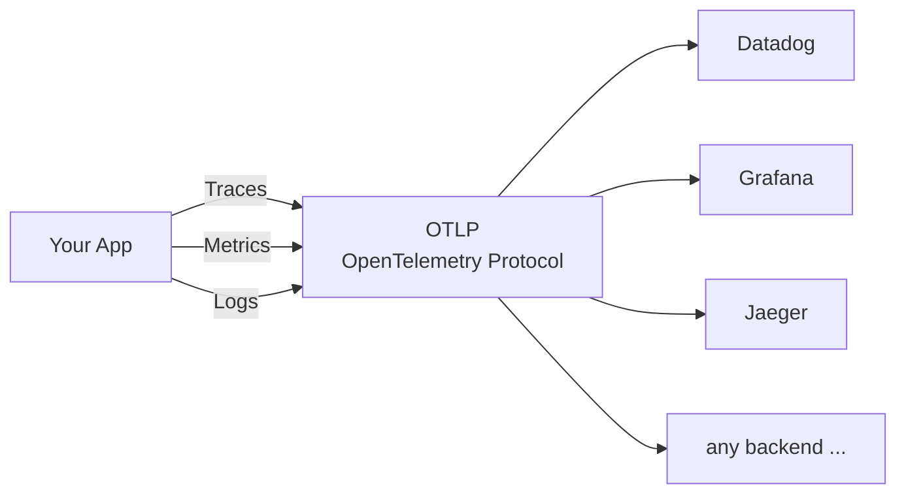

<!-- TOC -->
  * [Why Observability?](#why-observability)
  * [OpenTelemetry — The Open Standard](#opentelemetry--the-open-standard)
  * [Spring Boot — Best of Both Worlds](#spring-boot--best-of-both-worlds)
  * [Architecture: App → otel-lgtm](#architecture-app--otel-lgtm)
    * [Component Reference](#component-reference)
  * [What You Get for Free](#what-you-get-for-free)
    * [Traces](#traces)
    * [Metrics](#metrics)
    * [Logs](#logs)
  * [OTel Setup](#otel-setup)
    * [Infrastructure (`compose-observability.yaml`)](#infrastructure-compose-observabilityyaml)
    * [Dependency (`build.gradle`)](#dependency-buildgradle)
    * [Configuration (`application.yml`)](#configuration-applicationyml)
  * [Understanding TraceId and SpanId](#understanding-traceid-and-spanid)
    * [TraceId](#traceid)
    * [SpanId](#spanid)
    * [How They Fit Together](#how-they-fit-together)
    * [Why It Matters for Logs](#why-it-matters-for-logs)
    * [Logs](#logs-1)
  * [Grafana Dashboard](#grafana-dashboard)
    * [Why import instead of building panel by panel?](#why-import-instead-of-building-panel-by-panel)
    * [Import `dashboard-otel.json` (recommended)](#import-dashboard-oteljson-recommended)
    * [Build it yourself with an AI assistant](#build-it-yourself-with-an-ai-assistant)
  * [Custom Instrumentation](#custom-instrumentation)
    * [Traces](#traces-1)
    * [Metrics](#metrics-1)
    * [Logs](#logs-2)
  * [Summary](#summary)
<!-- TOC -->

## Why Observability?

In a distributed system you cannot just "look at the code" to understand what is happening at runtime. Observability answers three questions:

- **What happened?** — logs capture discrete events
- **How long did it take, and how often?** — metrics capture counts, durations, and rates
- **Why did it happen?** — traces connect the dots across service boundaries

Without it you are flying blind in production: you cannot tell whether a slow response is the LLM API, your own code, or the network — and you cannot prove it to anyone else either.

---

## OpenTelemetry — The Open Standard

OpenTelemetry (OTel) is a vendor-neutral, CNCF-graduated project that defines a single API and wire format for all three signals.



Before OTel, every backend (Datadog, Jaeger, Prometheus …) had its own SDK and agent. OTel decouples *instrumentation* from *backend choice*: instrument once, ship anywhere.

---

## Spring Boot — Best of Both Worlds

Spring Boot brings OTel to the JVM without boilerplate:

| Layer | What Boot wires up automatically |
|---|---|
| **Micrometer** | Metrics abstraction — counters, timers, gauges |
| **Micrometer Tracing** | Trace context propagation & span creation |
| **OTel SDK** | The bridge that turns Micrometer observations into OTLP spans & metrics |
| **OTLP exporters** | HTTP exporters for traces, metrics, and logs — configured via `application.yml` |
| **Auto-instrumentation** | HTTP requests, Spring AI chat calls, and `@Observed` methods are traced with zero code |

Add `spring-boot-starter-opentelemetry` and configure endpoints — Boot handles the rest.

---

## Architecture: App → otel-lgtm


### Component Reference

| Component | Role |
|---|---|
| **Spring MVC** | Handles inbound HTTP requests; auto-creates a span per request |
| **Spring AI ChatClient** | Executes LLM calls; auto-creates spans and records token-usage metrics |
| **Micrometer Observation API** | Unified abstraction for traces + metrics; `@Observed` and `Observation` API feed into this |
| **OTel SDK** | Translates Micrometer observations into OTLP-formatted spans, metrics, and log records |
| **OTel Collector** | Receives OTLP data, fans it out to the appropriate storage backend |
| **Tempo** | Distributed trace storage — stores and queries spans |
| **Mimir / Prometheus** | Time-series metrics storage — stores counters, histograms, and gauges |
| **Loki** | Log aggregation — stores structured log records with trace correlation |
| **Grafana UI** | Single pane of glass — query and visualise all three signals on port 3000 |


---

## What You Get for Free

Everything below requires **zero custom code** — just the starters and the `application.yml` configuration above.

### Traces

| Source | What gets traced |
|---|---|
| Spring MVC | Every inbound HTTP request — method, path, status code, latency |
| Spring AI | Every `ChatClient` call — model, prompt tokens, completion tokens, latency |
| Propagation | `traceId` / `spanId` propagated outbound via W3C `traceparent` header |

### Metrics

| Metric | Description |
|---|---|
| `http.server.request.duration` | Latency histogram per endpoint and status code |
| `jvm.memory.used` | Heap and non-heap per memory pool |
| `jvm.gc.duration` | GC pause time |
| `jvm.threads.active` | Live thread count |
| `gen_ai.client.token.usage` | Prompt + completion token counts per LLM call |
| `gen_ai.client.operation.duration` | End-to-end LLM call latency |
| `system.cpu.usage` | Process and system CPU utilisation |

### Logs

| What | Detail |
|---|---|
| All SLF4J / Logback output | Shipped to Loki via the OTLP appender |
| `traceId` & `spanId` | Injected into every log record — links a log line directly to its trace in Tempo |
| Severity mapping | Logback levels → OTel severity numbers automatically |

> **Note:** Logs require two small pieces of custom setup. Logback initialises before the Spring context, so the OTel appender exists but has no SDK reference at startup. Two files bridge that gap:
> - **`logback-spring.xml`** — declares the `OpenTelemetryAppender` and adds it alongside the console appender
> - **`InstallOpenTelemetryAppender.java`** — an `InitializingBean` that calls `OpenTelemetryAppender.install(openTelemetry)` once the Spring-managed `OpenTelemetry` bean is ready
>
> Without these, logs are written to the console only and never reach Loki.

---

## OTel Setup

Everything in this document flows from a single starter, a compose file for the backend infrastructure, and a few config properties.

### Infrastructure (`compose-observability.yaml`)

The `grafana/otel-lgtm` image bundles the entire observability backend — OTel Collector, Mimir, Tempo, Loki, and Grafana — into a single container. No separate services to wire together.

```yaml
services:
  grafana-lgtm:
    image: 'grafana/otel-lgtm:latest'
    ports:
      - '3000:3000'   # Grafana UI
      - '4317:4317'   # OTLP gRPC receiver
      - '4318:4318'   # OTLP HTTP receiver
```

**Start the infrastructure:**

```bash
docker compose -f compose-observability.yaml up
```

Grafana will be available at [http://localhost:3000](http://localhost:3000) once the container is healthy. The app pushes all signals to `localhost:4318` over OTLP/HTTP.

### Dependency (`build.gradle`)

```groovy
// OTel — brings in the SDK, OTLP exporters, and Micrometer bridge
implementation 'org.springframework.boot:spring-boot-starter-opentelemetry'
```

That one starter wires up:
- The OpenTelemetry SDK and OTLP exporters for traces, metrics, and logs
- A Micrometer `ObservationRegistry` bridge so every `@Observed` span and counter flows through OTel automatically
- Auto-instrumented HTTP server spans for every incoming request

### Configuration (`application.yml`)

```yaml
management:
  otlp:
    metrics:
      export:
        url: http://localhost:4318/v1/metrics
  opentelemetry:
    tracing:
      export:
        otlp:
          endpoint: http://localhost:4318/v1/traces
    logging:
      export:
        otlp:
          endpoint: http://localhost:4318/v1/logs
  tracing:
    sampling:
      probability: 1.0   # capture every request (tune down in production)
```

## Understanding TraceId and SpanId

These two IDs are the backbone of distributed tracing. Once you grasp them, everything in Grafana Tempo clicks into place.

### TraceId

- A **single unique ID** assigned at the very start of a request — when it enters Spring MVC.
- It **stays the same** for the entire lifetime of that request, across every method call, every service hop, and every log line.
- All spans belonging to the same request share this ID — it is what lets you pull up the full picture in Tempo.

### SpanId

- A **unique ID for one unit of work** within a trace — an HTTP handler, an LLM call, a custom `@Observed` method.
- Each span knows its **parent span**, forming a tree. The root span is the inbound HTTP request; child spans hang off it.
- A span records: operation name, start time, duration, status, and any attributes (e.g. `http.method`, `gen_ai.usage.input_tokens`).

### How They Fit Together

```
TraceId: a1b2c3d4e5f6...  (same across all rows below)

├── SpanId: 11aa  [HTTP GET /springai/v1/structured_outputs]  0ms → 340ms
│   ├── SpanId: 22bb  [Spring AI ChatClient call]             5ms → 330ms
│   │   └── SpanId: 33cc  [structured_outputs observation]   5ms → 330ms
```

Here is a real log line from this application. Notice the `traceId` and `spanId` embedded directly in the output:

```
2026-08-03T05:08:16.917-05:00  INFO 58957 --- [explore-openai] [nio-8080-exec-1] [ba224c7679bbf814e63ae1ebbd6ce243-30faf73441cb4fa1] com.llm.chats.ChatController : userInput message : UserInput[prompt=What is the overall format of the basketball tournament at the 2024 Olympics?]
```

Breaking it down:

| Part | Value | Meaning |
|---|---|---|
| Timestamp | `2026-08-03T05:08:16.917` | When the log was emitted |
| Thread | `nio-8080-exec-1` | The request thread |
| `traceId` | `ba224c7679bbf814e63ae1ebbd6ce243` | Identifies the entire request — paste this into Grafana Tempo to see the full trace |
| `spanId` | `30faf73441cb4fa1` | Identifies this specific unit of work within that trace |
| Logger | `com.llm.chats.ChatController` | The class that emitted the log |

### Why It Matters for Logs

Every log line emitted inside a request automatically carries the active `traceId` and `spanId`:

```
INFO  c.l.StructuredOutputsController - userInput message : ...
      traceId=a1b2c3d4e5f6  spanId=22bb
```

In Grafana you can click the `traceId` in a Loki log line and jump straight to the matching trace in Tempo — no manual searching.

---


### Logs

Logs are correlated with traces via the OTel Logback appender — the active `traceId` and `spanId` are injected into every log record automatically.

**`logback-spring.xml`** — routes all logs through the OTel appender:

```xml
<appender name="OTEL"
    class="io.opentelemetry.instrumentation.logback.appender.v1_0.OpenTelemetryAppender"/>

<root level="INFO">
    <appender-ref ref="CONSOLE"/>
    <appender-ref ref="OTEL"/>     <!-- ships logs to Loki via OTLP -->
</root>
```

**`InstallOpenTelemetryAppender.java`** — wires the Spring-managed `OpenTelemetry` SDK instance into the Logback appender at startup:

```java
@Component
class InstallOpenTelemetryAppender implements InitializingBean {

    private final OpenTelemetry openTelemetry;

    InstallOpenTelemetryAppender(OpenTelemetry openTelemetry) {
        this.openTelemetry = openTelemetry;
    }

    @Override
    public void afterPropertiesSet() {
        OpenTelemetryAppender.install(this.openTelemetry);
    }
}
```

This step is necessary because Logback initialises before the Spring context — the appender exists but has no SDK reference until `afterPropertiesSet` runs.


## Grafana Dashboard

### Why import instead of building panel by panel?

Grafana lets you build panels manually — pick a visualization, write a PromQL query, tweak axes — but starting from scratch for every metric is slow and error-prone. You have to know the exact metric names, understand the label set, and figure out the right query shape before you see anything useful.

A better approach: **use an AI assistant to generate the full dashboard JSON from your metric names**. In this project, `dashboard-otel.json` was built that way. Instead of spending an hour clicking through the UI, you describe what you want ("show P50 and max LLM response time by model, token usage over time, request rate per endpoint") and the assistant produces a valid Grafana v2 dashboard JSON in seconds. You paste it in, verify the queries against your live Prometheus data, and iterate from there.

The result is a dashboard that covers:
- **Spring AI Metrics row** — total requests, avg response time, prompt/completion tokens, LLM latency by model
- **API Metrics row** — HTTP request rate, error rate, duration per endpoint
- **Application Logs row** — correlated Loki logs, filterable by service

This is dramatically faster than the manual route and teaches you something more valuable than clicking: how to reason about metrics, labels, and query shapes — which is the transferable skill.

---

### Import `dashboard-otel.json` (recommended)

`dashboard-otel.json` is a pre-built dashboard tuned for the OTel metric names this stack exports (`gen_ai_client_operation_milliseconds_*`, `http_server_requests_milliseconds_*`, `service_name` labels).

**Steps:**
1. Open Grafana at [http://localhost:3000](http://localhost:3000)
2. Go to **Dashboards → Import**
3. Click **Upload dashboard JSON file**
4. Select `observability/dashboard-otel.json` from this repo
5. Click **Import**

---

### Build it yourself with an AI assistant

Instead of importing the finished file, build the same dashboard from scratch using an AI assistant (Claude, ChatGPT, Copilot — any will do):

- **Any assistant works** — the prompt is the same regardless of which one you use
- **Forces you to think** — you have to decide what you want to visualise and why, rather than inheriting someone else's decisions
- **You learn the metric names** — by describing what you want, you naturally discover the exact metric names and label keys your stack exports
- **You learn the query shapes** — `rate()`, `sum by()`, `histogram_quantile()` — you understand why each one is used, not just that it works
- **Faster than the UI** — generating a full dashboard JSON from a prompt takes seconds; building the same thing panel-by-panel in Grafana takes an hour

> **Important — LLM responses are non-deterministic.**
> The same prompt can produce different JSON on different runs. The assistant may generate a panel with a slightly wrong query, a missing label, or a field name that your Grafana version does not support. **Always verify each panel against your live Prometheus data in Grafana Explore before treating it as correct.** The prompt below is a starting point, not a guarantee.

**Prompt to use:**

```
I am building a Grafana dashboard for a Spring Boot 4 + Spring AI 2.0 application.
The app uses the OpenTelemetry SDK and pushes metrics to grafana/otel-lgtm via OTLP/HTTP.
Grafana version is 13.x and uses the v2 dashboard schema (apiVersion: dashboard.grafana.app/v2).

The following metrics are available in Prometheus:

HTTP server metrics:
  - http_server_requests_milliseconds_count{uri, method, status}
  - http_server_requests_milliseconds_sum{uri, method, status}
  - http_server_requests_max_milliseconds{uri}

Spring AI / LLM metrics:
  - gen_ai_client_operation_milliseconds_count{gen_ai_request_model, gen_ai_system, error}
  - gen_ai_client_operation_milliseconds_sum{gen_ai_request_model, gen_ai_system, error}
  - gen_ai_client_token_usage_total{gen_ai_token_type, gen_ai_request_model}

All metrics use the label service_name (not application) to identify the app.

Please generate a Grafana v2 dashboard JSON with two rows:

Row 1 — Spring AI Metrics:
  - Total AI Requests (stat): sum of gen_ai_client_operation_milliseconds_count
  - Avg Response Time (gauge, ms): rate(sum[5m]) / rate(count[5m])
  - Prompt Tokens (stat): gen_ai_client_token_usage_total{gen_ai_token_type="input"}
  - Completion Tokens (stat): gen_ai_client_token_usage_total{gen_ai_token_type="output"}
  - Token Usage Over Time (timeseries): prompt vs completion tokens
  - LLM Response Time by Model (timeseries): avg and max response time per gen_ai_request_model

Row 2 — API Metrics:
  - Request Rate (timeseries): rate of http_server_requests_milliseconds_count by uri
  - Avg Request Duration (timeseries): sum/count ratio by uri in ms
  - Max Request Duration (timeseries): http_server_requests_max_milliseconds by uri
  - Error Rate (timeseries): requests where status starts with 4 or 5

Use RowsLayout at the top level. Use AutoGridLayout inside the Spring AI row
and GridLayout inside the API row.
Do not use byNamePattern in field overrides — use byRegexp instead.
```

**After generating, verify each panel:**
- Open Grafana → Explore → Prometheus
- Run the panel's PromQL query manually
- Confirm you see data before saving the dashboard

**This is an iterative process — expect multiple rounds.**

The assistant rarely gets everything right in one shot. A typical session looks like this:

```
You:       Generate the dashboard JSON
Assistant: Produces JSON with 6 panels
You:       Import it → 2 panels show No Data
You:       Run the queries in Explore → wrong metric name on one, missing label on another
You:       Tell the assistant what you found → it corrects both
You:       Re-import → panels show data, but P99 panel has no Y axis
You:       Share the screenshot → assistant fixes the axis config
...and so on
```

Each round you understand the data model a little better. By the time the dashboard is working, you know exactly what every query does and why — which is the goal. The finished `dashboard-otel.json` in this repo went through exactly this process.


---

## Custom Instrumentation

### Traces

Spring Boot auto-creates spans for every incoming HTTP request. Spring AI adds spans around each LLM call automatically. For custom business spans, use `Observation` directly:

**Programmatic span — `StructuredOutputsController.java`**

```java
// Creates a span named "structured_outputs" wrapping the LLM call
Observation.createNotStarted("structured_outputs", observationRegistry)
        .observe(() -> {
            log.info("userInput message : {} ", userInput);
            var responseSpec = chatClient.prompt(promptMessage).call();
            return responseSpec.content();
        });
```

`Observation` is the Micrometer abstraction. When the OTel bridge is on the classpath it automatically produces an OTel span — no OTel API imports required.

**Declarative span — `@Observed`**

```java
@PostMapping("/v1/structured_outputs/fewshot")
@Observed(name = "fewshot.count", contextualName = "Structured Outputs Few Shot")
public String structuredOutputsFewShot(@RequestBody @Valid UserInput userInput) { ... }
```

`@Observed` wraps the entire method in a span. Requires the AOP starter (`spring-boot-starter-aop`) to be on the classpath.

---

### Metrics

Micrometer automatically exports JVM, HTTP server, and Spring AI token-usage metrics. The `@Observed` annotation and `Observation` API also produce a timer metric (count + duration histogram) alongside the trace span — one API, two signals.

**Auto-exported metrics include:**

| Metric | Description |
|---|---|
| `http.server.requests` | Request count, latency per endpoint |
| `jvm.memory.used` | Heap and non-heap usage |
| `gen_ai.client.token.usage` | Prompt and completion token counts per LLM call |
| `fewshot.count` | Custom timer from `@Observed` |
| `structured_outputs` | Custom timer from `Observation.createNotStarted` |

---

### Logs

Logs are correlated with traces via the OTel Logback appender — the active `traceId` and `spanId` are injected into every log record automatically.

**`logback-spring.xml`** — routes all logs through the OTel appender:

```xml
<appender name="OTEL"
    class="io.opentelemetry.instrumentation.logback.appender.v1_0.OpenTelemetryAppender"/>

<root level="INFO">
    <appender-ref ref="CONSOLE"/>
    <appender-ref ref="OTEL"/>     <!-- ships logs to Loki via OTLP -->
</root>
```

**`InstallOpenTelemetryAppender.java`** — wires the Spring-managed `OpenTelemetry` SDK instance into the Logback appender at startup:

```java
@Component
class InstallOpenTelemetryAppender implements InitializingBean {

    private final OpenTelemetry openTelemetry;

    InstallOpenTelemetryAppender(OpenTelemetry openTelemetry) {
        this.openTelemetry = openTelemetry;
    }

    @Override
    public void afterPropertiesSet() {
        OpenTelemetryAppender.install(this.openTelemetry);
    }
}
```

This step is necessary because Logback initialises before the Spring context — the appender exists but has no SDK reference until `afterPropertiesSet` runs.

---

## Summary

| Signal | How it gets there | Where to view |
|---|---|---|
| **Traces** | Auto (HTTP + Spring AI) + `@Observed` / `Observation` API | Grafana → Tempo |
| **Metrics** | Auto (JVM + HTTP) + `@Observed` timer | Grafana → Prometheus/Mimir |
| **Logs** | Logback OTEL appender + `InstallOpenTelemetryAppender` | Grafana → Loki |

All three signals share the same `traceId`, making it easy to jump from a slow metric → the offending trace → the exact log line that explains why.
