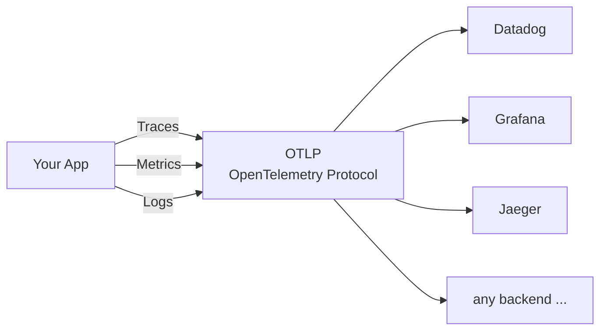
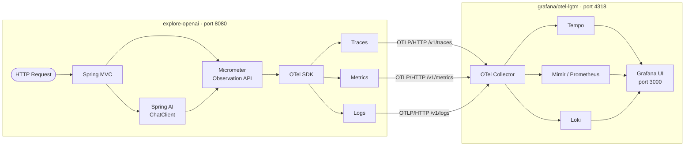
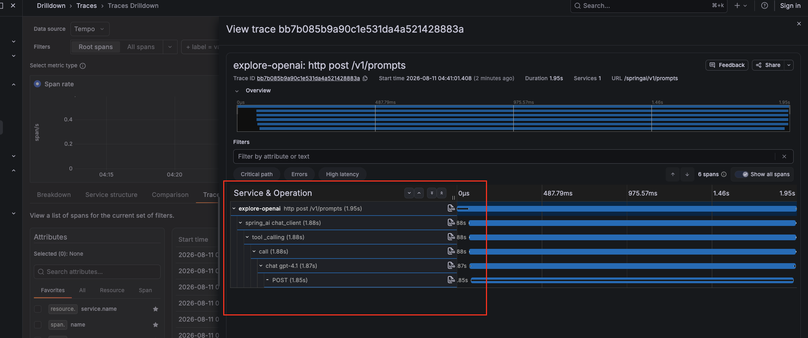
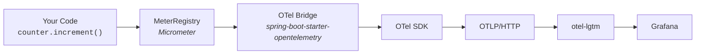
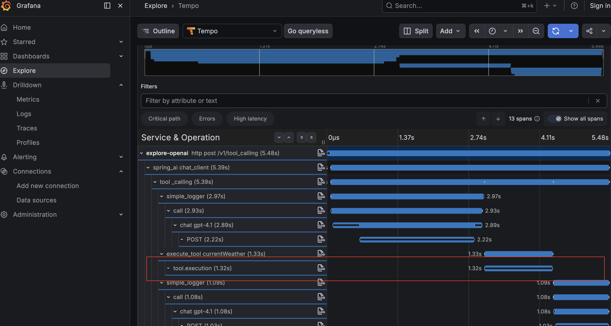

<!-- START doctoc generated TOC please keep comment here to allow auto update -->
<!-- DON'T EDIT THIS SECTION, INSTEAD RE-RUN doctoc TO UPDATE -->

- [Why Observability?](#why-observability)
- [OpenTelemetry — The Open Standard](#opentelemetry--the-open-standard)
- [Spring Boot — Best of Both Worlds](#spring-boot--best-of-both-worlds)
- [Architecture: App → otel-lgtm](#architecture-app-%E2%86%92-otel-lgtm)
  - [Component Reference](#component-reference)
- [What You Get for Free](#what-you-get-for-free)
  - [Traces](#traces)
  - [Metrics](#metrics)
  - [Logs](#logs)
- [OTel Setup](#otel-setup)
  - [Infrastructure (`compose-observability.yaml`)](#infrastructure-compose-observabilityyaml)
  - [Dependency (`build.gradle`)](#dependency-buildgradle)
  - [Configuration (`application.yml`)](#configuration-applicationyml)
  - [Logs](#logs-1)
- [Understanding TraceId and SpanId](#understanding-traceid-and-spanid)
  - [TraceId](#traceid)
  - [SpanId](#spanid)
  - [How They Fit Together](#how-they-fit-together)
  - [Why It Matters for Logs](#why-it-matters-for-logs)
- [Grafana Dashboard](#grafana-dashboard)
  - [Why import instead of building panel by panel?](#why-import-instead-of-building-panel-by-panel)
  - [Import `dashboard-otel.json` (recommended)](#import-dashboard-oteljson-recommended)
  - [Build it yourself with an AI assistant](#build-it-yourself-with-an-ai-assistant)
- [Custom Instrumentation](#custom-instrumentation)
  - [Custom Metrics](#custom-metrics)
      - [What is MeterRegistry?](#what-is-meterregistry)
      - [How does registering a metric publish it automatically?](#how-does-registering-a-metric-publish-it-automatically)
      - [How are OTel and MeterRegistry connected?](#how-are-otel-and-meterregistry-connected)
      - [Adding tool invocation counters](#adding-tool-invocation-counters)
  - [Observation API](#observation-api)
    - [Why Observation API?](#why-observation-api)
    - [How it works](#how-it-works)
    - [WeatherToolsFunctionV2 — Observation API in practice](#weathertoolsfunctionv2--observation-api-in-practice)
    - [Approach 2 — `@Observed` Annotation](#approach-2--observed-annotation)
- [Summary](#summary)

<!-- END doctoc generated TOC please keep comment here to allow auto update -->


## Why Observability?

In a distributed system you cannot just "look at the code" to understand what is happening at runtime. Observability answers three questions:

- **What happened?** — logs capture discrete events
- **How long did it take, and how often?** — metrics capture counts, durations, and rates
- **Why did it happen?** — traces connect the dots across service boundaries

Without it you are flying blind in production: you cannot tell whether a slow response is the LLM API, your own code, or the network — and you cannot prove it to anyone else either.

---

## OpenTelemetry — The Open Standard

OpenTelemetry (OTel) is a vendor-neutral, CNCF-graduated project that defines a single API and wire format for all three signals.



Before OTel, every backend (Datadog, Jaeger, Prometheus …) had its own SDK and agent. OTel decouples *instrumentation* from *backend choice*: instrument once, ship anywhere.

---

## Spring Boot — Best of Both Worlds

Spring Boot brings OTel to the JVM without boilerplate:

| Layer | What Boot wires up automatically |
|---|---|
| **Micrometer** | Metrics abstraction — counters, timers, gauges |
| **Micrometer Tracing** | Trace context propagation & span creation |
| **OTel SDK** | The bridge that turns Micrometer observations into OTLP spans & metrics |
| **OTLP exporters** | HTTP exporters for traces, metrics, and logs — configured via `application.yml` |
| **Auto-instrumentation** | HTTP requests, Spring AI chat calls, and `@Observed` methods are traced with zero code |

Add `spring-boot-starter-opentelemetry` and configure endpoints — Boot handles the rest.

---

## Architecture: App → otel-lgtm



### Component Reference

| Component | Role |
|---|---|
| **Spring MVC** | Handles inbound HTTP requests; auto-creates a span per request |
| **Spring AI ChatClient** | Executes LLM calls; auto-creates spans and records token-usage metrics |
| **Micrometer Observation API** | Unified abstraction for traces + metrics; `@Observed` and `Observation` API feed into this |
| **OTel SDK** | Translates Micrometer observations into OTLP-formatted spans, metrics, and log records |
| **OTel Collector** | Receives OTLP data, fans it out to the appropriate storage backend |
| **Tempo** | Distributed trace storage — stores and queries spans |
| **Mimir / Prometheus** | Time-series metrics storage — stores counters, histograms, and gauges |
| **Loki** | Log aggregation — stores structured log records with trace correlation |
| **Grafana UI** | Single pane of glass — query and visualise all three signals on port 3000 |


---

## What You Get for Free

Everything below requires **zero custom code** — just the starters and the `application.yml` configuration above.

### Traces

| Source | What gets traced |
|---|---|
| Spring MVC | Every inbound HTTP request — method, path, status code, latency |
| Spring AI | Every `ChatClient` call — model, prompt tokens, completion tokens, latency |
| Propagation | `traceId` / `spanId` propagated outbound via W3C `traceparent` header |

### Metrics

Micrometer automatically exports JVM, HTTP server, and Spring AI token-usage metrics. The `@Observed` annotation and `Observation` API also produce a timer metric (count + duration histogram) alongside the trace span — one API, two signals.

**Auto-exported metrics include:**

| Metric | Description |
|---|---|
| `http.server.requests` | Request count, latency per endpoint |
| `jvm.memory.used` | Heap and non-heap usage |
| `gen_ai.client.token.usage` | Prompt and completion token counts per LLM call |
| `fewshot.count` | Custom timer from `@Observed` |
| `structured_outputs` | Custom timer from `Observation.createNotStarted` |

---
### Logs

| What | Detail |
|---|---|
| All SLF4J / Logback output | Shipped to Loki via the OTLP appender |
| `traceId` & `spanId` | Injected into every log record — links a log line directly to its trace in Tempo |
| Severity mapping | Logback levels → OTel severity numbers automatically |

> **Note:** Logs require two small pieces of custom setup. Logback initialises before the Spring context, so the OTel appender exists but has no SDK reference at startup. Two files bridge that gap:
> - **`logback-spring.xml`** — declares the `OpenTelemetryAppender` and adds it alongside the console appender
> - **`InstallOpenTelemetryAppender.java`** — an `InitializingBean` that calls `OpenTelemetryAppender.install(openTelemetry)` once the Spring-managed `OpenTelemetry` bean is ready
>
> Without these, logs are written to the console only and never reach Loki.

---

## OTel Setup

Everything in this document flows from a single starter, a compose file for the backend infrastructure, and a few config properties.

### Infrastructure (`compose-observability.yaml`)

The `grafana/otel-lgtm` image bundles the entire observability backend — OTel Collector, Mimir, Tempo, Loki, and Grafana — into a single container. No separate services to wire together.

```yaml
services:
  grafana-lgtm:
    image: 'grafana/otel-lgtm:latest'
    ports:
      - '3000:3000'   # Grafana UI
      - '4317:4317'   # OTLP gRPC receiver
      - '4318:4318'   # OTLP HTTP receiver
```

**Start the infrastructure:**

```bash
docker compose -f compose-observability.yaml up
```

Grafana will be available at [http://localhost:3000](http://localhost:3000) once the container is healthy. The app pushes all signals to `localhost:4318` over OTLP/HTTP.

### Dependency (`build.gradle`)

```groovy
// OTel — brings in the SDK, OTLP exporters, and Micrometer bridge
implementation 'org.springframework.boot:spring-boot-starter-opentelemetry'
```

That one starter wires up:
- The OpenTelemetry SDK and OTLP exporters for traces, metrics, and logs
- A Micrometer `ObservationRegistry` bridge so every `@Observed` span and counter flows through OTel automatically
- Auto-instrumented HTTP server spans for every incoming request

### Configuration (`application.yml`)

```yaml
management:
  otlp:
    metrics:
      export:
        url: http://localhost:4318/v1/metrics
  opentelemetry:
    tracing:
      export:
        otlp:
          endpoint: http://localhost:4318/v1/traces
    logging:
      export:
        otlp:
          endpoint: http://localhost:4318/v1/logs
  tracing:
    sampling:
      probability: 1.0   # capture every request (tune down in production)
```

### Logs

Traces and metrics are shipped automatically, but logs need one extra dependency and two extra files because Logback initialises before the Spring context — the OTel appender exists at startup but has no SDK reference yet.

**`build.gradle`** — the Logback appender ships in a separate instrumentation artifact, not in the starter:

```groovy
//otel-logs
implementation 'io.opentelemetry.instrumentation:opentelemetry-logback-appender-1.0:2.21.0-alpha'
```

**`logback-spring.xml`** — adds the OTel appender alongside the console:

```xml
<?xml version="1.0" encoding="UTF-8"?>
<configuration>
  <include resource="org/springframework/boot/logging/logback/base.xml"/>

  <appender name="OTEL" class="io.opentelemetry.instrumentation.logback.appender.v1_0.OpenTelemetryAppender">
  </appender>

  <root level="INFO">
    <appender-ref ref="CONSOLE"/>
    <appender-ref ref="OTEL"/>
  </root>
</configuration>
```

**`InstallOpenTelemetryAppender.java`** — wires the Spring-managed `OpenTelemetry` bean into the appender once the context is ready:

```java
@Component
class InstallOpenTelemetryAppender implements InitializingBean {

    private final OpenTelemetry openTelemetry;

    InstallOpenTelemetryAppender(OpenTelemetry openTelemetry) {
        this.openTelemetry = openTelemetry;
    }

    @Override
    public void afterPropertiesSet() {
        OpenTelemetryAppender.install(this.openTelemetry);
    }
}
```

Without this dependency and these two files, logs are written to the console only and never reach Loki.

---

## Understanding TraceId and SpanId

These two IDs are the backbone of distributed tracing. Once you grasp them, everything in Grafana Tempo clicks into place.

### TraceId

- A **single unique ID** assigned at the very start of a request — when it enters Spring MVC.
- It **stays the same** for the entire lifetime of that request, across every method call, every service hop, and every log line.
- All spans belonging to the same request share this ID — it is what lets you pull up the full picture in Tempo.

### SpanId

- A **unique ID for one unit of work** within a trace — an HTTP handler, an LLM call, a custom `@Observed` method.
- Each span knows its **parent span**, forming a tree. The root span is the inbound HTTP request; child spans hang off it.
- A span records: operation name, start time, duration, status, and any attributes (e.g. `http.method`, `gen_ai.usage.input_tokens`).

### How They Fit Together




Here is a real log line from this application. Notice the `traceId` and `spanId` embedded directly in the output:

```
2026-08-03T05:08:16.917-05:00  INFO 58957 --- [explore-openai] [nio-8080-exec-1] [ba224c7679bbf814e63ae1ebbd6ce243-30faf73441cb4fa1] com.llm.chats.ChatController : userInput message : UserInput[prompt=What is the overall format of the basketball tournament at the 2024 Olympics?]
```

Breaking it down:

| Part | Value | Meaning |
|---|---|---|
| Timestamp | `2026-08-03T05:08:16.917` | When the log was emitted |
| Thread | `nio-8080-exec-1` | The request thread |
| `traceId` | `ba224c7679bbf814e63ae1ebbd6ce243` | Identifies the entire request — paste this into Grafana Tempo to see the full trace |
| `spanId` | `30faf73441cb4fa1` | Identifies this specific unit of work within that trace |
| Logger | `com.llm.chats.ChatController` | The class that emitted the log |

### Why It Matters for Logs

Every log line emitted inside a request automatically carries the active `traceId` and `spanId`:

```
INFO  c.l.StructuredOutputsController - userInput message : ...
      traceId=a1b2c3d4e5f6  spanId=22bb
```

In Grafana you can click the `traceId` in a Loki log line and jump straight to the matching trace in Tempo — no manual searching.

---

## Grafana Dashboard

### Why import instead of building panel by panel?

Grafana lets you build panels manually — pick a visualization, write a PromQL query, tweak axes — but starting from scratch for every metric is slow and error-prone. You have to know the exact metric names, understand the label set, and figure out the right query shape before you see anything useful.

A better approach: **use an AI assistant to generate the full dashboard JSON from your metric names**. In this project, `dashboard-otel.json` was built that way. Instead of spending an hour clicking through the UI, you describe what you want ("show P50 and max LLM response time by model, token usage over time, request rate per endpoint") and the assistant produces a valid Grafana v2 dashboard JSON in seconds. You paste it in, verify the queries against your live Prometheus data, and iterate from there.

The result is a dashboard that covers:
- **Spring AI Metrics row** — total requests, avg response time, prompt/completion tokens, LLM latency by model
- **API Metrics row** — HTTP request rate, error rate, duration per endpoint
- **Application Logs row** — correlated Loki logs, filterable by service

This is dramatically faster than the manual route and teaches you something more valuable than clicking: how to reason about metrics, labels, and query shapes — which is the transferable skill.

---

### Import `dashboard-otel.json` (recommended)

`dashboard-otel.json` is a pre-built dashboard tuned for the OTel metric names this stack exports (`gen_ai_client_operation_milliseconds_*`, `http_server_requests_milliseconds_*`, `service_name` labels).

**Steps:**
1. Open Grafana at [http://localhost:3000](http://localhost:3000)
2. Go to **Dashboards → Import**
3. Click **Upload dashboard JSON file**
4. Select `observability/dashboard-otel.json` from this repo
5. Click **Import**

---

### Build it yourself with an AI assistant

Instead of importing the finished file, build the same dashboard from scratch using an AI assistant (Claude, ChatGPT, Copilot — any will do):

- **Any assistant works** — the prompt is the same regardless of which one you use
- **Forces you to think** — you have to decide what you want to visualise and why, rather than inheriting someone else's decisions
- **You learn the metric names** — by describing what you want, you naturally discover the exact metric names and label keys your stack exports
- **You learn the query shapes** — `rate()`, `sum by()`, `histogram_quantile()` — you understand why each one is used, not just that it works
- **Faster than the UI** — generating a full dashboard JSON from a prompt takes seconds; building the same thing panel-by-panel in Grafana takes an hour

> **Important — LLM responses are non-deterministic.**
> The same prompt can produce different JSON on different runs. The assistant may generate a panel with a slightly wrong query, a missing label, or a field name that your Grafana version does not support. **Always verify each panel against your live Prometheus data in Grafana Explore before treating it as correct.** The prompt below is a starting point, not a guarantee.

**Prompt to use:**

```
I am building a Grafana dashboard for a Spring Boot 4 + Spring AI 2.0 application.
The app uses the OpenTelemetry SDK and pushes metrics to grafana/otel-lgtm via OTLP/HTTP.
Grafana version is 13.x and uses the v2 dashboard schema (apiVersion: dashboard.grafana.app/v2).

The following metrics are available in Prometheus:

HTTP server metrics:
  - http_server_requests_milliseconds_count{uri, method, status}
  - http_server_requests_milliseconds_sum{uri, method, status}
  - http_server_requests_max_milliseconds{uri}

Spring AI / LLM metrics:
  - gen_ai_client_operation_milliseconds_count{gen_ai_request_model, gen_ai_system, error}
  - gen_ai_client_operation_milliseconds_sum{gen_ai_request_model, gen_ai_system, error}
  - gen_ai_client_token_usage_total{gen_ai_token_type, gen_ai_request_model}

All metrics use the label service_name (not application) to identify the app.

Please generate a Grafana v2 dashboard JSON with two rows:

Row 1 — Spring AI Metrics:
  - Total AI Requests (stat): sum of gen_ai_client_operation_milliseconds_count
  - Avg Response Time (gauge, ms): rate(sum[5m]) / rate(count[5m])
  - Prompt Tokens (stat): gen_ai_client_token_usage_total{gen_ai_token_type="input"}
  - Completion Tokens (stat): gen_ai_client_token_usage_total{gen_ai_token_type="output"}
  - Token Usage Over Time (timeseries): prompt vs completion tokens
  - LLM Response Time by Model (timeseries): avg and max response time per gen_ai_request_model

Row 2 — API Metrics:
  - Request Rate (timeseries): rate of http_server_requests_milliseconds_count by uri
  - Avg Request Duration (timeseries): sum/count ratio by uri in ms
  - Max Request Duration (timeseries): http_server_requests_max_milliseconds by uri
  - Error Rate (timeseries): requests where status starts with 4 or 5

Use RowsLayout at the top level. Use AutoGridLayout inside the Spring AI row
and GridLayout inside the API row.
Do not use byNamePattern in field overrides — use byRegexp instead.
```

**After generating, verify each panel:**
- Open Grafana → Explore → Prometheus
- Run the panel's PromQL query manually
- Confirm you see data before saving the dashboard

**This is an iterative process — expect multiple rounds.**

The assistant rarely gets everything right in one shot. A typical session looks like this:

```
You:       Generate the dashboard JSON
Assistant: Produces JSON with 6 panels
You:       Import it → 2 panels show No Data
You:       Run the queries in Explore → wrong metric name on one, missing label on another
You:       Tell the assistant what you found → it corrects both
You:       Re-import → panels show data, but P99 panel has no Y axis
You:       Share the screenshot → assistant fixes the axis config
...and so on
```

Each round you understand the data model a little better. By the time the dashboard is working, you know exactly what every query does and why — which is the goal. The finished `dashboard-otel.json` in this repo went through exactly this process.


---

## Custom Instrumentation

### Custom Metrics

Spring Boot ships metrics for HTTP requests, JVM memory, and thread pools out of the box. But these tell you nothing about what your application is *actually doing*. 

When a tool is called 500 times and fails 200 of those, the default metrics won't surface it — you just see an HTTP 200.

Custom metrics let you instrument the parts of your code that matter to your users:

- **Which tools are being invoked, and how often?** — so you know where load concentrates
- **Are tools failing silently?** — Spring AI converts tool exceptions to LLM responses, so no HTTP error is produced; without a custom error counter you'd never know
- **Which tool is the bottleneck?** — invocation rate per tool reveals which one to optimize first

These questions cannot be answered by auto-instrumentation alone. Custom counters fill that gap with minimal code.

##### What is MeterRegistry?

`MeterRegistry` is the Micrometer interface for managing all metrics in your application:

- **Central registry** — every counter, timer, or gauge you create is registered here
- **Live ledger** — values are tracked in memory and exported automatically on each scrape/push interval
- **Backend-agnostic** — Micrometer publishes to whichever backend is configured (Prometheus, OTel, Datadog, …)
- **Spring-managed** — you never instantiate it yourself; Spring Boot auto-creates it as a bean and you just inject it:


```java
public WeatherToolsFunction(WeatherConfigProperties props, MeterRegistry meterRegistry) {
    // store it, use it to register metrics
}
```

##### How does registering a metric publish it automatically?

The moment you call `.register(meterRegistry)`, the metric is live. From that point on:

```java
Counter counter = Counter.builder("tool.invocations")
        .tag("tool", "weather")
        .register(meterRegistry);  // ← metric is live from this line

counter.increment();  // ← value goes up; next export picks it up automatically
```

- Micrometer tracks the current value internally
- No polling, no manual flushing — you just call `increment()` and Micrometer handles the rest
- On every scrape or push interval, it reads the current value and exports it

##### How are OTel and MeterRegistry connected?

`spring-boot-starter-opentelemetry` installs a **Micrometer OTel bridge** automatically. This bridge sits between `MeterRegistry` and the OTel SDK:



You write standard Micrometer code (`Counter`, `Timer`, `Gauge`) — OTel is never imported directly. The bridge translates Micrometer's metric model into OTel's format and the OTLP exporter ships it to the collector.

One naming side effect: Micrometer uses dots (`tool.invocations`) but Prometheus uses underscores, so the metric arrives in Grafana as `tool_invocations_total`.

##### Adding tool invocation counters

Each tool registers two counters in its constructor — one for every call, one for errors only:

```java
private final Counter invocationCounter;
private final Counter errorCounter;

public WeatherToolsFunction(WeatherConfigProperties props, MeterRegistry meterRegistry) {
    this.invocationCounter = Counter.builder("tool.invocations")
            .tag("tool", "weather")
            .description("Number of times the weather tool was invoked")
            .register(meterRegistry);

    this.errorCounter = Counter.builder("tool.invocation.errors")
            .tag("tool", "weather")
            .description("Number of weather tool invocations that resulted in an error")
            .register(meterRegistry);
}
```

In the method body, `invocationCounter` fires on every call. `errorCounter` fires only inside the `catch` block before rethrowing:

```java
@Override
public WeatherResponse apply(WeatherRequest weatherRequest) {
    invocationCounter.increment();          // always
    try {
        // ... call weather API ...
    } catch (Exception e) {
        errorCounter.increment();           // only on failure
        throw e;
    }
}
```

The same pattern is applied to all three tools (`weather`, `currency`, `datetime`), producing:

| Prometheus metric | Tag | Meaning |
|---|---|---|
| `tool_invocations_total` | `tool=weather\|currency\|datetime` | Cumulative call count per tool |
| `tool_invocation_errors_total` | `tool=weather\|currency\|datetime` | Cumulative error count per tool |

> **Note — HTTP 200 on tool errors:** When a tool throws, Spring AI's `ToolCallingAdvisor` catches the rethrown exception, converts it to a tool response, and sends it back to the LLM. The LLM generates a graceful fallback reply and the HTTP request still returns 200. The `errorCounter` is still incremented because our `catch` block runs before Spring AI sees the exception.

**Useful PromQL queries:**

```promql
# cumulative invocations by tool
sum by(tool)(tool_invocations_total)

# error rate per tool (errors/sec over last 5 min)
sum by(tool)(rate(tool_invocation_errors_total[5m]))

# error ratio — what % of calls are failing per tool
sum by(tool)(rate(tool_invocation_errors_total[5m]))
  /
sum by(tool)(rate(tool_invocations_total[5m]))
```

---

### Observation API

#### Why Observation API?

- `MeterRegistry` is great for counters and gauges, but it only gives you **metrics**. 
- Every real operation also has a duration, can fail, and is part of a trace. 
- The Observation API handles all three signals in one place:

| Concern | MeterRegistry | Observation API |
|---|---|---|
| Increment a counter | ✅ | ✅ (automatically) |
| Record duration (timer) | Manual `Timer.record()` | ✅ Automatic |
| Create a trace span | ❌ | ✅ Automatic |
| Mark an error | Manual error counter | ✅ `observation.error(e)` |
| One API, three signals | ❌ | ✅ Traces + Metrics + Events |

Use `MeterRegistry` when you need a **simple counter or gauge**. Use the Observation API when you want to **instrument an operation** — something with a start, an end, and a possible failure.

#### How it works

- `ObservationRegistry` is the entry point. 
- You create an `Observation`, start it, run your code inside it, and stop it. 

```java
Observation observation = Observation.createNotStarted("tool.execution", observationRegistry)
        .lowCardinalityKeyValue("tool", "weather")
        .start();

try (Observation.Scope scope = observation.openScope()) {
    // your business logic here
} catch (Exception e) {
    observation.error(e);   // records error on the span AND increments error metrics
    throw e;
} finally {
    observation.stop();     // ends the span and records the timer
}
```

- The OTel bridge on the classpath automatically turns it into both a **span** (in Tempo) and a **timer metric** (in Grafana) — no extra configuration needed.

Key methods:

- **`lowCardinalityKeyValue`** — adds a tag that is safe to use in metric cardinality (few distinct values)
- **`openScope`** — propagates the trace context to the current thread so child spans link correctly
- **`observation.error(e)`** — marks the span as failed and records error metadata
- **`observation.stop()`** — closes the span and flushes the timer measurement

#### WeatherToolsFunctionV2 — Observation API in practice



Here is the same weather tool rewritten to use the Observation API instead of raw counters. The `MeterRegistry` version is kept intact — this is an additive alternative:

```java
public class WeatherToolsFunctionV2 implements Function<WeatherRequest, WeatherResponse> {

    private final RestClient restClient;
    private final WeatherConfigProperties weatherProps;
    private final ObservationRegistry observationRegistry;

    public WeatherToolsFunctionV2(WeatherConfigProperties props,
                                   ObservationRegistry observationRegistry) {
        this.weatherProps = props;
        this.restClient = RestClient.create(weatherProps.apiUrl());
        this.observationRegistry = observationRegistry;
    }

    @Override
    public WeatherResponse apply(WeatherRequest weatherRequest) {
        Observation observation = Observation
                .createNotStarted("tool.execution", observationRegistry)
                .lowCardinalityKeyValue("tool", "weather")
                .lowCardinalityKeyValue("city", weatherRequest.city())
                .start();

        try (Observation.Scope scope = observation.openScope()) {
            var response = restClient
                    .get()
                    .uri("/current.json?key={key}&q={q}",
                            weatherProps.apiKey(), weatherRequest.city())
                    .retrieve()
                    .body(WeatherResponse.class);
            return response;
        } catch (Exception e) {
            observation.error(e);
            throw e;
        } finally {
            observation.stop();
        }
    }
}
```

This is **Approach 1 — Programmatic API**. You control exactly when the observation starts, which tags are added (including dynamic ones like `city`), and when errors are recorded.

What you get for free — without any extra configuration:

| Signal | What appears |
|---|---|
| **Trace span** | `tool.execution` span linked to the parent HTTP request span in Tempo |
| **Timer metric** | `tool_execution_milliseconds_count` + `tool_execution_milliseconds_sum` in Grafana |
| **Error tag** | `error=BadRequest` on the span and metric when an exception is thrown |
| **Tags** | `tool=weather`, `city=<value>` as span attributes and metric labels |

---

#### Approach 2 — `@Observed` Annotation

`@Observed` requires the AOP starter to be on the classpath:

```groovy
//observation
implementation 'org.springframework.boot:spring-boot-starter-aop:4.0.0-M2'
```

The same result with zero boilerplate. Add the annotation to the method and Spring AOP does the rest:

```java
@Component  // must be a Spring bean for AOP to proxy it
public class WeatherToolsFunctionV2 implements Function<WeatherRequest, WeatherResponse> {

    @Observed(
        name = "tool.execution",
        contextualName = "Weather Tool",
        lowCardinalityKeyValues = {"tool", "weather"}
    )
    @Override
    public WeatherResponse apply(WeatherRequest weatherRequest) {
        return restClient
                .get()
                .uri("/current.json?key={key}&q={q}",
                        weatherProps.apiKey(), weatherRequest.city())
                .retrieve()
                .body(WeatherResponse.class);
    }
}
```

`@Observed` automatically starts the observation before the method, records an error if the method throws, and stops the observation when it returns — no try/catch/finally needed.

**Approach 1 vs Approach 2 — side by side**

| | Programmatic (`Observation` API) | Declarative (`@Observed`) |
|---|---|---|
| **Setup** | Inject `ObservationRegistry`, manual start/stop | Annotation only — AOP handles lifecycle |
| **Dynamic tags** | ✅ Add per-request (e.g. `city=London`) | ❌ Static values only at annotation level |
| **Error recording** | Manual `observation.error(e)` in catch | ✅ Automatic on any thrown exception |
| **Works with `new`** | ✅ No Spring proxy needed | ❌ Must be a Spring `@Component` bean |
| **Boilerplate** | Medium — try/scope/finally | Minimal — one annotation |
| **Best for** | Tools instantiated with `new`, dynamic tags | Service beans with uniform instrumentation |

> **Why `WeatherToolsFunctionV2` uses Approach 1:** The tool is created with `new WeatherToolsFunctionV2(...)` in the controller, so Spring AOP cannot proxy it. `@Observed` would be silently ignored. The programmatic API works regardless of how the object is created.


## Summary

| Signal | How it gets there | Where to view |
|---|---|---|
| **Traces** | Auto (HTTP + Spring AI) + `@Observed` / `Observation` API | Grafana → Tempo |
| **Metrics** | Auto (JVM + HTTP) + `@Observed` timer | Grafana → Prometheus/Mimir |
| **Logs** | Logback OTEL appender + `InstallOpenTelemetryAppender` | Grafana → Loki |

All three signals share the same `traceId`, making it easy to jump from a slow metric → the offending trace → the exact log line that explains why.
