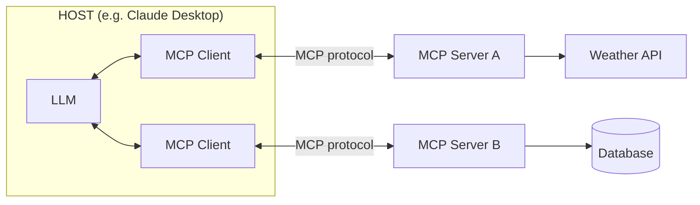
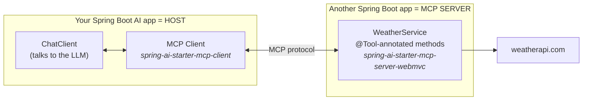
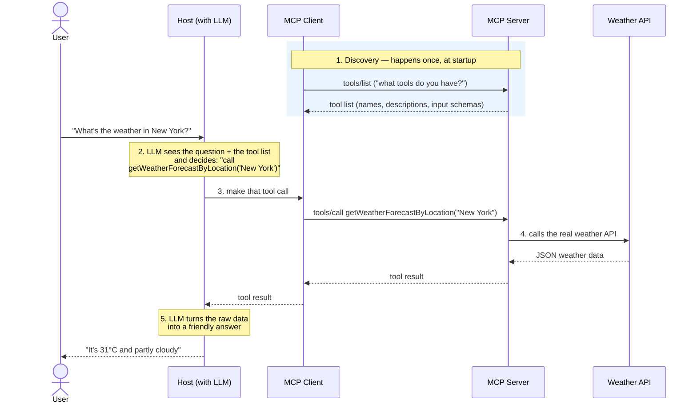
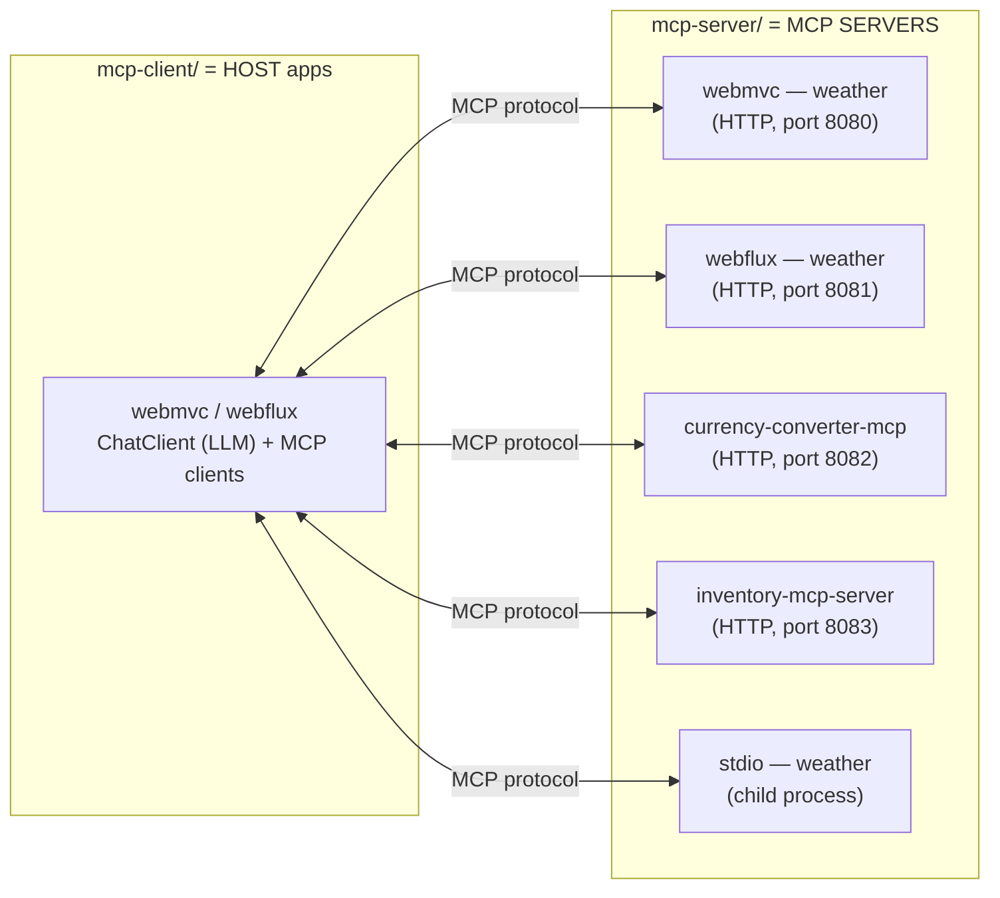

# Introduction to MCP (Model Context Protocol)

A beginner-friendly guide to understanding what MCP is, how it works, and why it matters
for building AI applications. The sub-projects in this folder ([`mcp-server/`](mcp-server))
contain working Spring AI examples of everything described here.

<!-- TOC -->
* [Introduction to MCP (Model Context Protocol)](#introduction-to-mcp-model-context-protocol)
  * [1. The problem: LLMs are frozen in time and isolated](#1-the-problem-llms-are-frozen-in-time-and-isolated)
  * [2. The old solution and why it didn't scale](#2-the-old-solution-and-why-it-didnt-scale)
  * [3. What is MCP?](#3-what-is-mcp)
    * [The USB-C analogy](#the-usb-c-analogy)
  * [4. MCP architecture: Host, Client, Server](#4-mcp-architecture-host-client-server)
    * [The REST analogy: MCP Server ≈ REST API, MCP Client ≈ REST Client](#the-rest-analogy-mcp-server--rest-api-mcp-client--rest-client)
    * [Where Spring AI fits](#where-spring-ai-fits)
  * [5. What can an MCP server offer?](#5-what-can-an-mcp-server-offer)
  * [6. How it works: a tool call, step by step](#6-how-it-works-a-tool-call-step-by-step)
  * [7. How AI benefits from MCP servers](#7-how-ai-benefits-from-mcp-servers)
  * [8. Key takeaways](#8-key-takeaways)
  * [9. What are we going to build?](#9-what-are-we-going-to-build)
  * [Further reading](#further-reading)
  * [Appendix: Testing MCP servers with MCP Inspector](#appendix-testing-mcp-servers-with-mcp-inspector)
    * [Starting the Inspector](#starting-the-inspector)
    * [Connecting to the servers in this repo](#connecting-to-the-servers-in-this-repo)
    * [Exercising a tool](#exercising-a-tool)
<!-- TOC -->

---

## 1. The problem: LLMs are frozen in time and isolated

A Large Language Model (LLM — such as GPT, Claude, Gemini, Llama, or Mistral) is
incredibly capable, but it has two built-in limitations:

1. **Its knowledge has a cutoff date.** The model only knows what was in its training
   data. Ask it *"What's the weather in New York right now?"* and it simply cannot know —
   that information didn't exist when it was trained.

2. **It can't take actions.** By itself, a model can only produce text. It cannot query
   your database, call a REST API, read a file, or book a meeting.

```
        ┌─────────────────────────────┐
        │            LLM              │
        │  "I know a lot... up to my  │
        │   training cutoff. I can't  │
        │   see or touch anything     │
        │   outside this box."        │
        └─────────────────────────────┘
             ❌ live data   ❌ your database
             ❌ your APIs   ❌ your files
```

To build genuinely useful AI applications, the model needs to reach **outside the box**.
That's what *tools* (also called *function calling*) enable:

- The app tells the model: *"here are functions you may ask me to run."*
- The model, when it needs outside information or an action, responds with a request:
  *"please call `getWeather('New York')` for me."*
- The app runs the function and feeds the result back to the model, which uses it to
  answer.

## 2. The old solution and why it didn't scale

Before MCP, every AI application had to hand-wire each integration itself:

- You want weather? Write custom glue code for the weather API.
- You want database access? Write custom glue code for the database.
- Switching from one AI app/framework to another? **Rewrite all of that glue code.**

This creates the classic **M × N problem**: M applications × N data sources = M × N custom
integrations.

```
   BEFORE MCP (M × N custom integrations)

   Claude Desktop ──┬── custom code ──► Weather API
                    ├── custom code ──► Database
                    └── custom code ──► GitHub

   Your Spring app ─┬── custom code ──► Weather API   (written AGAIN)
                    ├── custom code ──► Database      (written AGAIN)
                    └── custom code ──► GitHub        (written AGAIN)

   Another Spring ──┬── custom code ──► Weather API   (and AGAIN...)
   app              └── ...
```

Every integration is bespoke, duplicated, and locked to one application.

Note that this isn't only a "different frameworks" problem — it bites even between two
**similar Spring apps** on your own team. If a second Spring app needs the same weather
integration, your options are:

- **Rewrite (or copy-paste) the same integration code** into the new app — immediate
  duplication, and the copies drift apart over time.
- **Publish the integration as a shared library** and add it as a dependency in each app —
  less duplication, but every app is still coupled to the library's version and build.

And here's the real pain: **when the integration changes** (the weather API releases v2,
the auth scheme changes, a bug is found), that change must be applied in **every app** —
each one has to update the code or bump the library version, then be rebuilt, retested,
and redeployed. One integration change fans out into N application releases.

## 3. What is MCP?

**MCP (Model Context Protocol)** is an **open standard**, introduced by Anthropic in
November 2024, that defines a common language for connecting AI applications to external
tools and data. Instead of every app inventing its own integration format, everyone speaks
the same protocol.

With MCP, the M × N problem becomes **M + N**: each app implements MCP once, each data
source is wrapped in an MCP server once, and any app can talk to any server.

```
   AFTER MCP (M + N)

   Claude Desktop ──┐                ┌──► Weather MCP Server ──► Weather API
   Your Spring app ─┼── MCP protocol ┼──► Database MCP Server ──► Database
   Claude Code ─────┘                └──► GitHub MCP Server  ──► GitHub
```

Build the Weather MCP Server **once**, and *every* MCP-compatible application can use it —
no extra code.

### The USB-C analogy

Think of MCP as the **USB-C port for AI applications**.

Before USB-C, every device had its own charger and its own cable. Today, one standard port
connects your laptop to chargers, monitors, and drives — any device, any accessory, one
plug.

MCP does the same for AI: one standard "port" through which any AI application can connect
to any tool or data source. The AI app doesn't need to know *how* the weather API works
internally, just as your laptop doesn't need to know how the monitor works — the standard
handles the conversation.

> 📖 The official specification, documentation, and guides live at
> [modelcontextprotocol.io](https://modelcontextprotocol.io).

## 4. MCP architecture: Host, Client, Server

MCP defines three participants. Getting these straight makes everything else easy:

| Role | What it is | Example |
|---|---|---|
| **Host** | The AI application the user interacts with. It contains the LLM (or calls one) and decides what to do. | Claude Desktop, Claude Code, your Spring AI chatbot |
| **MCP Client** | A connector *inside the host* that maintains a 1-to-1 connection with one MCP server and speaks the protocol. | Spring AI's MCP client, the client built into Claude Desktop |
| **MCP Server** | A (usually small) program that exposes capabilities — tools, data, prompts — in the standard MCP format. | The weather servers in this repo, a GitHub server, a database server |



Key points to remember:

- One host can connect to **many servers** (one client per server).
- The **LLM never talks to the server directly** — the host orchestrates every call.
- Servers don't know or care which AI app is calling them. Our weather server works
  identically with Claude Desktop, MCP Inspector, or a Spring AI client.

### The REST analogy: MCP Server ≈ REST API, MCP Client ≈ REST Client

If you've built Spring applications, you already know this pattern — it's the same
client/server relationship you use every day with REST:

| REST world | MCP world | The shared idea |
|---|---|---|
| **REST API** (e.g. a `@RestController` exposing endpoints) | **MCP Server** (exposing tools/resources/prompts) | A server publishes capabilities in a standard format and waits for requests |
| **REST Client** (`RestClient`, `WebClient`, Postman) | **MCP Client** (Spring AI's MCP client, the one inside Claude Desktop) | A connector that knows how to speak the protocol and invoke the server |
| **Endpoints** (`GET /weather?city=...`) | **Tools** (`getWeatherForecastByLocation(city)`) | Named operations the server offers |
| **OpenAPI / Swagger spec** | **`tools/list` discovery** | A machine-readable description of what's available and what inputs it takes |
| **HTTP + JSON** | **JSON-RPC over STDIO or streamable HTTP** | An agreed wire format so any client can talk to any server |
| **Your service code** calls the API when *your logic* decides to | **The LLM** asks for a tool call when *it* decides one is needed | Who initiates the request |

So when you build an MCP server with Spring AI, think: *"I'm writing a
`@RestController`, except the 'endpoints' are `@Tool` methods, the 'API docs' are
generated automatically from my method signatures, and the 'client' calling me is an AI
application."*

The one crucial difference is the last row — **who decides to make the call**:

- **With REST**, *you* write the code that decides when to call the API and with what
  parameters.
- **With MCP**, the *LLM* makes that decision at runtime — it reads the tool
  descriptions (its "API documentation") and chooses which tool to call based on the
  user's question.
- **That's why good tool names and descriptions matter** as much as good REST API docs:
  they're what the "client developer" (here, the model) reads to figure out how to use
  you.

### Where Spring AI fits

Spring AI gives you ready-made building blocks for **both sides** of this architecture:

| Role you want to build | Spring AI starter | What it does |
|---|---|---|
| **Host / MCP Client** — your own AI app that consumes MCP servers | `spring-ai-starter-mcp-client` | Auto-configures MCP client connections from `application.yml` and exposes the discovered tools to your `ChatClient` |
| **MCP Server** — publish your Spring services as tools | `spring-ai-starter-mcp-server-webmvc` (or `-webflux`, or plain for STDIO) | Turn `@Tool`-annotated methods into MCP tools served over STDIO or streamable HTTP |



The [`mcp-server/`](mcp-server) modules in this repo are working examples of the server
side. See the [Spring AI MCP reference documentation](https://docs.spring.io/spring-ai/reference/api/mcp/mcp-overview.html)
for the full details of both.

## 5. What can an MCP server offer?

An MCP server can expose three kinds of capabilities:

| Capability | What it is | Who controls it | Analogy |
|---|---|---|---|
| **Tools** | Functions the model can ask to execute (`getWeather(city)`, `createTicket(...)`) | The **model** decides when to call them | Verbs — things the AI can *do* |
| **Resources** | Data the application can read for context (files, database rows, documents) | The **application** decides what to attach | Nouns — things the AI can *read* |
| **Prompts** | Reusable prompt templates the user can invoke (e.g. a "summarize meeting notes" template) | The **user** picks them | Recipes — pre-written instructions |

> **Tools are the most commonly used capability** and the one this repo's examples focus
> on. Our weather servers expose two tools: `getWeatherForecastByLocation` and
> `getForecastWeatherByLocation`.

## 6. How it works: a tool call, step by step

Let's walk through what happens when a user asks *"What's the weather in New York?"* to a
host connected to our weather MCP server:



> Remember from section 4: the **MCP client lives inside the host** — it is the host's
> "phone line" to one server. The LLM and the server never talk directly; every
> `tools/list` and `tools/call` message travels through the client.

The five steps in words:

1. **Discovery** — when the host starts, its MCP client connects to the server and asks
   *"what tools do you have?"* (`tools/list`). The server answers with each tool's name,
   description, and input schema.
2. **Decision** — the tool descriptions are given to the LLM along with the user's
   question. The LLM *decides* a tool is needed and *which one*, with what arguments.
3. **Execution request** — the host hands the request to its MCP client, which sends
   `tools/call` to the server. (The LLM never executes anything itself — it only *asks*.)
4. **Real work** — the server runs its code (here: calling weatherapi.com) and returns the
   result to the client.
5. **Final answer** — the result goes back into the LLM's context, and it composes a
   natural-language reply for the user.

## 7. How AI benefits from MCP servers

Why does all this matter? Because MCP servers transform what an AI can do:

1. **Live, real-time data.** The model is no longer stuck at its training cutoff — it can
   check today's weather, current stock prices, or the latest tickets in your issue
   tracker.

2. **Access to *your* private data.** Company databases, internal wikis, local files —
   data the model was never trained on becomes available at answer time, securely, without
   retraining anything.

3. **The ability to act, not just talk.** With tools, an AI assistant can *do* things:
   create a calendar event, open a pull request, send a notification — turning a chatbot
   into an *agent*.

4. **Write once, use everywhere.** Because the protocol is standard, one server serves
   every MCP-compatible host. Build the weather server once; Claude Desktop, Claude Code,
   MCP Inspector, and your own Spring AI app can all use it unchanged.

5. **A growing ecosystem of ready-made servers.** Thousands of open-source MCP servers
   already exist (GitHub, Slack, PostgreSQL, Google Drive, browsers...). Often you don't
   build — you just *plug in*.

6. **Clean separation of concerns.** The AI app focuses on conversation and reasoning; the
   server encapsulates the messy integration details (API keys, pagination, error
   handling). Each side can evolve independently — the same reason we love microservices
   and well-defined APIs.

## 8. Key takeaways

- LLMs alone are **isolated**: no live data, no actions. Tools fix that; MCP
  **standardizes** how tools are offered and called.
- MCP is the **USB-C of AI**: one open protocol replacing M × N custom integrations with
  M + N.
- Three roles: **Host** (the AI app) → **Client** (the connector, one per server) →
  **Server** (exposes tools/resources/prompts).
- The **LLM only decides** which tool to call — the host executes the call, the server
  does the real work.
- Same protocol, two transports: **STDIO** (local child process) and **streamable HTTP**
  (networked, multi-client) — see the sub-project READMEs for the details.
- For AI, MCP servers mean **fresh data, private data, real actions, and a plug-and-play
  ecosystem**.

## 9. What are we going to build?

Everything described above is implemented as working Spring Boot projects in this folder —
we build **both sides** of the MCP architecture:



**MCP servers** ([`mcp-server/`](mcp-server)) — Spring services published as MCP tools:

| Module | What it exposes | Transport |
|---|---|---|
| [`webmvc`](mcp-server/webmvc) | Weather tools backed by weatherapi.com | Streamable HTTP (port 8080) |
| [`webflux`](mcp-server/webflux) | The same weather tools, on the reactive stack | Streamable HTTP (port 8081) |
| [`currency-converter-mcp`](mcp-server/currency-converter-mcp) | Live currency exchange-rate tools | Streamable HTTP (port 8082) |
| [`inventory-mcp-server`](mcp-server/inventory-mcp-server) | Read tools over a product-inventory REST service (full CRUD API + MCP on top) | Streamable HTTP (port 8083) |
| [`stdio`](mcp-server/stdio) | Weather tools again, but launched as a child process | STDIO |

**MCP clients / hosts** ([`mcp-client/`](mcp-client)) — your own AI app consuming those servers:

| Module | What it does |
|---|---|
| [`webmvc`](mcp-client/webmvc) | A host app: an LLM-backed `ChatClient` wired to the weather, currency and inventory servers — ask one question, and the model picks the right tool from the right server |
| [`webflux`](mcp-client/webflux) | The same host on the reactive stack |
| [`fake-mcp-servers`](mcp-client/fake-mcp-servers) | Lightweight fake servers used to integration-test the clients without real APIs |

Together they demonstrate the full story: the **M + N** promise (one client talking to many
servers), both **transports** (Streamable HTTP and STDIO), both web stacks (**WebMVC** and
**WebFlux**), and how to **test** each piece — with MCP Inspector (see the
[appendix](#appendix-testing-mcp-servers-with-mcp-inspector)) and with integration tests.

## Further reading

- [MCP transports and Spring AI's support for them](docs/mcp-transports.md) — STDIO vs Streamable HTTP (and friends), and the Spring AI starters/properties for each
- [MCP official documentation](https://modelcontextprotocol.io) — the specification and guides
- [Spring AI MCP reference](https://docs.spring.io/spring-ai/reference/api/mcp/mcp-overview.html) — how Spring AI implements MCP clients and servers
- [MCP Inspector](https://github.com/modelcontextprotocol/inspector) — interactive testing tool used throughout this repo
- The sub-project READMEs in [`mcp-server/`](mcp-server) — deep dives on transports, SYNC vs ASYNC, and integration testing

## Appendix: Testing MCP servers with MCP Inspector

Just as you'd reach for **Postman** to poke at a REST API before wiring up a real client,
[**MCP Inspector**](https://github.com/modelcontextprotocol/inspector) is the interactive
tool for testing MCP servers. It's a browser-based UI (maintained by the MCP project) that
acts as a full MCP **client**: it connects to your server, lists its tools, lets you call
them with hand-typed arguments, and shows the raw JSON-RPC messages going back and forth —
no LLM, no host application, no API keys for a model provider needed.

That makes it the fastest feedback loop while developing a server: you verify the
*protocol* side (does the server connect? are the tools discovered? do the schemas look
right? does a call return what you expect?) in isolation, before ever involving a model.

### Starting the Inspector

The Inspector runs via `npx` — no installation needed (Node.js required):

```bash
npx @modelcontextprotocol/inspector
```

It starts a local proxy and prints a URL like
`http://localhost:6274/?MCP_PROXY_AUTH_TOKEN=...` — open that in your browser.

### Connecting to the servers in this repo

How you connect depends on the server's **transport** (each sub-project README has a
detailed "Testing with MCP Inspector" walkthrough):

- **Streamable HTTP servers** — start the server yourself first (`./gradlew bootRun` in the
  module), then in the Inspector UI select transport type **Streamable HTTP**, enter the
  server's URL, and click **Connect**.
- **STDIO servers** — do *not* start the server yourself. The Inspector launches the jar as
  a child process (that's how the STDIO transport works), so build the jar first and pass
  the launch command to the Inspector.

| Server module | Transport | How to connect |
|---|---|---|
| [`mcp-server/webmvc`](mcp-server/webmvc) — weather | Streamable HTTP | URL `http://localhost:8080/mcp` |
| [`mcp-server/webflux`](mcp-server/webflux) — weather | Streamable HTTP | URL `http://localhost:8081/mcp` |
| [`mcp-server/currency-converter-mcp`](mcp-server/currency-converter-mcp) | Streamable HTTP | URL `http://localhost:8082/mcp` |
| [`mcp-server/inventory-mcp-server`](mcp-server/inventory-mcp-server) | Streamable HTTP | URL `http://localhost:8083/mcp` |
| [`mcp-server/stdio`](mcp-server/stdio) — weather | STDIO | Inspector launches the jar (see below) |

For the STDIO weather server, build the jar and let the Inspector spawn it, passing the
weatherapi.com key with `-e` (run from the repo root, `spring-ai/`):

```bash
./gradlew :mcp:mcp-server:stdio:bootJar
npx @modelcontextprotocol/inspector -e WEATHER_API_KEY=<your-weatherapi-key> java -jar mcp/mcp-server/stdio/build/libs/stdio-0.0.2-SNAPSHOT.jar
```

> ⚠️ **STDIO gotcha:** with STDIO, the protocol runs over the server's stdout, so *any*
> console output (Spring Boot banner, log lines) corrupts the stream and the Inspector
> fails to connect. The [`stdio` README](mcp-server/stdio/README.md) explains the
> configuration that keeps stdout silent.

### Exercising a tool

Once connected, the workflow is the same for every server:

1. Click **Connect** — a successful handshake confirms transport and configuration.
2. Open the **Tools** tab and click **List Tools** — this is the same `tools/list`
   discovery call from section 6, so you see exactly what an LLM would see: each tool's
   name, description, and input schema. (This is a great place to sanity-check your
   `@Tool` descriptions — remember, they're the model's "API docs".)
3. Select a tool, fill in the arguments (e.g. `Seattle` for
   `getWeatherForecastByLocation`, or `symbols = EUR,GBP,INR` for `getCurrencyRates`),
   and click **Run Tool** — the Inspector sends a real `tools/call` and shows the result.
4. If you change server code: for HTTP servers restart the server and reconnect; for
   STDIO rebuild the jar and hit **Restart** in the Inspector.

Because the Inspector is just another MCP client, a server that works here will work
unchanged in Claude Desktop, Claude Code, or your own Spring AI client app — that's the
"write once, use everywhere" promise from section 7 in action.
