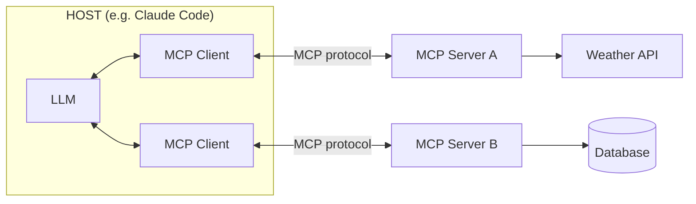
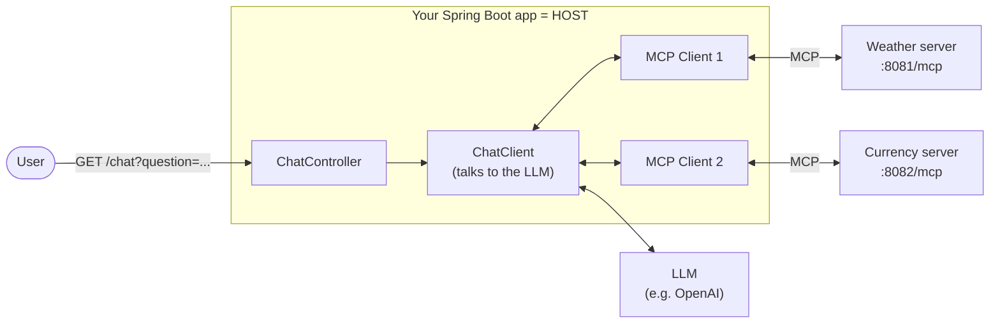
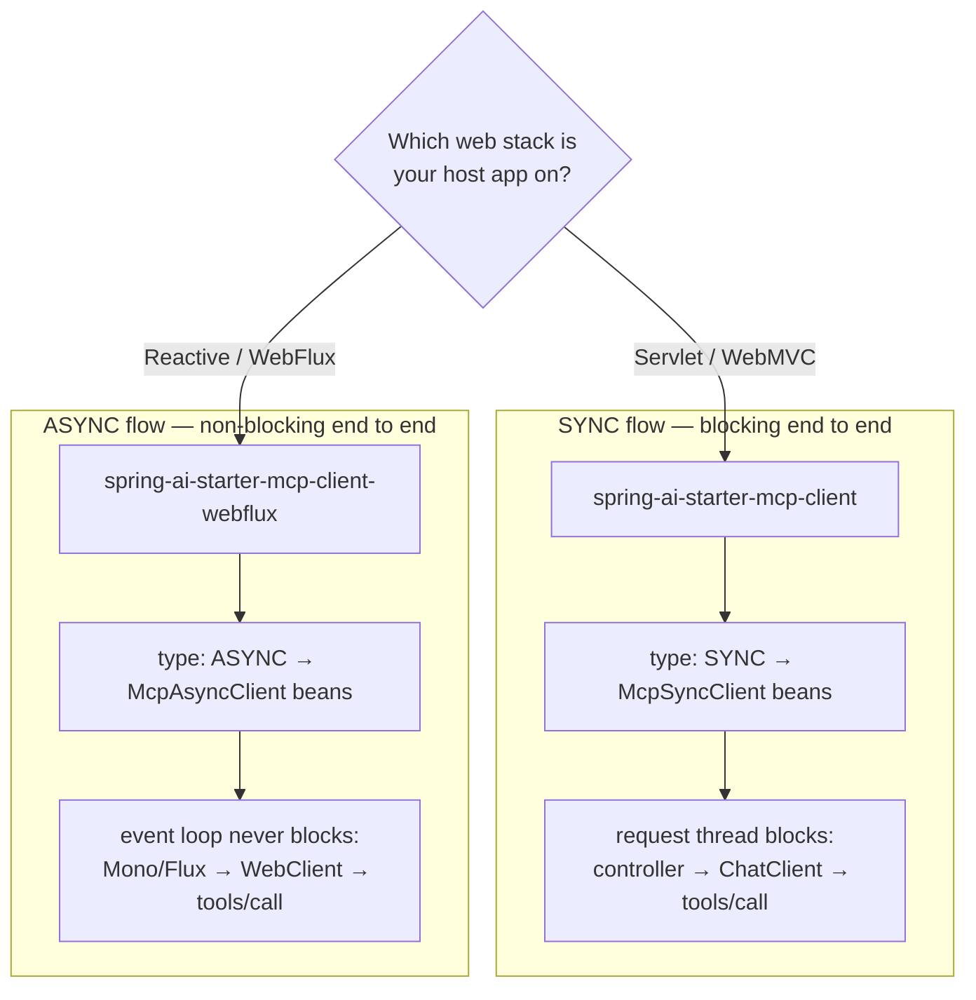
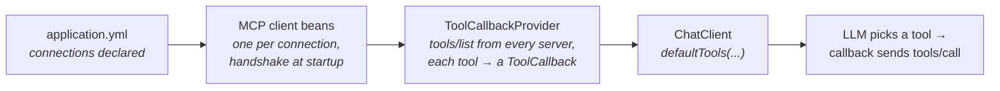

# MCP Clients with Spring AI — an Introduction

- **An MCP client is the connector inside your AI application** (the *host*) that
  maintains a 1-to-1 connection with one MCP server and speaks the protocol on the
  host's behalf.
- **With Spring AI you don't hand-write that connector** — a Boot starter
  auto-configures the clients from `application.yml` and hands the discovered tools to
  your `ChatClient`.
- **There isn't just one kind of MCP client.** Spring AI lets you vary two
  independent things:
  1. the **web stack** — Servlet (WebMVC) or Reactive (WebFlux), chosen by starter;
  2. the **programming model** — `SYNC` (blocking, `McpSyncClient`) or `ASYNC`
     (non-blocking, `McpAsyncClient`), chosen by a property.
- **Whatever you pick, your application code is identical:** a `ToolCallbackProvider`
  full of tools, wired into a `ChatClient`. This doc is the introduction; the
  [`mcp-client/webmvc`](../mcp-client/webmvc) and [`mcp-client/webflux`](../mcp-client/webflux)
  sections do the deep dives.

<!-- TOC -->
* [MCP Clients with Spring AI — an Introduction](#mcp-clients-with-spring-ai--an-introduction)
  * [1. Revisiting the architecture: Host, Client, Server](#1-revisiting-the-architecture-host-client-server)
  * [2. Your Spring Boot app *is* the host](#2-your-spring-boot-app-is-the-host)
  * [3. The kinds of MCP clients you can build](#3-the-kinds-of-mcp-clients-you-can-build)
    * [Approach 1 — Web stack: two starters](#approach-1--web-stack-two-starters)
    * [Approach 2 — Programming model: SYNC vs ASYNC](#approach-2--programming-model-sync-vs-async)
    * [Putting the approaches together](#putting-the-approaches-together)
  * [4. The pipeline every client follows](#4-the-pipeline-every-client-follows)
  * [5. What we build in this section](#5-what-we-build-in-this-section)
  * [References](#references)
<!-- TOC -->

## 1. Revisiting the architecture: Host, Client, Server

MCP defines three participants. Getting these straight makes everything else easy:

| Role | What it is | Example |
|---|---|---|
| **Host** | The AI application the user interacts with. It contains the LLM (or calls one) and decides what to do. | Claude Code, your Spring AI chatbot |
| **MCP Client** | A connector *inside the host* that maintains a 1-to-1 connection with one MCP server and speaks the protocol. | Spring AI's MCP client, the client built into Claude Code |
| **MCP Server** | A (usually small) program that exposes capabilities — tools, data, prompts — in the standard MCP format. | The weather servers in this repo, a GitHub server, a database server |



Two details of this picture matter for everything that follows:

- **One client per server.** A host talking to three servers holds three MCP clients.
  You won't create them by hand — you'll *declare* three connections and Spring AI
  builds the three clients.
- **The client is plumbing, not intelligence.** It performs the handshake, asks
  `tools/list`, forwards `tools/call`, and returns results. Deciding *which* tool to
  call is the LLM's job, orchestrated by the host.

## 2. Your Spring Boot app *is* the host

So far in this course, the host was someone else's app — MCP Inspector or Claude
Desktop connecting to *our* servers. In this section the roles flip: **your Spring Boot
application becomes the host**, with the LLM and the MCP clients inside it.



The host app has exactly two jobs, and Spring AI provides a building block for each:

| Job | Building block | Provided by |
|---|---|---|
| Talk to the **LLM** | `ChatClient` | a model starter, e.g. `spring-ai-starter-model-openai` |
| Talk to the **MCP servers** | auto-configured MCP clients + `ToolCallbackProvider` | an MCP **client** starter (this doc) |

Note what you *don't* write: no JSON-RPC handling, no `initialize` handshake, no
`tools/list` or `tools/call` plumbing. You declare connections in `application.yml`;
the starter turns each one into a live MCP client at startup.

## 3. The kinds of MCP clients you can build

"Which MCP client should I build?" is really two smaller questions, and they are
**independent** — you answer each one separately.

### Approach 1 — Web stack: two starters

Just like MCP *servers*, Spring AI ships the MCP *client* in two flavors matching the
two Spring web stacks:

| Starter | Stack | HTTP transport built on | Used by |
|---|---|---|---|
| `spring-ai-starter-mcp-client` | Servlet (WebMVC) | Java `HttpClient` | [`mcp-client/webmvc`](../mcp-client/webmvc) |
| `spring-ai-starter-mcp-client-webflux` | Reactive (WebFlux) | `WebClient` (non-blocking) | [`mcp-client/webflux`](../mcp-client/webflux) |

```groovy
// Servlet stack
implementation 'org.springframework.boot:spring-boot-starter-webmvc'
implementation 'org.springframework.ai:spring-ai-starter-mcp-client'

// Reactive stack
implementation 'org.springframework.boot:spring-boot-starter-webflux'
implementation 'org.springframework.ai:spring-ai-starter-mcp-client-webflux'
```

The rule of thumb is simple: **match the starter to the web stack your host app
already uses.** A WebMVC app takes the plain client starter; a WebFlux app takes the
webflux one, so MCP traffic rides the same non-blocking machinery as everything else.

### Approach 2 — Programming model: SYNC vs ASYNC

One property decides whether the auto-configured clients are blocking or non-blocking:

```yaml
spring:
  ai:
    mcp:
      client:
        type: SYNC        # or ASYNC
```

| | `SYNC` (default) | `ASYNC` |
|---|---|---|
| Client bean created per connection | `McpSyncClient` | `McpAsyncClient` |
| Tool provider bean | `SyncMcpToolCallbackProvider` | `AsyncMcpToolCallbackProvider` |
| A `tools/call` … | blocks the calling thread until the result returns | returns a `Mono`, resolved on a reactive pipeline |
| Natural fit | WebMVC host — thread-per-request, blocking is the model | WebFlux host — never block an event-loop thread |

This is a *programming-model* choice, not a wire choice: a SYNC and an ASYNC client
send byte-for-byte the same JSON-RPC messages. Our two client apps demonstrate the
natural pairings — [`webmvc`](../mcp-client/webmvc) runs `SYNC`,
[`webflux`](../mcp-client/webflux) runs `ASYNC`.

### Putting the approaches together

The two choices are independent, but they shouldn't be made independently: **the better
approach is to keep each flow consistent end to end** — one fully **blocking (SYNC)
flow** on WebMVC, or one fully **non-blocking (ASYNC) flow** on WebFlux. Blocking vs
non-blocking only pays off when the *whole* request path follows the same model:



Why the matched pairings, and not a mix?

- **WebMVC + SYNC** — a servlet app dedicates a thread to each request anyway, so a
  blocking `tools/call` is exactly what the stack expects. Adding ASYNC here buys no
  extra throughput (the request thread still has to wait for the answer) — it only adds
  reactive plumbing to otherwise simple, debuggable, top-to-bottom code.
- **WebFlux + ASYNC** — a reactive app serves many requests from a few event-loop
  threads, which must **never block**. ASYNC keeps the MCP calls as `Mono`s on the same
  non-blocking pipeline, preserving WebFlux's scalability and enabling token-by-token
  streaming. A SYNC client here would block an event-loop thread on every tool call —
  the one thing that breaks the reactive model.


The other combinations are legitimate too (a WebFlux starter can run `SYNC`, for
example) — but these two pairings are the idiomatic ones, and the ones we build.

## 4. The pipeline every client follows

Here's the part that makes the two approaches cheap to choose: **they all converge on the
same pipeline.** Whatever stack and model you picked:



1. **Declare** — each entry under `connections` describes one server.
2. **Connect** — at startup the starter builds one client per entry and performs the
   MCP `initialize` handshake.
3. **Discover** — the auto-configured `ToolCallbackProvider` calls `tools/list` on
   every connected server and adapts each MCP tool into a Spring AI `ToolCallback`.
4. **Register** — you inject that provider and hand it to your `ChatClient`. This is
   the *only* line of MCP-related code in the whole host app:

   ```java
   public ChatController(ChatClient.Builder builder, ToolCallbackProvider tools) {
       this.chatClient = builder
           .defaultSystem("You are a helpful assistant ...")
           .defaultTools(tools.getToolCallbacks())
           .build();
   }
   ```

5. **Call** — when the LLM decides a tool is needed, the callback forwards it as a
   `tools/call` to the right server and feeds the result back into the conversation.

Tools from *all* connected servers land in one flat list, so the model sees weather,
currency tools side by side and picks the right one per question —
that's the **M + N promise** from the [intro README](../README.md) working in our favor:
adding a third server is one more YAML block, zero new code.

## 5. What we build in this section

Both client apps expose the same tiny REST surface — ask a question, the LLM answers
using whichever MCP tools it needs:

```bash
# webmvc host (port 9000)
curl "http://localhost:9000/chat?question=Is+it+warmer+in+Chicago+or+Seattle+today%3F"

# webflux host (port 9001) — same, plus token-by-token streaming
curl -N "http://localhost:9001/chat/stream?question=What+is+the+EUR+to+USD+exchange+rate%3F"
```

Each app connects to the two servers built in the server section (weather `:8081`,
currency converter `:8082`).

- ➡️ [`mcp-client/webmvc`](../mcp-client/webmvc) — the Servlet/SYNC host
- ➡️ [`mcp-client/webflux`](../mcp-client/webflux) — the Reactive/ASYNC host


## References

- [MCP intro README](../README.md) — Host / Client / Server, the REST analogy, and the tool-call walkthrough this doc builds on
- [MCP transports and Spring AI's support for them](mcp-transports.md) — STDIO vs Streamable HTTP in depth, including the client-side starters table
- [Spring AI MCP Client Boot Starter reference](https://docs.spring.io/spring-ai/reference/api/mcp/mcp-client-boot-starter-docs.html) — every property, both starters, SYNC and ASYNC
- The client app READMEs: [`mcp-client/webmvc`](../mcp-client/webmvc/README.md) and [`mcp-client/webflux`](../mcp-client/webflux/README.md)
