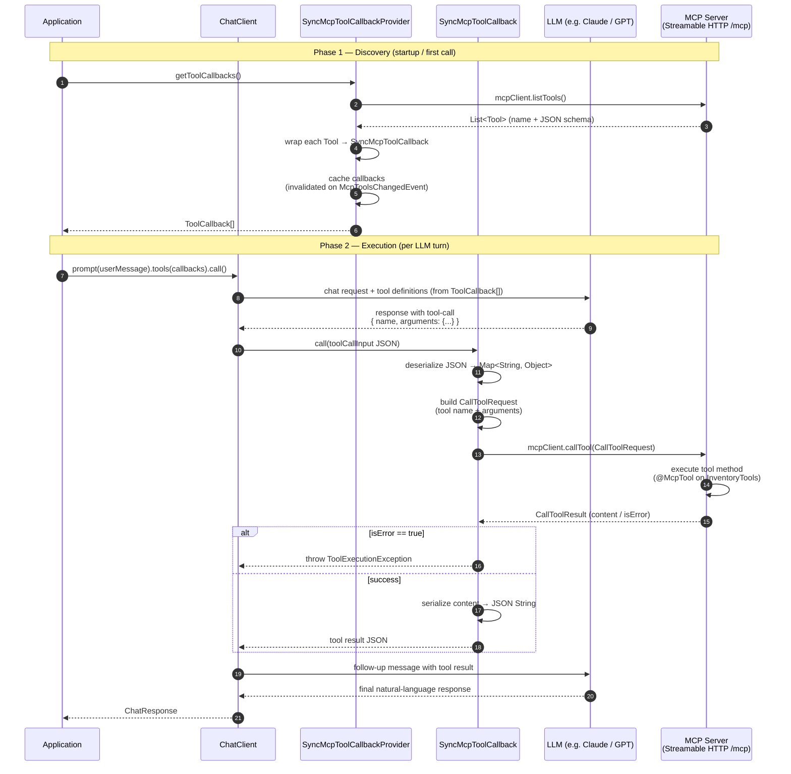

# MCP Tool Call Flow in Spring AI

How Spring AI's Chat Client discovers MCP tools and executes them when the LLM decides to call one.

---

## Two-phase flow

The overall flow has two distinct phases that happen at different points in time.

| Phase | When | Class |
|-------|------|-------|
| **Discovery** | App startup / first Chat call | `SyncMcpToolCallbackProvider` |
| **Execution** | Every time the LLM picks a tool | `SyncMcpToolCallback` |

---

## Phase 1 — Discovery (`SyncMcpToolCallbackProvider`)

Before any prompt is sent to the LLM, Spring AI needs to know what tools are available so it can
include their schemas in the LLM request.

`SyncMcpToolCallbackProvider.getToolCallbacks()` calls `mcpClient.listTools()` on each registered
MCP server and wraps every returned `Tool` in a `SyncMcpToolCallback`. The result is cached and
only re-fetched when a `McpToolsChangedEvent` is received (dynamic tool list changes).

## Phase 2 — Execution (`SyncMcpToolCallback`)

When the LLM responds with a tool-call, Spring AI invokes `SyncMcpToolCallback.call()`:

1. Deserializes the JSON argument string into `Map<String, Object>`.
2. Builds a `CallToolRequest` with the original MCP tool name and the arguments.
3. Calls `mcpClient.callTool(request)` over Streamable HTTP → receives `CallToolResult`.
4. Checks `result.isError()` — throws `ToolExecutionException` if the server reported an error.
5. Serializes `result.content()` back to a JSON string — this is returned to the LLM as the tool result.

---

## Mermaid diagram

---

## Key classes

### `SyncMcpToolCallbackProvider`

- Implements `ToolCallbackProvider` and `ApplicationListener<McpToolsChangedEvent>`.
- Holds a list of `McpSyncClient` instances (one per MCP server).
- `getToolCallbacks()` is called by the Chat Client before building the LLM request.
- Caches tool callbacks behind a `ReentrantLock`; sets `invalidateCache = true` on tool-list change events.

### `SyncMcpToolCallback`

- Implements Spring AI's `ToolCallback` interface.
- Wraps a single MCP `Tool` and the `McpSyncClient` that owns it.
- `getToolDefinition()` returns the tool name and JSON schema — this is what the LLM sees.
- `call(String toolCallInput, ToolContext ctx)` is the method Spring AI invokes when the LLM picks this tool:
  - Builds `CallToolRequest` (`io.modelcontextprotocol.spec.McpSchema`).
  - Delegates to `mcpClient.callTool()` over Streamable HTTP.
  - Unpacks `CallToolResult` and returns the content as a JSON string.

### `CallToolRequest` / `CallToolResult`

- Defined in `io.modelcontextprotocol.spec.McpSchema` (the MCP Java SDK).
- `CallToolRequest` — carries the tool name and a `Map<String, Object>` of arguments.
- `CallToolResult` — carries a list of content items and an `isError` flag.

---

## Where the original tool name matters

`SyncMcpToolCallback` stores both a **prefixed name** (used in `getToolDefinition()` so the Chat
Client can route the call back to the right callback) and the **original MCP tool name** (used in
`CallToolRequest` so the server recognises it). The two can differ when multiple MCP servers expose
tools with the same base name.
