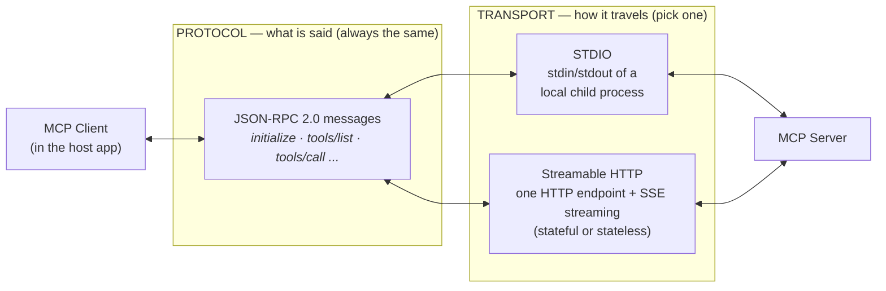
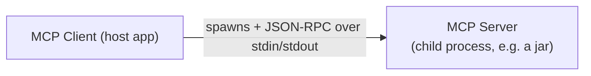
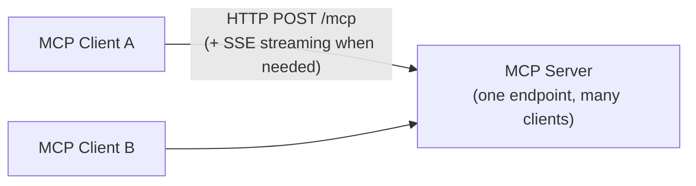

# MCP Transports and Spring AI's Support for Them

- **MCP messages are plain JSON-RPC 2.0** — every request and response, on every
  transport, is the same message format.
  - *How is that different from JSON?* JSON is just a data format — it defines how to
    write objects, arrays, and strings, but says nothing about what a message means.
    JSON-RPC 2.0 is a small **protocol built on top of JSON**: it fixes the shape of a
    remote call and its response. Both documents below are valid JSON, but only the
    second one is a JSON-RPC message:

    ```json
    // Plain JSON — just data; the receiver has no idea what to do with it
    {
      "city": "Chicago",
      "unit": "celsius"
    }
    ```

    ```json
    // JSON-RPC 2.0 — the same data, wrapped as a *call*: invoke the method
    // "tools/call" with these params, and reply to request id 1
    {
      "jsonrpc": "2.0",
      "id": 1,
      "method": "tools/call",
      "params": {
        "name": "getWeather",
        "arguments": { "city": "Chicago", "unit": "celsius" }
      }
    }
    ```

    | Aspect | JSON | JSON-RPC 2.0 |
    |---|---|---|
    | What it is | A data *format* (syntax for objects, arrays, strings…) | A remote-procedure-call *protocol* whose messages are written in JSON |
    | Answers the question | "How do I write structured data as text?" | "How do I ask another process to run a method and get the result back?" |
    | Required structure | None — any valid document is fine | Fixed envelope: `jsonrpc: "2.0"`, `method`, optional `params`, and an `id` |
    | Request/response link | Not a concept — there are no requests | Response echoes the request's `id`, so the client can match them up |
    | Errors | Not a concept | Standard `error` object with `code` and `message` |
    | One-way messages | Not a concept | A request without an `id` is a *notification* (no reply expected) |
    | Relationship | Every JSON-RPC message is valid JSON | Not every JSON document is a JSON-RPC message |
- **A *transport* answers one question:** how do those messages physically travel
  between the MCP client and the MCP server?
- **The protocol never changes; only the wire does.** What the messages *say* is
  identical across every transport — the transport just carries them.
- **That separation is the payoff:** the same weather server in this repo runs as a
  local child process (STDIO) *or* as a networked HTTP service (Streamable HTTP)
  without changing a line of tool code.



Read it left to right: the client and the server always exchange the **same JSON-RPC 2.0
messages** — the transport in the middle is just an interchangeable wire, chosen per
connection.

<!-- TOC -->
* [MCP Transports and Spring AI's Support for Them](#mcp-transports-and-spring-ais-support-for-them)
  * [1. The transports MCP defines](#1-the-transports-mcp-defines)
    * [STDIO — local child process](#stdio--local-child-process)
    * [Streamable HTTP — the networked standard](#streamable-http--the-networked-standard)
      * [Option 1 — Stateful (the default)](#option-1--stateful-the-default)
      * [Option 2 — Stateless](#option-2--stateless)
    * [Choosing a transport](#choosing-a-transport)
  * [2. How Spring AI supports every transport](#2-how-spring-ai-supports-every-transport)
    * [Client side](#client-side)
    * [Server side](#server-side)
  * [References](#references)
<!-- TOC -->

## 1. The transports MCP defines

### STDIO — local child process

STDIO (standard input/output) is the simplest MCP transport: everything runs on one
machine, with no network involved. It's the standard choice for servers that live on the
user's own computer — the host application starts and manages the server itself.

The client **launches the server as a child process** and the two talk over the
process's standard input and standard output: JSON-RPC requests go in via `stdin`,
responses come back via `stdout`.



- **No network at all** — nothing to deploy, no port, no URL, no TLS.
- One client per server process; the server's lifecycle is tied to the client's.

**When to use STDIO** — whenever the server needs to run *on the user's machine*,
because that's where the data or capability lives:

- **Access to local files and folders** — e.g. the official filesystem MCP server that
  desktop hosts spawn so the model can read/edit files in a project directory. You
  *can't* serve someone's local disk from a remote HTTP service.
- **Local developer tools** — wrapping `git`, a local SQLite database, docker, or build
  tools for an AI coding assistant. The tool binary is already installed locally; the
  MCP server is just a thin adapter around it.
- **Single-user desktop integrations** — a server distributed as a jar/npx package that
  end users add to their desktop host's config; the host launches it on demand, no one
  has to operate a service.
- **Development-time testing** — MCP Inspector spawning your jar (as with this repo's
  [`stdio` server](../mcp-server/stdio)) to exercise tools before any deployment exists.

> ⚠️ **The classic STDIO gotcha:** the protocol *owns* `stdout`. Any stray console
> output — the Spring Boot banner, a log line, a `System.out.println` — corrupts the
> JSON-RPC stream and the client fails to connect. A STDIO server must keep its console
> completely silent (see the [`stdio` server README](../mcp-server/stdio/README.md) for
> the exact Spring Boot configuration).

### Streamable HTTP — the networked standard

Streamable HTTP is the transport for MCP servers that run as **network services**: the
server is deployed once — on a port, behind a URL, like any web application — and any
number of clients connect to it remotely. If STDIO is "a tool on your machine",
Streamable HTTP is "a service on the network".

It is the current standard remote transport (it replaced HTTP + SSE in the 2025-03-26
revision of the MCP spec). The server exposes a **single HTTP endpoint** (e.g. `/mcp`) that
accepts JSON-RPC over `POST`; when the server needs to stream (progress updates,
multiple messages for one request), the response upgrades to a Server-Sent-Events
stream on that same endpoint.



- **Networked and multi-client** — deploy the server once, any number of hosts connect.
  This is exactly the REST API model you already know: you deploy one
  `@RestController`-based service, and any number of clients — browsers, mobile apps,
  other services — call it concurrently. A Streamable HTTP MCP server works the same
  way, just with MCP clients instead of REST clients.

Streamable HTTP comes in **two options**. The wire format is identical — they differ
only in whether the server keeps a session:

#### Option 1 — Stateful (the default)

The server issues a session id (`Mcp-Session-Id` header) on initialize, and the client
sends it with every subsequent request.

- **Pros:** the session unlocks the full protocol — server → client features like
  notifications, sampling, and elicitation.
- **Cons:** scaling out needs session affinity (sticky sessions) or a shared session
  store, since a client's requests must reach the instance that knows its session.

#### Option 2 — Stateless

The server keeps **no session state**: every request is self-contained, like a classic
stateless REST API.

- **Pros:** server restarts and horizontal scaling are invisible to clients — any
  instance can serve any request, no sticky sessions behind the load balancer.
- **Cons:** no server → client features (notifications, sampling, elicitation), since
  those require a session to push into.
- Clients don't need a special mode — a stateless server simply never issues a session
  id.

**When to use Streamable HTTP** (either option) — whenever the capability lives
*behind a service*, not on the user's machine:

- **Exposing an existing backend service to AI** — like this repo's
  [inventory server](../mcp-server/inventory-mcp-server): the product catalog already
  lives in a service with a database; the MCP endpoint is just another interface to it.
  Spawning a copy per user with STDIO would make no sense.
- **Shared team/company tool servers** — one deployed server (issue tracker, internal
  wiki, CI status) that every developer's host connects to, with normal service-side
  auth, monitoring, and upgrades — update the server once, all clients benefit.
- **Third-party / SaaS integrations** — vendors host one MCP server for all their
  customers (the way GitHub, Slack and others expose hosted MCP endpoints); shipping
  users a local process is not an option.
- **Server-to-server setups** — a Spring AI application in your data center consuming
  MCP servers that are themselves deployed services (this repo's
  [client apps](../mcp-client) do exactly this), scaled and load-balanced like any
  other microservice.

### Choosing a transport

| | STDIO | Streamable HTTP | Stateless Streamable HTTP |
|---|---|---|---|
| **Wire** | stdin/stdout of a child process | one HTTP endpoint, SSE upgrade for streaming | same as Streamable HTTP |
| **Reach** | local machine only | network | network |
| **Clients per server** | exactly one | many | many |
| **Sessions / server push** | yes (implicit — dedicated process) | yes (`Mcp-Session-Id`) | no |
| **Scale out** | n/a | needs session affinity (or a shared session store) | trivially — any instance can serve any request |
| **Use when…** | local tools, desktop hosts, dev | remote servers needing full protocol features | remote servers behind load balancers, simple tool-only servers |

## 2. How Spring AI supports every transport

Spring AI covers **all of the above, on both sides** of the protocol, through Boot
starters — you pick the transport with dependencies and a few properties, and the
auto-configuration wires up the right transport implementation underneath.

### Client side

Two starters, depending on your stack:

| Starter | Stack | Transports provided |
|---|---|---|
| `spring-ai-starter-mcp-client` | Servlet / plain | STDIO, Streamable HTTP, Stateless Streamable HTTP, SSE (Java `HttpClient` based) |
| `spring-ai-starter-mcp-client-webflux` | Reactive | Streamable HTTP, Stateless Streamable HTTP, SSE (`WebClient` based, e.g. `WebClientStreamableHttpTransport`) |

```groovy
// Servlet stack (this repo's mcp-client/webmvc)
implementation 'org.springframework.ai:spring-ai-starter-mcp-client'

// Reactive stack (this repo's mcp-client/webflux)
implementation 'org.springframework.ai:spring-ai-starter-mcp-client-webflux'
```

You declare *connections* in `application.yml`, grouped by transport — this is exactly
what the [client apps in this repo](../mcp-client) do:

```yaml
spring:
  ai:
    mcp:
      client:
        name: my-weather-client-webmvc
        version: 0.0.1
        type: SYNC                      # or ASYNC
        request-timeout: 30s
        streamable-http:                # ── Streamable HTTP connections
          connections:
            weather-server:
              url: http://localhost:8081
              endpoint: /mcp
            currency-converter:
              url: http://localhost:8082
              endpoint: /mcp
```

For a STDIO connection the client declares the **command to launch** instead of a URL —
the client spawns the server itself:

```yaml
spring:
  ai:
    mcp:
      client:
        stdio:                          # ── STDIO connections
          connections:
            weather-stdio:
              command: java
              args:
                - -jar
                - mcp/mcp-server/stdio/build/libs/stdio-0.0.2-SNAPSHOT.jar
```

Every connection, whatever its transport, ends up as the same thing: a set of
discovered tools exposed through a `ToolCallbackProvider` that you hand to your
`ChatClient`. **Your application code never sees the transport.**

### Server side

Three starters — pick by transport and web stack:

| Starter | Stack | Transports provided |
|---|---|---|
| `spring-ai-starter-mcp-server` | none (no web server) | STDIO |
| `spring-ai-starter-mcp-server-webmvc` | Servlet (Tomcat) | Streamable HTTP, Stateless, SSE |
| `spring-ai-starter-mcp-server-webflux` | Reactive (Netty) | Streamable HTTP, Stateless, SSE |

```groovy
// Servlet stack (this repo's mcp-server/webmvc and inventory-mcp-server)
implementation 'org.springframework.ai:spring-ai-starter-mcp-server-webmvc'

// Reactive stack (this repo's mcp-server/webflux and currency-converter-mcp)
implementation 'org.springframework.ai:spring-ai-starter-mcp-server-webflux'
```

For the HTTP starters, a **single property selects the transport** — the
`@Tool`-annotated service code is identical in all cases:

```yaml
spring:
  ai:
    mcp:
      server:
        name: my-weather-server-webmvc
        version: 0.0.1
        type: SYNC
        protocol: STREAMABLE            # STREAMABLE | STATELESS | SSE (legacy, default)
        streamable-http:
          mcp-endpoint: /mcp            # same endpoint property is used by STATELESS mode
```

A STDIO server instead sets `stdio: true`, disables the web stack, and silences the
console (the gotcha from section 1):

```yaml
spring:
  main:
    web-application-type: none
    banner-mode: "off"                  # keep stdout silent — the protocol owns it
  ai:
    mcp:
      server:
        name: my-weather-server
        type: SYNC
        stdio: true
logging:
  pattern:
    console: ""                         # no console logging either
  file:
    name: ./build/mcp-weather-stdio-server.log
```

Under the hood each combination maps to a dedicated transport implementation that
Spring AI maintains:

| Transport | WebMVC class | WebFlux class |
|---|---|---|
| Streamable HTTP | `WebMvcStreamableServerTransportProvider` | `WebFluxStreamableServerTransportProvider` |
| Stateless | `WebMvcStatelessServerTransport` | `WebFluxStatelessServerTransport` |
| SSE (legacy) | `WebMvcSseServerTransportProvider` | `WebFluxSseServerTransportProvider` |

With the Boot starters you normally never touch these classes — auto-configuration
instantiates the right one from the properties above.

## References

- [Spring AI MCP overview](https://docs.spring.io/spring-ai/reference/api/mcp/mcp-overview.html) — transports, starters, and migration notes (source for section 2)
- [MCP specification — transports](https://modelcontextprotocol.io/specification/latest/basic/transports) — the authoritative definition of STDIO and Streamable HTTP
- [MCP intro README](../README.md) — the concepts (host / client / server) this doc builds on
- The sub-project READMEs under [`mcp-server/`](../mcp-server) and [`mcp-client/`](../mcp-client) — per-transport deep dives
