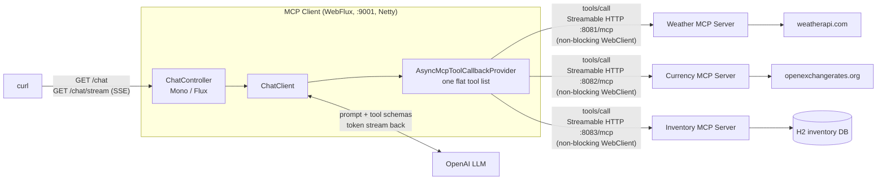

<!-- TOC -->
* [MCP Client (WebFlux)](#mcp-client-webflux)
  * [How it differs from the WebMVC client](#how-it-differs-from-the-webmvc-client)
  * [How it works](#how-it-works)
    * [Architecture at a glance](#architecture-at-a-glance)
    * [From YAML to `ToolCallbackProvider`](#from-yaml-to-toolcallbackprovider)
    * [Reactive endpoints](#reactive-endpoints)
  * [Where MCP shines: new capabilities without new integration code](#where-mcp-shines-new-capabilities-without-new-integration-code)
  * [Running](#running)
  * [Troubleshooting](#troubleshooting)
<!-- TOC -->

# MCP Client (WebFlux)

A Spring Boot MCP **client** that connects to three MCP servers over **Streamable HTTP** — the [MCP Weather Server (WebFlux)](../../mcp-server/webflux), the [Currency Converter MCP Server](../../mcp-server/currency-converter-mcp) and the [Inventory MCP Server](../../mcp-server/inventory-mcp-server) — and exposes their tools to a single OpenAI-backed `ChatClient`. It is the fully **reactive** counterpart of the [WebMVC client](../webmvc).

## How it differs from the WebMVC client

| | WebMVC client | WebFlux client (this module) |
|---|---|---|
| Boot starter | `spring-ai-starter-mcp-client` | `spring-ai-starter-mcp-client-webflux` |
| Web stack | Servlet (Tomcat) | Reactive (Netty) |
| MCP client type | `type: SYNC` → `McpSyncClient` | `type: ASYNC` → `McpAsyncClient` |
| HTTP transport | blocking `RestClient` | non-blocking `WebClient` |
| Tool provider | `SyncMcpToolCallbackProvider` | `AsyncMcpToolCallbackProvider` |
| Controller | returns `String` | returns `Mono<String>` / `Flux<String>` |
| Port | 9000 | **9001** |

Everything else — the Streamable HTTP protocol, the stateful vs. stateless session discussion, and how tools reach the LLM — is identical; see the [WebMVC client README](../webmvc/README.md) for the deep dive.

## How it works

- Uses the [`spring-ai-starter-mcp-client-webflux`](https://docs.spring.io/spring-ai/reference/api/mcp/mcp-client-boot-starter-docs.html) Boot starter with `ASYNC` clients.
- Connects to the WebFlux weather server at `http://localhost:8081/mcp`, the currency converter at `http://localhost:8082/mcp` and the inventory server at `http://localhost:8083/mcp` (see `application.yml`):

```yaml
spring:
  ai:
    mcp:
      client:
        type: ASYNC
        streamable-http:
          connections:
            weather-server:
              url: http://localhost:8081
              endpoint: /mcp
            currency-converter:
              url: http://localhost:8082
              endpoint: /mcp
            inventory-server:
              url: http://localhost:8083
              endpoint: /mcp
```

- The starter creates one `McpAsyncClient` **per connection entry**, auto-discovers every server's tools (`getWeatherForecastByLocation` and `getForecastWeatherByLocation` from the weather server, `getCurrencyRates` from the currency converter, and the four inventory lookup tools such as `searchInventoryItemsByProductName` from the inventory server), and merges them all into a single `ToolCallbackProvider`, whose callbacks `ChatController` registers on the `ChatClient` via `defaultToolCallbacks(...)` (resolved once at startup — the async provider blocks on `tools/list`, which is not allowed on a Netty event-loop thread). The LLM sees one flat tool list and picks the right server's tool per question — adding another server is just another `connections:` entry, no code changes.
- On startup, `McpClientApplication` logs the tools discovered from every connected MCP server — reactively, via `McpAsyncClient.listTools()` which returns a `Mono`.

### Architecture at a glance



- The `ChatClient` sends every question to the LLM together with the tool schemas discovered from **all** servers; when the LLM asks for a tool, the provider routes the `tools/call` to whichever MCP server owns it.
- Nothing in this pipeline blocks: MCP calls ride a reactive `WebClient`, and on `/chat/stream` the LLM's tokens flow straight through to the caller as Server-Sent Events.

### From YAML to `ToolCallbackProvider`

Same auto-configuration flow as the WebMVC client, with the async variants swapped in:

- **Connections → `McpAsyncClient` beans**
  - Each entry under `spring.ai.mcp.client.streamable-http.connections` produces one MCP client.
  - Because `type: ASYNC`, the three entries — `weather-server`, `currency-converter` and `inventory-server` — create three `McpAsyncClient`s backed by non-blocking `WebClient` streamable HTTP transports.
  - On startup, each client performs the MCP `initialize` handshake against its own server: `http://localhost:8081/mcp`, `http://localhost:8082/mcp` and `http://localhost:8083/mcp`.

- **Clients → one `ToolCallbackProvider` bean**
  - The starter wraps *all* `McpAsyncClient`s in a single `AsyncMcpToolCallbackProvider`.
  - The provider calls `tools/list` on each server and adapts every MCP tool into a Spring AI `ToolCallback`.

- **Provider → `ChatClient` → LLM**
  - `ChatController` resolves the provider's callbacks once at startup and registers them via `defaultToolCallbacks(...)`; when the model picks a tool, the callback issues an MCP `tools/call` over the same streamable HTTP connection — without blocking an event-loop thread.

### Reactive endpoints

The controller never blocks:

- `GET /chat` — streams the model's answer internally and aggregates it into a single `Mono<String>` response.
- `GET /chat/stream` — returns the answer as it is generated, token by token, as a `Flux<String>` over Server-Sent Events. This is the natural fit for the reactive stack: LLM tokens flow from OpenAI through the client to the caller without buffering.

## Where MCP shines: new capabilities without new integration code

The currency converter was added to this client **without touching a line of Java** — the entire integration is three lines of YAML:

```diff
 spring:
   ai:
     mcp:
       client:
         streamable-http:
           connections:
             weather-server:
               url: http://localhost:8081
               endpoint: /mcp
+            currency-converter:
+              url: http://localhost:8082
+              endpoint: /mcp
```

- **No client-side code** — no HTTP client for openexchangerates.org, no DTOs, no `@Tool` method, no recompile.
- **Discovery instead of hardcoding** — each server *describes its own tools* over `tools/list` at startup, so the client discovers new capabilities instead of being coded against them.
- **Works for any server** — the same three lines would plug in any third-party MCP server you didn't write (GitHub, Slack, a database, …).

See the [WebMVC client's section](../webmvc/README.md#where-mcp-shines-new-capabilities-without-new-integration-code) for the full discussion of why this works.

## Running

1. Start the WebFlux weather server (in another terminal):

   ```bash
   WEATHER_API_KEY=<your-weatherapi-key> ./gradlew :mcp:mcp-server:webflux:bootRun
   ```

2. Start the currency converter server (in another terminal, listens on **8082**):

   ```bash
   CURRENCY_EXCHANGE_API_KEY=<your-openexchangerates-key> ./gradlew :mcp:mcp-server:currency-converter-mcp:bootRun
   ```

3. Start the inventory server (in another terminal, listens on **8083** — no API key needed):

   ```bash
   ./gradlew :mcp:mcp-server:inventory-mcp-server:bootRun
   ```

4. Start this client (listens on port **9001**):

   ```bash
   OPENAI_KEY=<your-openai-key> ./gradlew :mcp:mcp-client:webflux:bootRun
   ```

5. Ask a question — the LLM decides which MCP server's tool to call:

   ```bash
   curl -G http://localhost:9001/chat --data-urlencode "question=What is the current weather in New York?"

   curl -G http://localhost:9001/chat --data-urlencode "question=How much is 100 USD in EUR?"

   curl -G http://localhost:9001/chat --data-urlencode "question=Do we have any iPhones in stock?"

   # one question, two MCP servers: inventory price + currency conversion
   curl -G http://localhost:9001/chat --data-urlencode "question=How much does the iPhone 16 Pro cost in EUR?"

   # Streaming (SSE) variant — tokens arrive as they are generated
   curl -N -G http://localhost:9001/chat/stream --data-urlencode "question=Which laptops do we carry and what do they cost?"
   ```

## Troubleshooting

Same failure modes as the WebMVC client — see its [Troubleshooting](../webmvc/README.md#troubleshooting) section:

- **First request after a server restart fails** — the `STREAMABLE` protocol is stateful; the client re-handshakes automatically, just retry (or switch the server to `protocol: STATELESS`).
- **Client fails to start with `Client failed to initialize by explicit API call`** — the MCP server isn't running or the `url`/`endpoint` in `application.yml` is wrong. Start the server first.
