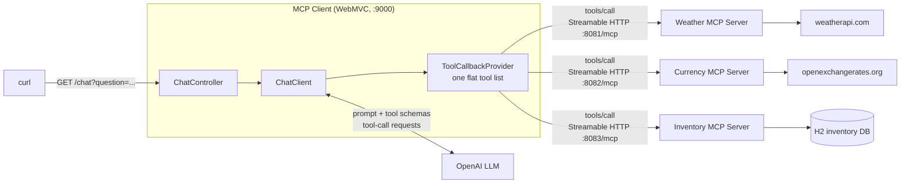
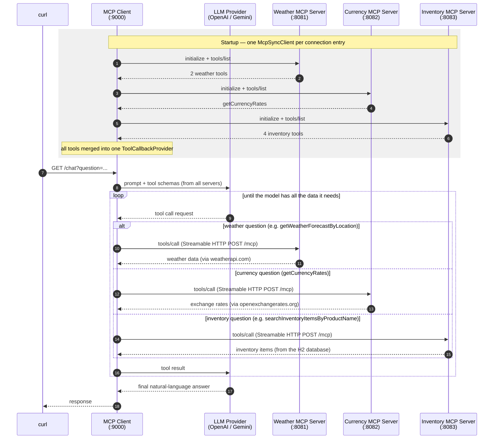
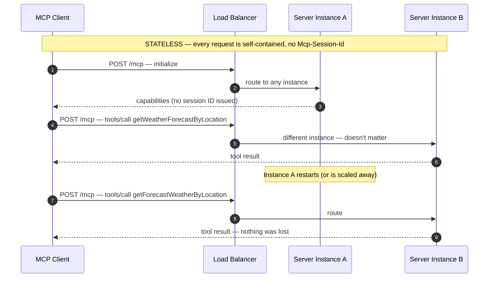

<!-- TOC -->
* [MCP Client (WebMVC)](#mcp-client-webmvc)
  * [How it works](#how-it-works)
    * [Architecture at a glance](#architecture-at-a-glance)
    * [From YAML to `ToolCallbackProvider`](#from-yaml-to-toolcallbackprovider)
    * [How it all fits together](#how-it-all-fits-together)
  * [Where MCP shines: new capabilities without new integration code](#where-mcp-shines-new-capabilities-without-new-integration-code)
  * [Stateful by default](#stateful-by-default)
    * [How the session works](#how-the-session-works)
    * [What a stateful session buys you](#what-a-stateful-session-buys-you)
    * [The trade-off](#the-trade-off)
    * [Scaling out: multiple server instances in the cloud](#scaling-out-multiple-server-instances-in-the-cloud)
      * [Options, in order of practicality](#options-in-order-of-practicality)
  * [Going stateless](#going-stateless)
    * [How it works under the hood](#how-it-works-under-the-hood)
    * [Benefits](#benefits)
  * [Running](#running)
  * [Troubleshooting](#troubleshooting)
<!-- TOC -->

# MCP Client (WebMVC)


A Spring Boot MCP **client** that connects to three MCP servers over **Streamable HTTP** — the [MCP Weather Server](../../mcp-server/webflux) (port **8081**), the [Currency Converter MCP Server](../../mcp-server/currency-converter-mcp) (port **8082**) and the [Inventory MCP Server](../../mcp-server/inventory-mcp-server) (port **8083**) — and exposes their tools to a single OpenAI-backed `ChatClient`.

## How it works

- Uses the default [`spring-ai-starter-mcp-client`](https://docs.spring.io/spring-ai/reference/api/mcp/mcp-client-boot-starter-docs.html) Boot starter with `SYNC` clients.
- Connects to the weather server, the currency converter and the inventory server (see `application.yml`):

```yaml
spring:
  ai:
    mcp:
      client:
        type: SYNC
        streamable-http:
          connections:
            weather-server:
              url: http://localhost:8081
              endpoint: /mcp
            currency-converter:
              url: http://localhost:8082
              endpoint: /mcp
            inventory-server:
              url: http://localhost:8083
              endpoint: /mcp
```

- The starter creates one `McpSyncClient` **per connection entry**, auto-discovers every server's tools (`getWeatherForecastByLocation` and `getForecastWeatherByLocation` from the weather server, `getCurrencyRates` from the currency converter, and the four inventory lookup tools such as `searchInventoryItemsByProductName` from the inventory server), and merges them all into a single `ToolCallbackProvider`, which `ChatController` registers on the `ChatClient` via `defaultTools(...)`. The LLM sees one flat tool list and picks the right server's tool per question.
- On startup, `McpClientApplication` logs the tools discovered from every connected MCP server.

### Architecture at a glance



- The `ChatClient` sends every question to the LLM together with the tool schemas discovered from **all** servers.
- When the LLM asks for a tool, the `ToolCallbackProvider` routes the `tools/call` to whichever MCP server owns that tool — the controller has no idea (and doesn't care) which server answers.
- Each server keeps its own upstream API, database, and credentials to itself; the client never talks to weatherapi.com, openexchangerates.org, or the inventory database directly.

### From YAML to `ToolCallbackProvider`

The `mcpToolCallbackProvider` injected into `ChatController` is wired up entirely by the starter's auto-configuration:

- **Connections → `McpSyncClient` beans**
  - Each entry under `spring.ai.mcp.client.streamable-http.connections` produces one MCP client.
  - The three entries — `weather-server`, `currency-converter` and `inventory-server` — create three `McpSyncClient`s (because `type: SYNC`).
  - On startup, each client performs the MCP `initialize` handshake against its own server: `http://localhost:8081/mcp`, `http://localhost:8082/mcp` and `http://localhost:8083/mcp`.
  - `name` / `version` are sent as the client info; `request-timeout` applies to every call.

- **Clients → one `ToolCallbackProvider` bean**
  - Active because `spring.ai.mcp.client.toolcallback.enabled` defaults to `true`.
  - The starter wraps *all* `McpSyncClient`s in a single `SyncMcpToolCallbackProvider`.
  - The provider calls `tools/list` on each server and adapts every MCP tool into a Spring AI `ToolCallback`.
  - Injection into `ChatController` is by type (`ToolCallbackProvider`) — the parameter name is just a local name.

- **Provider → `ChatClient` → LLM**
  - `ChatController` registers the provider via `defaultTools(...)`.
  - The tool names, descriptions, and input schemas are sent to the LLM with each request.
  - When the model picks a tool, the callback issues an MCP `tools/call` over the same streamable HTTP connection and returns the result to the model.

- **Adding another server**
  - Just add another entry under `connections:` — its tools automatically show up in the same provider, no code changes needed (see [Where MCP shines](#where-mcp-shines-new-capabilities-without-new-integration-code)).

### How it all fits together



- The **startup block** happens once: each auto-configured `McpSyncClient` does the MCP handshake and tool discovery, and the tools from all servers feed one `ToolCallbackProvider`.
- Everything after it happens **per request**: the client sends the question *plus* the discovered tool schemas to the LLM; the LLM never talks to the MCP servers directly — it only *asks* the client to run a tool, and the client routes the call to whichever server owns that tool.
- The **loop** repeats if the model decides to call more tools (e.g. weather *and* currency in one question).
- All client ↔ server traffic is JSON-RPC over Streamable HTTP: `POST http://localhost:8081/mcp` for weather, `POST http://localhost:8082/mcp` for currency, `POST http://localhost:8083/mcp` for inventory.

## Where MCP shines: new capabilities without new integration code

The currency converter was added to this client **without touching a line of Java**. The entire integration is three lines of YAML:

```diff
 spring:
   ai:
     mcp:
       client:
         streamable-http:
           connections:
             weather-server:
               url: http://localhost:8081
               endpoint: /mcp
+            currency-converter:
+              url: http://localhost:8082
+              endpoint: /mcp
```

A traditional integration would have meant writing an HTTP client for openexchangerates.org, modeling its request/response DTOs, handling auth and errors, writing a `@Tool` method with a schema so the LLM can call it — and recompiling and redeploying the client. With MCP, none of that lives in the client. Why it works:

- **Discovery instead of hardcoding** — at startup the client calls `tools/list` and each server *describes its own tools*: names, descriptions, and JSON input schemas. The client needs no compile-time knowledge of what a server offers.
- **One uniform protocol** — every server speaks the same JSON-RPC over Streamable HTTP, so a new server adds zero new protocol code on the client side.
- **The server owns its domain** — API keys and upstream quirks (weatherapi.com vs. openexchangerates.org) stay inside each server; the client and the LLM only ever see clean tool schemas.
- **Server upgrades are client-free** — a server can add or change tools and clients pick them up on the next startup (or live, via `tools/list_changed` notifications in stateful mode) with no client changes.

The same three lines would plug in *any* MCP server — including third-party ones (GitHub, Slack, a database, …) you didn't write.

##  Stateful by default

Streamable HTTP is **stateful** out of the box: the Spring AI server starter defaults to `spring.ai.mcp.server.protocol: STREAMABLE`, which manages a session per client.

### How the session works

- During the `initialize` handshake the server generates a session ID and returns it in the `Mcp-Session-Id` response header.
- The client sends that header on **every** subsequent request (`tools/list`, `tools/call`, …), so the server always knows which client it is talking to.
- Sessions live **in server memory** — they do not survive a server restart.

### What a stateful session buys you

The session is a persistent, addressable channel back to a specific client. Everything that flows *server → client* depends on it:

- **Notifications** — the server pushes `tools/list_changed`, resource/prompt change events, and log messages without the client polling.
- **Sampling** — mid-tool-call, the server can ask the *client's* LLM to generate content.
- **Elicitation** — the server can pause a tool call and ask the end user for missing input.
- **Progress + streaming** — long-running tools stream progress over the session's SSE channel, resumable via `Last-Event-ID` after a dropped connection.
- **Per-client server state** — e.g. resource subscriptions only make sense if the server remembers who subscribed.

### The trade-off

- A server **restart wipes all sessions**: the first request from an already-running client fails once, then the client re-handshakes automatically (see [Troubleshooting](#troubleshooting)).
- Horizontal scaling needs sticky sessions, since the session lives in one server instance's memory.
- For a pure request/response tool server like this weather example, none of the server → client features are used — switching the server to `protocol: STATELESS` removes the session entirely, making restarts invisible and scaling trivial at the cost of those features.

### Scaling out: multiple server instances in the cloud

With the stateful default, running several MCP server instances behind a load balancer breaks:

1. The client's `initialize` lands on **instance A**, which stores the session **in its own JVM memory** and returns the `Mcp-Session-Id`.
2. The next `tools/call` is routed to **instance B**, which has never heard of that session → "unknown session" 404.
3. The client invalidates and re-handshakes — possibly landing on **instance C**. With round-robin routing this session churn happens continuously, not just after restarts.

#### Options, in order of practicality

- **`protocol: STATELESS` (the standard answer).** No session IDs, so *any* instance can serve *any* request — round-robin, autoscaling, and rolling deploys all just work. The right fit for tool-only servers like this weather service.
- **Sticky sessions (keep stateful).** Route by the `Mcp-Session-Id` header (nginx / Envoy / Istio can hash on a header). Fragile: scale-in or a pod crash still kills every session pinned to that instance, load skews, and autoscaling fights the affinity.
- **Externalized session state (not really available).** Sharing sessions via Redis is not supported — the MCP Java SDK keeps the session map inside the transport provider with no pluggable store. Even then, the server → client SSE stream is a live connection bound to one instance, so cross-instance push would need an internal pub/sub layer.

**Decision rule:** tools only → `STATELESS` and scale freely; need notifications / sampling / elicitation → stateful with sticky sessions and few, long-lived instances.

## Going stateless

Switching is a one-line change in the **server's** `application.yml` (already present there, commented out):

```yaml
spring:
  ai:
    mcp:
      server:
        # protocol: STREAMABLE
        protocol: STATELESS
        streamable-http:
          mcp-endpoint: /mcp   # same endpoint property is used by STATELESS mode
```

No client changes are needed — the client simply never receives an `Mcp-Session-Id` header, so it stops sending one.



### How it works under the hood

- Every request carries everything the server needs — no session ID is issued after `initialize` and none is expected later, so the load balancer can send each request to **any** instance, and an instance disappearing mid-conversation (step in the diagram where A restarts) is invisible to the client.
- The auto-configuration swaps the entire server stack: instead of a session-based `McpSyncServer`, `McpServerStatelessAutoConfiguration` builds an **`McpStatelessSyncServer`** (or the async variant) on a **`WebMvcStatelessServerTransport`**, registered at the same `/mcp` endpoint.
- Each `POST /mcp` is a **self-contained JSON-RPC exchange**: parse the request → dispatch to the tool → return the result in the HTTP response body. Nothing is stored between requests.
- The server **never issues or validates** an `Mcp-Session-Id` header, and there is no `GET` SSE listening stream — the two ingredients that make the default mode stateful.
- `initialize` is still answered (so existing clients keep working), but the server records nothing about the client afterwards.
- Tool handlers receive a per-request **`McpTransportContext`** instead of an `McpSyncServerExchange` — that missing exchange object is *why* stateless tools cannot call back to the client (no sampling, elicitation, or notifications): there is simply no channel to send them on.

### Benefits

- **Restart-proof** — there is no session to lose, so the "first request after a restart fails" problem disappears entirely.
- **Scales horizontally for free** — any instance can serve any request: plain round-robin load balancing, autoscaling, rolling deploys, and spot/preemptible instances all just work.
- **Serverless-friendly** — fits scale-to-zero platforms (Cloud Run, Lambda) where instances are ephemeral by design.
- **Lower memory + simpler ops** — no in-memory session map; every request is independent and reproducible with a single `curl`, which makes debugging easier.

## Running

1. Start the weather server (in another terminal, listens on **8081**):

   ```bash
   WEATHER_API_KEY=<your-weatherapi-key> ./gradlew :mcp:mcp-server:webflux:bootRun
   ```

   > The client is configured for the WebFlux weather server on port 8081. To use the [WebMVC weather server](../../mcp-server/webmvc) (port 8080) instead, run `:mcp:mcp-server:webmvc:bootRun` and change the `weather-server` `url` in `application.yml` to `http://localhost:8080` — both servers expose the same tools.

2. Start the currency converter server (in another terminal, listens on **8082**):

   ```bash
   CURRENCY_EXCHANGE_API_KEY=<your-openexchangerates-key> ./gradlew :mcp:mcp-server:currency-converter-mcp:bootRun
   ```

3. Start the inventory server (in another terminal, listens on **8083** — no API key needed):

   ```bash
   ./gradlew :mcp:mcp-server:inventory-mcp-server:bootRun
   ```

4. Start this client (listens on port **9000**):

   ```bash
   OPENAI_KEY=<your-openai-key> ./gradlew :mcp:mcp-client:webmvc:bootRun
   ```

5. Ask a question — the LLM decides which MCP server's tool to call:

   ```bash
   curl -G http://localhost:9000/chat --data-urlencode "question=What is the current weather in New York?"

   curl -G http://localhost:9000/chat --data-urlencode "question=Give me a 5 day forecast for Dallas"

   curl -G http://localhost:9000/chat --data-urlencode "question=How much is 100 USD in EUR?"

   curl -G http://localhost:9000/chat --data-urlencode "question=Do we have any iPhones in stock?"

   curl -G http://localhost:9000/chat --data-urlencode "question=Which laptops do we carry and what do they cost?"

   # one question, two MCP servers: inventory price + currency conversion
   curl -G http://localhost:9000/chat --data-urlencode "question=How much does the iPhone 16 Pro cost in EUR?"
   ```

## Troubleshooting

**First request after a server restart fails** (log shows `Server does not recognize session … Invalidating` and `MCP session with server terminated`; the LLM replies that the weather service is unavailable).

- The `STREAMABLE` protocol is *stateful*: the server keeps MCP sessions in memory, so a restart wipes them. The client's next call still carries the old session ID, the server rejects it, and that one request fails. The client then invalidates the stale session and re-handshakes automatically — **just retry the request**.
- To make server restarts seamless, switch the server to `spring.ai.mcp.server.protocol: STATELESS` (fine for plain tool servers; you lose server-initiated features like notifications and sampling).

**Client fails to start with `Client failed to initialize by explicit API call`** — the MCP server isn't running (or the `url`/`endpoint` in `application.yml` is wrong). Start the server first; the client verifies the connection eagerly at startup.
