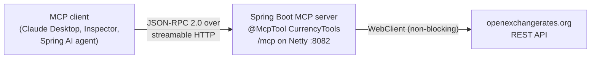
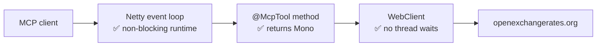
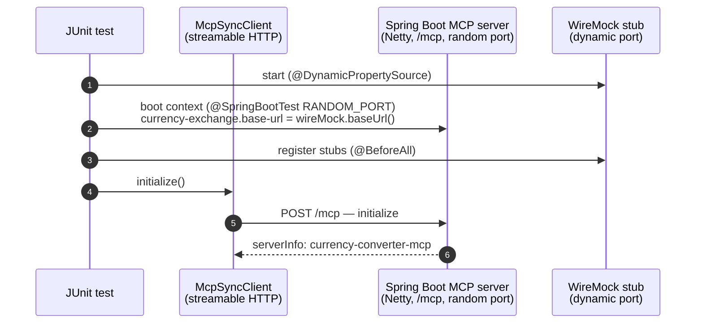
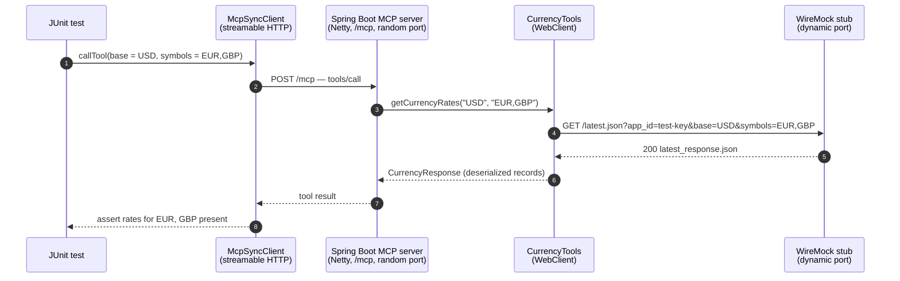
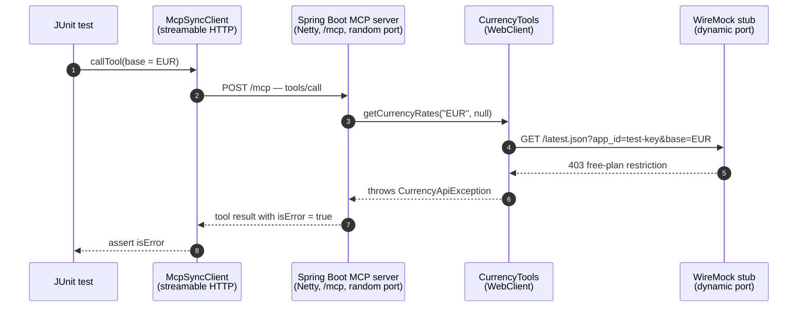

<!-- TOC -->
* [MCP Currency Converter Server (Streamable HTTP / WebFlux)](#mcp-currency-converter-server-streamable-http--webflux)
  * [Building the server with `spring-ai-starter-mcp-server-webflux`](#building-the-server-with-spring-ai-starter-mcp-server-webflux)
  * [Reactive end to end — the WebFlux difference](#reactive-end-to-end--the-webflux-difference)
  * [Transport configuration](#transport-configuration)
  * [Code example](#code-example)
  * [Running the server](#running-the-server)
    * [Option 1: Run with Gradle (`bootRun`)](#option-1-run-with-gradle-bootrun)
    * [Option 2: Build the jar and run it](#option-2-build-the-jar-and-run-it)
  * [Testing with MCP Inspector](#testing-with-mcp-inspector)
  * [Automated integration test](#automated-integration-test)
    * [How it works, step by step](#how-it-works-step-by-step)
<!-- TOC -->

# MCP Currency Converter Server (Streamable HTTP / WebFlux)



In this project we build a **currency-exchange MCP server** from scratch on the
**reactive stack**:

- **What it is** — an MCP server that any MCP client (Claude Desktop, MCP Inspector, a
  Spring AI agent) can connect to over the network and ask for live exchange rates.
- **What it exposes** — one tool, `getCurrencyRates` (latest rates for a base currency,
  optionally filtered to specific symbols), backed by the real
  [openexchangerates.org](https://openexchangerates.org) REST API.
- **How it's built and what stack it runs on** — a plain Spring Boot application with a
  single starter, `spring-ai-starter-mcp-server-webflux`, on Spring WebFlux / Netty; the
  tool is an ordinary service method marked with `@McpTool` returning `Mono`, calling the
  API through a non-blocking `WebClient` — **non-blocking end to end**, with
  auto-configuration wiring up everything else.
- **How clients reach it** — over the **streamable HTTP transport**: one `/mcp` endpoint
  on port 8082.
- **How it's verified** — interactively with **MCP Inspector**, and automatically with a
  WireMock-backed integration test that exercises the full MCP pipeline offline.
- **Configuration** — the API key and URL live in `currency-exchange.*` properties, so
  the server owns the credentials and connecting clients never see them.

## Building the server with `spring-ai-starter-mcp-server-webflux`

Turning a Spring Boot application into a reactive MCP server takes exactly one dependency:

```groovy
implementation 'org.springframework.ai:spring-ai-starter-mcp-server-webflux'
```

## Reactive end to end — the WebFlux difference

The [webmvc weather sibling](../webmvc/README.md) is blocking (`SYNC` on Tomcat): one
servlet thread per request, held for the full duration of the downstream call. This
server is the opposite — **every link in the chain is non-blocking**:



What that buys:

- The `Mono` *describes* the work — nothing executes until the event loop subscribes to it.
- The event loop registers interest in the response and **no thread ever waits** on
  openexchangerates.org.
- A handful of event-loop threads can hold thousands of slow calls in flight.
- This end-to-end non-blocking chain is exactly where `ASYNC` is **the right fit**.
- Reactive tool bodies on a servlet stack would only buy the programming style, not the
  scalability.


Layer by layer, compared to the webmvc sibling:

| Layer | webmvc sibling (blocking) | This module (non-blocking) |
|---|---|---|
| Server runtime | Tomcat — one servlet thread per request | Netty — event loop |
| MCP starter | `spring-ai-starter-mcp-server-webmvc` | `spring-ai-starter-mcp-server-webflux` |
| Server type | `SYNC` → `McpSyncServer` | `ASYNC` → `McpAsyncServer` |
| Tool signature | returns the value directly | returns `Mono<CurrencyResponse>` |
| HTTP client | `RestClient` (thread waits) | `WebClient` (no thread waits) |


## Transport configuration

The transport is selected purely by configuration:

```yaml
server:
  port: 8082

spring:
  ai:
    mcp:
      server:
        name: currency-converter-mcp
        version: 0.0.1
        type: ASYNC               # reactive programming model -> McpAsyncServer
        protocol: STREAMABLE      # streamable HTTP
        streamable-http:
          mcp-endpoint: /mcp      # the default; shown for clarity

currency-exchange:
  api-key: ${CURRENCY_EXCHANGE_API_KEY}   # your openexchangerates.org App ID
  base-url: https://openexchangerates.org/api
```

A `STATELESS` alternative exists (`protocol: STATELESS`): no sessions, so server restarts
and horizontal scaling are invisible to clients — at the cost of server→client features
like notifications, sampling, and elicitation.


## Code example

[`CurrencyTools`](src/main/java/com/mcp/service/CurrencyTools.java) exposes the tool this
way:

```java
@Service
public class CurrencyTools {

    @McpTool(description = "Fetch the latest currency exchange rates. "
            + "For multiple currency conversions use comma separated values for symbols.")
    public Mono<CurrencyResponse> getCurrencyRates(
            @McpToolParam(description = "The base currency code, e.g. USD. Defaults to USD.",
                    required = false) String base,
            @McpToolParam(description = "Comma separated target currency codes, e.g. 'EUR,GBP,INR'. "
                    + "Omit to get rates for all currencies.", required = false) String symbols) {
        var baseCurrency = base != null && !base.isBlank() ? base : DEFAULT_BASE_CURRENCY;

        return this.webClient.get()
            .uri(uriBuilder -> {
                uriBuilder.path("/latest.json")
                    .queryParam("app_id", currencyExchangeProps.apiKey())
                    .queryParam("base", baseCurrency);
                if (symbols != null && !symbols.isBlank()) {
                    uriBuilder.queryParam("symbols", symbols);
                }
                return uriBuilder.build();
            })
            .retrieve()
            .bodyToMono(CurrencyResponse.class)
            .onErrorMap(e -> new CurrencyApiException(
                    "Failed to fetch currency rates for base '%s': %s".formatted(baseCurrency, e.getMessage()), e));
    }
}
```

Things to note:

- Both parameters are optional (`required = false`); `base` falls back to `USD` when
  omitted.
- The method returns `Mono<CurrencyResponse>` — it *describes* the `WebClient` call; no
  thread waits on the response.
- `onErrorMap` wraps any failure in `CurrencyApiException`, which the client receives as
  an MCP tool error.
- The openexchangerates.org **free plan only allows `base=USD`** — requesting another
  base returns a 403, which surfaces to MCP clients as a tool error.

| Tool | Parameters | Backend call |
|---|---|---|
| `getCurrencyRates` | `base` (optional, defaults to `USD`), `symbols` (optional, comma separated e.g. `EUR,GBP,INR`; all currencies when omitted) | `GET /api/latest.json` |


## Running the server

The server is a standalone HTTP service — you run it yourself, and any number of clients
connect to it over the network. All commands run from the repo root (`spring-ai/`).

### Option 1: Run with Gradle (`bootRun`)

Quickest during development — compiles and runs in one step, no jar needed:

```bash
CURRENCY_EXCHANGE_API_KEY=<your-app-id> ./gradlew :mcp:mcp-server:currency-converter-mcp:bootRun
```

### Option 2: Build the jar and run it

What a real deployment does — build once, run the artifact anywhere:

```bash
./gradlew :mcp:mcp-server:currency-converter-mcp:bootJar
CURRENCY_EXCHANGE_API_KEY=<your-app-id> java -jar mcp/mcp-server/currency-converter-mcp/build/libs/currency-converter-mcp-0.0.1-SNAPSHOT.jar
```

In both cases the MCP endpoint is `http://localhost:8082/mcp` (port 8082 — the weather
webmvc and webflux servers own 8080 and 8081). The API key is a property of the
**server's** environment at startup — connecting clients never see or supply it, which is
exactly the multi-client model: one deployment owns the credentials.

## Testing with MCP Inspector

`npx` ships with Node.js — if you don't have it, follow the
[install steps in the webmvc README](../webmvc/README.md#installing-npx).

With the server already running:

```bash
npx @modelcontextprotocol/inspector
```

In the browser UI select transport type **Streamable HTTP**, set the URL to
`http://localhost:8082/mcp`, and click **Connect**. In the **Tools** tab, click
**List Tools** to see `getCurrencyRates`, then fill in the arguments
(e.g. `symbols: EUR,GBP,INR`) and **Run Tool** to see the live rates.

## Automated integration test

**Why integration tests make sense for this app**

- **Proves the full pipeline works** — from an incoming MCP request all the way to a
  tool result, in one test.
- **Catches wiring mistakes early** — misconfigured beans, wrong URLs, and missed
  annotations only show up when the real context starts.
- **No external dependency** — WireMock replaces openexchangerates.org, so the test is
  offline and runs reliably on every build.

[`McpCurrencyConverterIntegrationTest`](src/test/java/com/mcp/McpCurrencyConverterIntegrationTest.java):

- Talks **real MCP** to the server over streamable HTTP — no mocked protocol layer.
- Replaces only the openexchangerates.org backend with a **WireMock stub**.
- Exercises the entire pipeline: MCP `tools/call` → `CurrencyTools` → `WebClient` →
  JSON deserialization → tool result.
- Runs deterministically on every build: offline, no API key, no rate limits, no
  flakiness.

### Test SetUp and How Wiremock is integrated ?

The flow as sequence diagrams — setup first, then one happy-path tool call, then the
stubbed failure path. Everything runs inside the one test JVM.

#### Setup

WireMock starts before the Spring context so its URL can be injected as the exchange API
base URL; then the stubs are registered and the MCP client performs the `initialize`
handshake:



#### Happy path

A real `tools/call` travels the whole pipeline; the stub answers with canned JSON, and
the assertions check its values come back through deserialization:



#### Failure path

The stub replies with a 403 (openexchangerates.org's free-plan restriction for non-USD
base); the service throws, and the client receives an MCP tool result flagged `isError`
— the server keeps running:



### How it works, step by step

1. **WireMock starts first.** The `WireMockServer` (dynamic port) is started inside
   `@DynamicPropertySource` — the one hook Spring calls *before* building the application
   context, which is exactly when the stub's URL must already exist.
2. **Config redirection instead of code changes.** `@DynamicPropertySource` overrides
   `currency-exchange.base-url` with the stub's URL and `currency-exchange.api-key` with
   a test key. `CurrencyExchangeConfigProperties` binds to those values, so
   `CurrencyTools` builds its `WebClient` against the stub without knowing anything
   changed — the production code is untouched by the test.
3. **The real server boots.** `@SpringBootTest(webEnvironment = RANDOM_PORT)` starts the
   actual application in-process — real Netty, real `/mcp` endpoint.
4. **Stubs are registered** for `/latest.json`, including an error stub for the
   free-plan 403 so the error path is covered too.
5. **The MCP client connects**, performs the `initialize` handshake, and the tests issue
   `tools/list` / `tools/call` requests — verifying the tool is exposed, stub values
   round-trip through deserialization, the base currency defaults to `USD`, and an API
   error becomes an MCP tool error.
6. **Teardown:** the MCP client is closed and WireMock stopped; Spring shuts the context
   down itself.

Run it (a green `build` *is* the test validation — it fails if any test fails):

```bash
./gradlew :mcp:mcp-server:currency-converter-mcp:test                                          # WireMock-backed suite (offline)
CURRENCY_EXCHANGE_API_KEY=<your-app-id> ./gradlew :mcp:mcp-server:currency-converter-mcp:test  # + live openexchangerates.org smoke test
```

The live smoke test ([`McpCurrencyConverterLiveApiTest`](src/test/java/com/mcp/McpCurrencyConverterLiveApiTest.java))
is skipped unless `CURRENCY_EXCHANGE_API_KEY` is set; the HTML report lands in
`mcp/mcp-server/currency-converter-mcp/build/reports/tests/test/index.html`.
