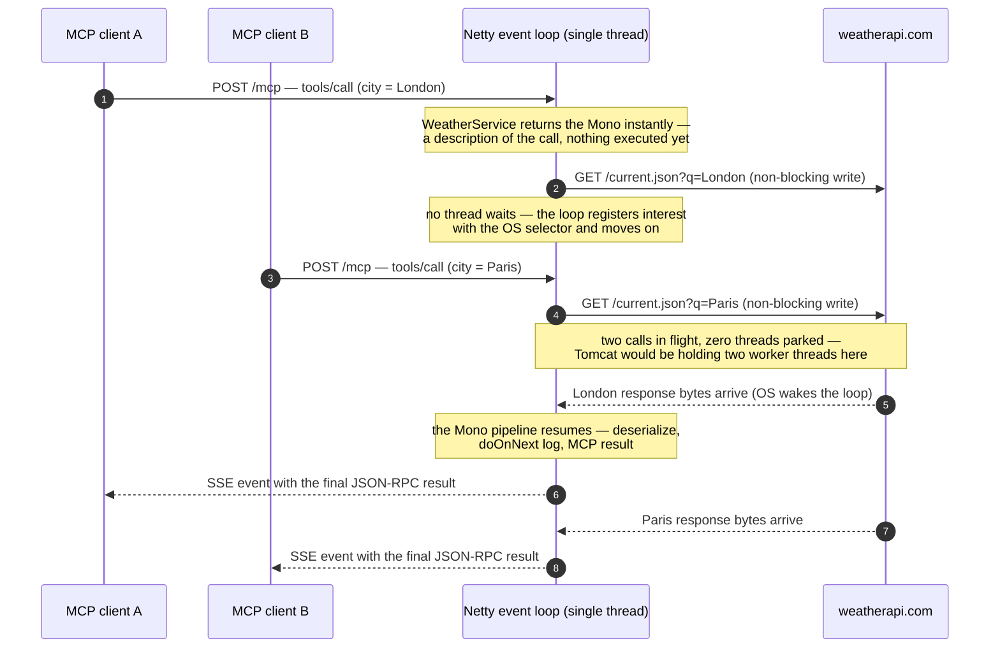

# MCP Weather Server (Streamable HTTP / WebFlux, ASYNC)

The **ASYNC** rendition of the same weather MCP server as the
[`webmvc`](../webmvc/README.md) and [`stdio`](../stdio/README.md) siblings: the same two
tools (`getWeatherForecastByLocation`, `getForecastWeatherByLocation`), the same models and
`weather.*` configuration — but reactive end to end. See the webmvc README's
["SYNC vs ASYNC"](../webmvc/README.md#sync-vs-async) section for the full comparison; this
module is the "full event-loop benefit" option described there.

What is different from the webmvc module:

| | webmvc (SYNC) | this module (ASYNC) |
|---|---|---|
| Starter | `spring-ai-starter-mcp-server-webmvc` | `spring-ai-starter-mcp-server-webflux` |
| Web runtime | Tomcat (servlet, thread-per-request) | Netty (event loop, non-blocking) |
| `spring.ai.mcp.server.type` | `SYNC` → `McpSyncServer` | `ASYNC` → `McpAsyncServer` |
| Tool signature | `WeatherResponse get...(city)` | `Mono<WeatherResponse> get...(city)` |
| HTTP client to weatherapi.com | `RestClient` (blocks the caller) | `WebClient` (no thread waits) |
| Validation errors | `throw new IllegalArgumentException` | `return Mono.error(...)` |
| Port | 8080 | 8081 |

The transport is the same streamable HTTP on `/mcp` — an MCP client cannot tell the two
apart. Everything else (running the server, Inspector testing, the WireMock-backed
integration tests) works exactly as documented in the webmvc README, with `webmvc` replaced
by `webflux` in the commands:

All commands run from the repo root (`spring-ai/`).

### Build and validate

```bash
# build — compiles, runs the WireMock-backed test suite, and packages the boot jar
./gradlew :mcp:mcp-server:webflux:build

# force a full rebuild (ignores up-to-date checks) when validating test changes
./gradlew :mcp:mcp-server:webflux:clean :mcp:mcp-server:webflux:build

# run only the tests (skip packaging)
./gradlew :mcp:mcp-server:webflux:test                            # WireMock-backed suite (offline)
WEATHER_API_KEY=<your-key> ./gradlew :mcp:mcp-server:webflux:test # + live weatherapi.com smoke tests

# build all three sibling servers (stdio, webmvc, webflux) in one go
./gradlew :mcp:mcp-server:stdio:build :mcp:mcp-server:webmvc:build :mcp:mcp-server:webflux:build
```

`build` fails if any test fails, so a green build *is* the test validation; the HTML report
lands in `mcp/mcp-server/webflux/build/reports/tests/test/index.html` when you need details.
Gradle skips tasks whose inputs haven't changed (shown as `UP-TO-DATE`) — the `clean` variant
is the sledgehammer when you want to see the tests actually execute again.

### Launch the server

```bash
WEATHER_API_KEY=<your-weatherapi-key> ./gradlew :mcp:mcp-server:webflux:bootRun
```

The MCP endpoint is `http://localhost:8081/mcp`. To run the packaged jar instead of Gradle:

```bash
WEATHER_API_KEY=<your-weatherapi-key> java -jar mcp/mcp-server/webflux/build/libs/webflux-0.0.1-SNAPSHOT.jar
```

## How the non-blocking pipeline works

The whole point of this module is that **no thread ever waits on the network**. Here is one
Netty event-loop thread serving two clients whose tool calls are both waiting on
weatherapi.com at the same time (rendered by GitHub/IntelliJ from the Mermaid source):



The four ideas the picture encodes (the numbers refer to the numbered arrows in the
diagram):

- **The inbound HTTP call from the MCP client — steps 1 and 3:**
  - The client sends `tools/call` as an ordinary **HTTP POST to `/mcp`** (the streamable
    HTTP transport — same wire format as the webmvc module).
  - Netty accepts the connection and reads the request bytes **on the event loop too** —
    inbound is just as non-blocking as outbound. There is no thread-per-connection even for
    the client side of the story.
  - The server answers by opening the SSE response (`text/event-stream`) immediately, but
    that open response **holds no thread** while the result is pending — it's written to
    only when the pipeline completes at steps **6**/**8**.
- **Assembly vs execution — steps 1 → 2:**
  - At step **1** the tool call arrives and `WeatherService.getWeatherForecastByLocation`
    runs — for microseconds.
  - The method only *assembles* a `Mono` (a recipe for the call) and returns. Nothing has
    touched the network yet.
  - The MCP framework then subscribes to that `Mono`, and the subscription is what actually
    fires the `WebClient` request at step **2**.
- **The gap is free — between steps 2 and 5:**
  - After the request is written at step **2**, *no thread exists that is "doing" this tool
    call* — the pending call is just a callback registered with the OS selector.
  - That freedom is visible in the diagram: the same loop thread immediately serves client
    B (steps **3**–**4**) while London is still in flight.
  - Contrast with the webmvc module: a Tomcat worker thread would physically sit inside
    `RestClient` for that entire gap — one parked thread per in-flight call.
- **Resumption is event-driven — steps 5 → 8:**
  - Nothing polls. The arrival of response bytes at step **5** is what wakes the event loop.
  - The loop then runs the rest of the pipeline — deserialization, `doOnNext` logging,
    `onErrorMap` wrapping on failure — and writes the SSE response back at step **6**.
  - Steps **7**–**8** repeat the same dance for Paris, on the same thread. A handful of loop
    threads finish *every* in-flight call, which is why concurrency is not bounded by a
    thread pool.

Two implementation notes worth reading in the code:

- [`WeatherService`](src/main/java/com/mcp/service/WeatherService.java) returns the `Mono`
  built by `WebClient` **without subscribing or blocking** — it describes the call, and the
  MCP framework (via `AsyncMcpToolProvider`) subscribes when a `tools/call` arrives. Logging
  hangs off the pipeline as `doOnNext`/`doOnError`; the days-range validation throws
  `IllegalArgumentException` synchronously (it runs before the pipeline exists), while
  downstream failures are rethrown as `WeatherApiException` via `onErrorMap` — the reactive
  equivalent of catch-and-rethrow.
- The integration test is intentionally **identical** to the webmvc one (same WireMock
  stubs, same assertions) — proof that SYNC vs ASYNC is invisible to clients: only the
  server-side programming model changed.
