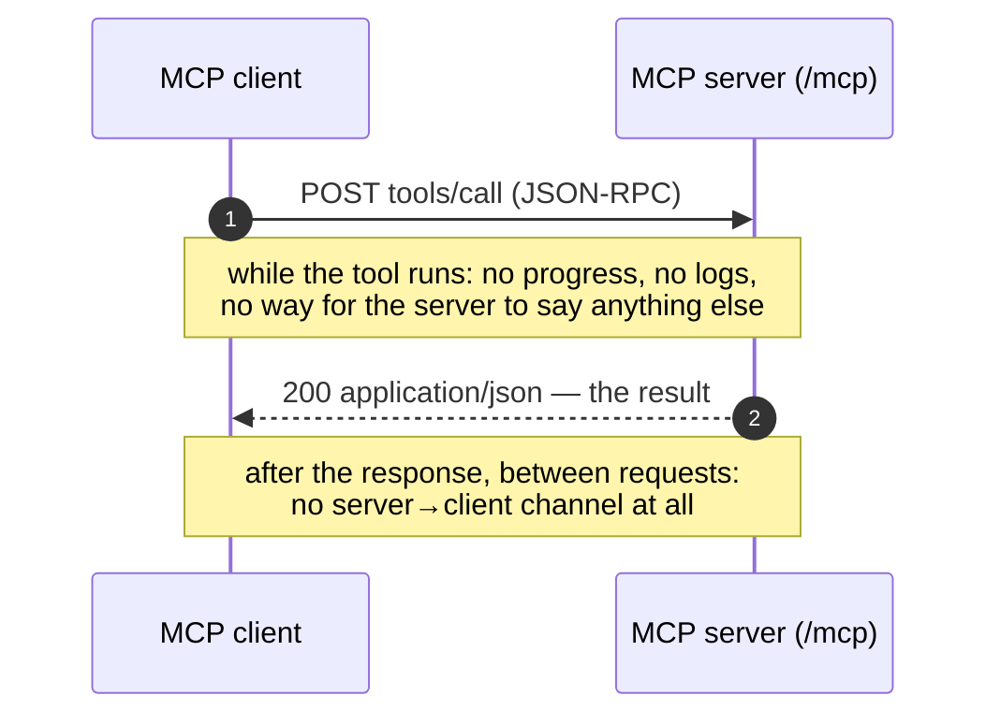
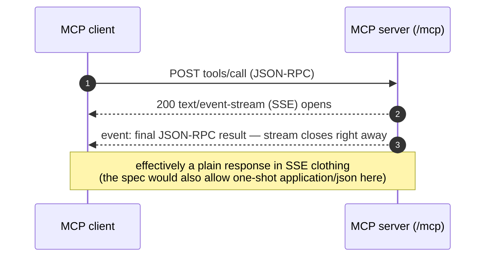
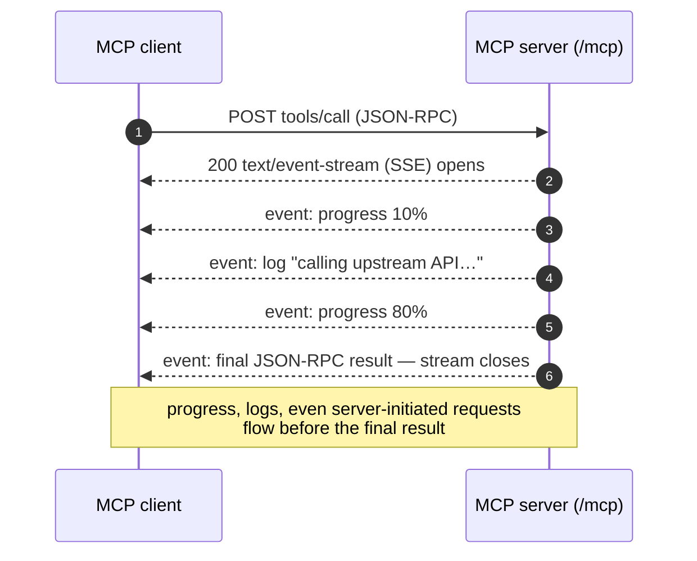
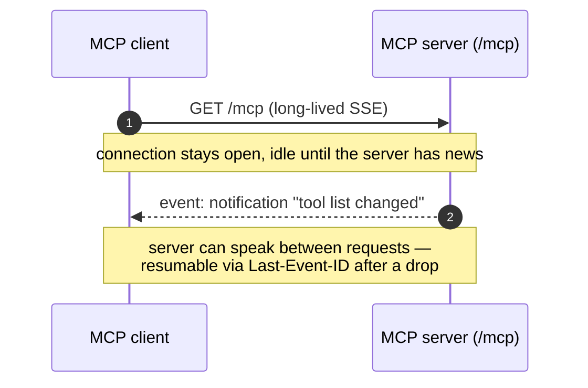
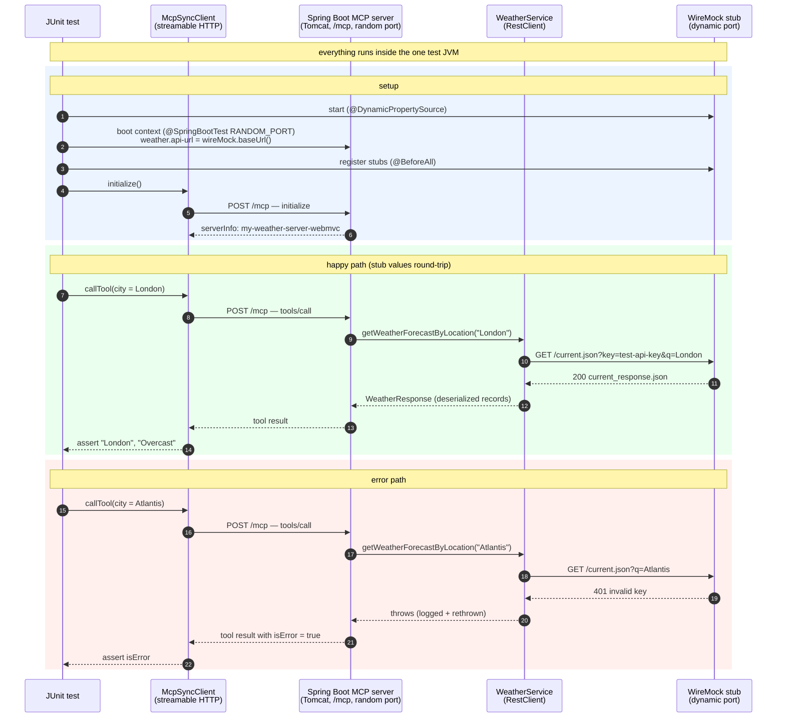

<!-- TOC -->
* [MCP Weather Server (Streamable HTTP / WebMVC)](#mcp-weather-server-streamable-http--webmvc)
  * [What is streamable HTTP?](#what-is-streamable-http)
  * [SYNC vs ASYNC](#sync-vs-async)
    * [What SYNC means (this module)](#what-sync-means-this-module)
    * [What would change for ASYNC](#what-would-change-for-async)
    * [The fundamental difference](#the-fundamental-difference)
    * [ASYNC on WebMVC — possible, but know what you get](#async-on-webmvc--possible-but-know-what-you-get)
  * [Running the server](#running-the-server)
    * [Option 1: Run with Gradle (`bootRun`)](#option-1-run-with-gradle-bootrun)
    * [Option 2: Build the jar and run it](#option-2-build-the-jar-and-run-it)
  * [Testing with MCP Inspector](#testing-with-mcp-inspector)
  * [Automated integration test](#automated-integration-test)
    * [Test SetUp and How Wiremock is integrated ?](#test-setup-and-how-wiremock-is-integrated-)
    * [How it works, step by step](#how-it-works-step-by-step)
    * [What is covered](#what-is-covered)
    * [Live smoke tests](#live-smoke-tests)
<!-- TOC -->

# MCP Weather Server (Streamable HTTP / WebMVC)

The same weather MCP server as the [`stdio` sibling](../stdio/README.md) — identical
`WeatherService`, tools (`getWeatherForecastByLocation`, `getForecastWeatherByLocation`),
models, and `weather.*` configuration — but exposed over the **streamable HTTP transport**
instead of STDIO. See the stdio README's ["When to use STDIO"](../stdio/README.md#when-to-use-stdio)
section for how to choose between the two.

## What is streamable HTTP?

**Plain HTTP:**

- Strictly one request → one response: the client asks, the server answers once, the
  exchange is over.
- Mapped naively onto MCP, every JSON-RPC message would get exactly one JSON reply —
  workable for a quick tool call.
- But the server has no way to push anything *while* a tool runs: no progress updates, no
  log messages, no server-initiated MCP requests (sampling/elicitation).
- And between requests there is no server→client channel at all.

**Streamable HTTP (MCP's current HTTP transport):**

- Keeps HTTP's infrastructure-friendliness while adding streaming *on demand*.
- Everything happens on **one endpoint** (`/mcp` here).
- The client sends every JSON-RPC message as an **HTTP POST**.
- The server then **chooses, per request**, how to respond (the spec allows either):
  - `Content-Type: application/json` — a single one-shot response, exactly like classic HTTP.
  - `Content-Type: text/event-stream` — the response becomes a **Server-Sent Events stream**
    for that one request: the server can emit many messages (progress notifications, logs,
    its own requests back to the client) and finishes with the final JSON-RPC response.
- How the MCP Java SDK used here exercises that choice: `initialize` is answered with plain
  `application/json`, but **every other request — including `tools/call` — is always answered
  over SSE**. When a tool has nothing extra to say (this weather server), the stream simply
  carries one event (the final result) and closes — a plain response in SSE clothing.
- Optionally, the client can open a long-lived **GET** stream on the same endpoint for
  unsolicited server→client notifications (e.g. "the tool list changed").
- A `Mcp-Session-Id` header correlates requests into a session.
- Streams are resumable (`Last-Event-ID`) after a dropped connection.

**Plain HTTP — one reply, then silence:**



**Streamable HTTP, fast tool — nothing extra to say (what this weather server does):**



**Streamable HTTP, slow tool — the response becomes a stream:**



**Streamable HTTP — the optional listening channel:**

Independent of any tool call, a client can also keep one long-lived GET stream open to hear
from the server between requests:



**In short:**

| | Plain HTTP | Streamable HTTP |
|---|---|---|
| Messages per request | exactly one response | one response **or** a stream of them |
| Server push mid-request | impossible | progress/logs/server requests via SSE |
| Server push between requests | impossible | optional long-lived GET stream |
| Infrastructure fit | ideal | same — it *is* HTTP, streams only when needed |

**Historical note:**

- Streamable HTTP replaced MCP's earlier "HTTP+SSE" transport.
- The old transport required a permanently open SSE channel on a second endpoint just to
  receive responses.
- Folding both directions into one endpoint that streams only when necessary made servers
  easier to load-balance and scale statelessly — an idle client now costs nothing.

**Takeaway:**

- "Streamable HTTP" is best read as *HTTP that can become a stream when the server has more
  than one thing to say*.
- This module's tools never have more than one thing to say, so on the wire it behaves like
  ordinary request/response — but the transport is ready the moment a tool wants to report
  progress.

The tool code is unchanged; only the transport configuration differs:

```yaml
server:
  port: 8080

spring:
  ai:
    mcp:
      server:
        name: my-weather-server-webmvc
        version: 0.0.1
        type: SYNC
        protocol: STREAMABLE      # streamable HTTP instead of stdio: true
        streamable-http:
          mcp-endpoint: /mcp      # the default; shown for clarity
```

Because the protocol runs over HTTP — not the process's stdout — none of the stdio
housekeeping applies: the banner can print, console logging stays on, and
`web-application-type` stays servlet (Tomcat serves the `/mcp` endpoint on port 8080).

## SYNC vs ASYNC

`spring.ai.mcp.server.type` selects the server's **programming model** — how your `@McpTool`
methods are written and executed — not the transport (STDIO/HTTP is chosen separately, and
either combines with either).

### What SYNC means (this module)

`SYNC` builds an `McpSyncServer`: tool methods are plain blocking Java. When a `tools/call`
arrives, a Tomcat worker thread enters `getWeatherForecastByLocation`, sits **blocked inside
the `RestClient` call** until weatherapi.com answers, then returns the result. One request,
one thread, held for the full duration. Simple to write, simple to debug — a stack trace
reads top to bottom — and blocking dependencies (`RestClient`, JDBC) fit naturally.

### What would change for ASYNC

`ASYNC` builds an `McpAsyncServer`: tool methods return a **promise of a result** instead of
the result, and no thread waits for the downstream call. Three coordinated changes:

1. **Config** — flip the type (transport config stays the same):

   ```yaml
   spring:
     ai:
       mcp:
         server:
           type: ASYNC
   ```

2. **Stack** — pair it with the reactive sibling starter (its natural home is the `webflux`
   module, not this servlet one):

   ```groovy
   implementation 'org.springframework.ai:spring-ai-starter-mcp-server-webflux'
   ```

3. **Tool code** — methods return `Mono`/`Flux`, and the blocking `RestClient` becomes a
   non-blocking `WebClient`:

   ```java
   @McpTool(description = "Get the current weather conditions for the given city.")
   public Mono<WeatherResponse> getWeatherForecastByLocation(
           @McpToolParam(description = "The name of a city or a country") String city) {
       return webClient.get()
           .uri("/current.json?key={key}&q={q}", weatherProps.apiKey(), city)
           .retrieve()
           .bodyToMono(WeatherResponse.class);   // describes the call; no thread waits on it
   }
   ```

   Spring AI's annotation scanner picks the matching adapter automatically
   (`AsyncMcpToolProvider` for `ASYNC`, its sync counterpart for `SYNC`).

### The fundamental difference

It is a **threading-model** difference, not a feature difference — both serve the same MCP
protocol, and the client can't tell them apart:

- **SYNC** is *thread-per-request*: concurrency = thread count. 200 simultaneous tool calls
  waiting 2s each for weatherapi.com means 200 parked threads.
- **ASYNC** is *event-loop*: the `Mono` describes the work, an event loop registers interest
  in the response, and a handful of threads serve thousands of in-flight calls because none
  of them ever waits. It also composes: fan out to several APIs concurrently (`Mono.zip`),
  add timeouts/retries declaratively, stream partial results.

The cost of ASYNC is that reactive types infect the whole call chain (one accidental
`.block()` on an event loop defeats or deadlocks it), and debugging gets harder — stack
traces are scheduler frames instead of your call path.

Rule of thumb: a tool server like this one — modest concurrency, one blocking HTTP call per
tool — gains nothing from ASYNC; `SYNC` (optionally on virtual threads via
`spring.threads.virtual.enabled: true`, which removes most of the parked-thread cost without
touching the code) is the right default. Reach for `ASYNC` when the server must hold **many
slow calls in flight at once**, or when the tools themselves are naturally reactive/streaming.

### ASYNC on WebMVC — possible, but know what you get

Since the reactive stack has its own home (the `webflux` sibling — currently an empty
placeholder module in this repo), a fair question is whether `type: ASYNC` on **this** webmvc
module even makes sense. It's a supported combination — `type` and transport are independent,
and Reactor is already on the classpath (the MCP Java SDK itself is built on it) — but you
need to be clear about what it does and doesn't buy.

What it takes:

1. Keep the `spring-ai-starter-mcp-server-webmvc` dependency — the transport stays servlet
   streamable HTTP; only set `type: ASYNC`.
2. Tool methods must return `Mono`/`Flux`. For non-blocking HTTP you'd add the `WebClient`
   libraries (`org.springframework:spring-webflux` + `io.projectreactor.netty:reactor-netty-http`
   as plain dependencies — with both stacks present, Spring Boot still runs the app as a
   servlet application). Alternatively, keep the blocking `RestClient` but wrap it:

   ```java
   return Mono.fromCallable(() -> restClient.get()...body(WeatherResponse.class))
       .subscribeOn(Schedulers.boundedElastic());   // blocking work off the caller's thread
   ```

   That wrapping is mandatory for anything blocking (`RestClient`, JDBC) — blocking directly
   inside a `Mono` chain that may run on shared threads is how reactive apps deadlock.

What you get — and don't:

- You **get** the reactive *programming model*: composition (`Mono.zip` fan-out to several
  APIs), declarative timeouts/retries, and tool signatures that can later move to `webflux`
  unchanged.
- You **don't get** the non-blocking *runtime*. The transport underneath is still Tomcat:
  every MCP HTTP exchange occupies a servlet thread, so scalability stays bounded by the
  servlet thread pool no matter how reactive the tool bodies are. The event-loop economics
  from the section above only materialize on the `webflux` stack end to end.

So ASYNC-on-webmvc is a half-step, legitimate in two situations: you're **pinned to the
servlet stack** (existing servlet filters, security config, agents) but want reactive
composition inside tools; or you're **migrating incrementally** toward webflux and want the
tool signatures reactive first, the runtime later. If neither applies, stay `SYNC` here — and
when the full event-loop benefit is wanted, implement it in the `webflux` module where the
whole chain (Netty → transport → `WebClient`) is non-blocking.

## Running the server

Unlike stdio, the client does **not** launch this server — you run it yourself and clients
connect to it.

### Option 1: Run with Gradle (`bootRun`)

Quickest during development — compiles and runs in one step, no jar needed:

```bash
WEATHER_API_KEY=<your-weatherapi-key> ./gradlew :mcp:mcp-server:webmvc:bootRun
```

### Option 2: Build the jar and run it

What a real deployment does — build once, run the artifact anywhere:

```bash
./gradlew :mcp:mcp-server:webmvc:bootJar
WEATHER_API_KEY=<your-weatherapi-key> java -jar mcp/mcp-server/webmvc/build/libs/webmvc-0.0.1-SNAPSHOT.jar
```

In both cases the MCP endpoint is `http://localhost:8080/mcp`. Note the API key is now a property of the
**server's** environment at startup — connecting clients never see or supply it, which is
exactly the multi-client model: one deployment owns the credentials.

## Testing with MCP Inspector

With the server already running:

```bash
npx @modelcontextprotocol/inspector
```

In the browser UI select transport type **Streamable HTTP**, set the URL to
`http://localhost:8080/mcp`, and click **Connect**. The Tools tab works exactly as described
in the stdio README.

## Automated integration test

[`McpWeatherServerWebMvcIntegrationTest`](src/test/java/com/mcp/McpWeatherServerWebMvcIntegrationTest.java)
mirrors the stdio test suite: it talks real MCP to the server over streamable HTTP, while the
weatherapi.com backend is replaced by a **WireMock stub**. That way the entire pipeline —
MCP `tools/call` → `WeatherService` → `RestClient` → JSON deserialization → tool result —
runs deterministically on every build: offline, no API key, no rate limits, no flakiness.

### Test SetUp and How Wiremock is integrated ?


The same flow as a sequence diagram — setup first, then one happy-path tool call and the
stubbed error path (rendered by GitHub/IntelliJ from the Mermaid source):



### How it works, step by step

1. **WireMock starts first.** The `WireMockServer` (dynamic port, so parallel builds never
   clash) is started inside `@DynamicPropertySource` — the one hook Spring calls *before*
   building the application context, which is exactly when the stub's URL must already exist.
2. **Config redirection instead of code changes.** `@DynamicPropertySource` overrides
   `weather.api-url` with `wireMock.baseUrl()` and `weather.api-key` with `test-api-key`.
   `WeatherConfigProperties` binds to those values, so `WeatherService` builds its
   `RestClient` against the stub without knowing anything changed. This is the payoff of
   keeping the URL externalized config — the production code is untouched by the test.
3. **The real server boots.** `@SpringBootTest(webEnvironment = RANDOM_PORT)` starts the
   actual application in-process — real Tomcat, real `/mcp` endpoint. (Compare stdio: no jar,
   no child process, no `ProcessBuilder`; the "server" is just this test's Spring context.)
4. **Stubs are registered in `@BeforeAll`** with query-parameter matching: `/current.json`
   and `/forecast.json` only respond when `key=test-api-key` and `q=London` match — so the
   tests also prove the key and city actually make it into the outgoing request — plus a 401
   stub (weatherapi.com's real invalid-key error shape) for the error path.
5. **The MCP client connects** (`HttpClientStreamableHttpTransport` →
   `http://localhost:<random port>/mcp`), performs the `initialize` handshake, and the tests
   issue `tools/list` / `tools/call` requests. Assertions check that values from the stub
   JSON (e.g. `Overcast`, `2026-07-05`) come back through the whole pipeline, proving the
   record deserialization works.
6. **Teardown:** `@AfterAll` closes the MCP client and stops WireMock; Spring shuts the
   context down itself.

### What is covered

| Test | Verifies |
|---|---|
| `exposesTheWeatherTools` | `tools/list` returns exactly the two weather tools |
| `rejectsForecastDaysAboveTheMaximum` | `days: 20` returns an MCP error ("days must be between 1 and 14") |
| `rejectsForecastDaysBelowTheMinimum` | `days: 0` returns the same error |
| `returnsCurrentWeatherFromTheStubbedApi` | full happy path incl. deserialization — asserts stub values come back |
| `returnsForecastWeatherFromTheStubbedApi` | same for the 2-day forecast (dates, conditions) |
| `surfacesWeatherApiErrorsAsToolErrors` | a stubbed 401 from the API becomes an MCP tool error |

### Live smoke tests

A stub only encodes *our snapshot* of the API's shape — it can't catch weatherapi.com
changing its response format. Live smoke tests against the real weatherapi.com sit in
[`McpWeatherServerLiveApiTest`](src/test/java/com/mcp/McpWeatherServerLiveApiTest.java),
gated by `@EnabledIfEnvironmentVariable` — the class is skipped unless `WEATHER_API_KEY` is set.

```bash
./gradlew :mcp:mcp-server:webmvc:test                            # WireMock-backed suite (offline)
WEATHER_API_KEY=<your-key> ./gradlew :mcp:mcp-server:webmvc:test # + live weatherapi.com smoke tests
```
