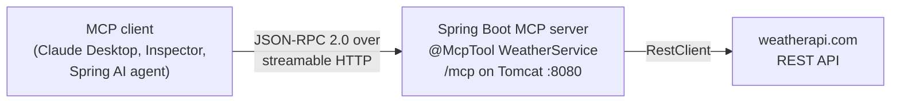
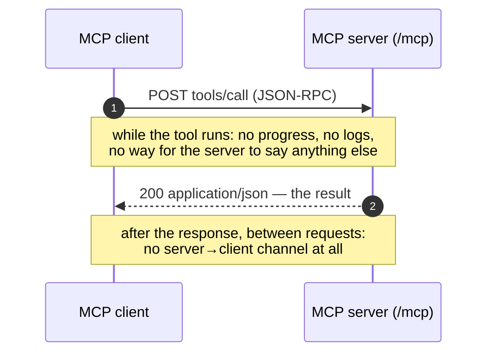
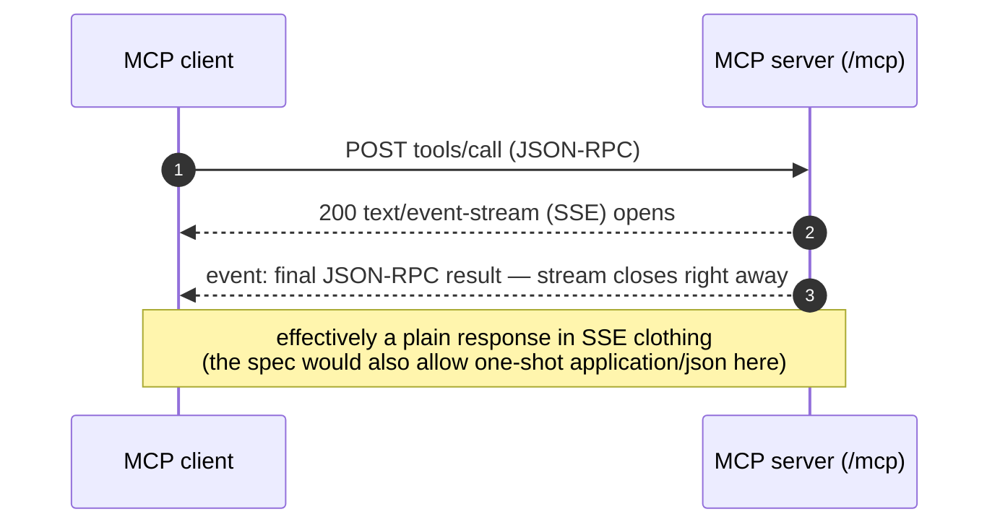
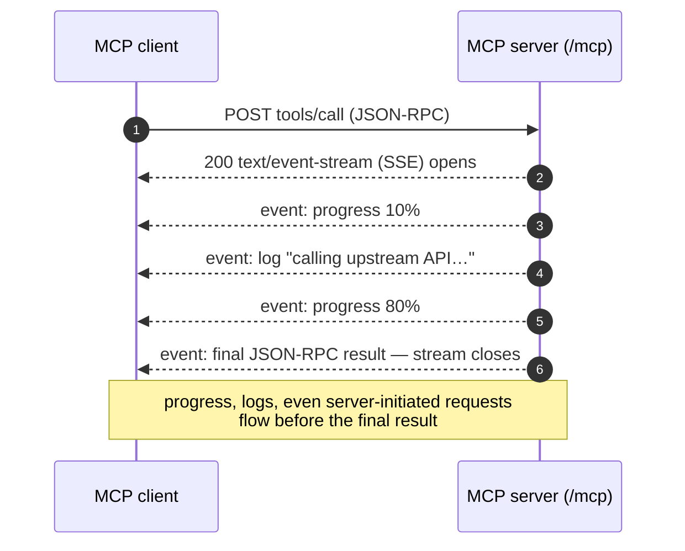
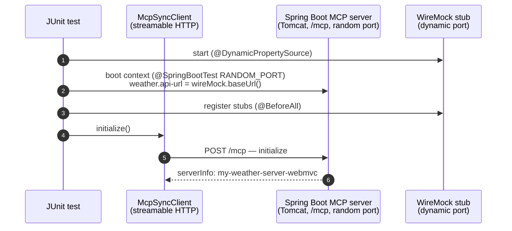
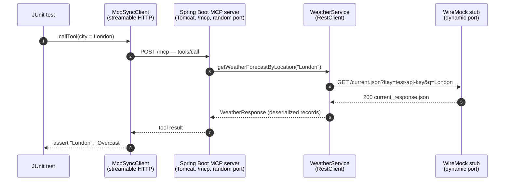
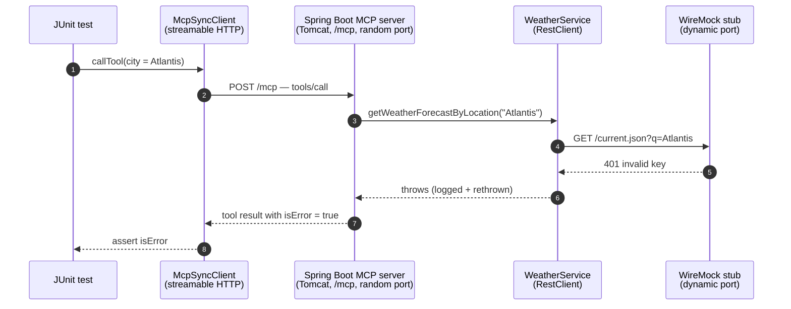
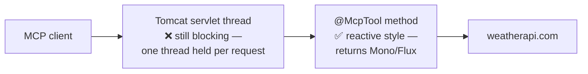
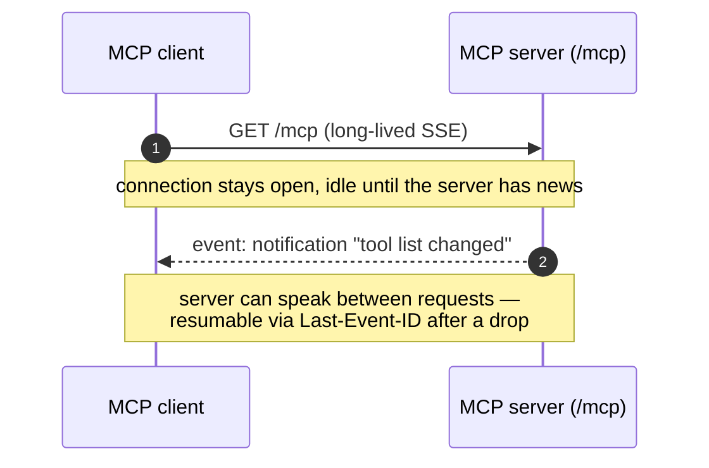

<!-- TOC -->
* [MCP Weather Server (Streamable HTTP / WebMVC)](#mcp-weather-server-streamable-http--webmvc)
  * [Building the server with `spring-ai-starter-mcp-server-webmvc`](#building-the-server-with-spring-ai-starter-mcp-server-webmvc)
  * [Exposing tools with `@McpTool`](#exposing-tools-with-mcptool)
  * [What is streamable HTTP?](#what-is-streamable-http)
  * [Code example](#code-example)
  * [Running the server](#running-the-server)
    * [Option 1: Run with Gradle (`bootRun`)](#option-1-run-with-gradle-bootrun)
    * [Option 2: Build the jar and run it](#option-2-build-the-jar-and-run-it)
  * [Testing with MCP Inspector](#testing-with-mcp-inspector)
    * [Installing `npx`](#installing-npx)
    * [Running the Inspector](#running-the-inspector)
  * [Automated integration test](#automated-integration-test)
    * [Test SetUp and How Wiremock is integrated ?](#test-setup-and-how-wiremock-is-integrated-)
      * [Setup](#setup)
      * [Happy path](#happy-path)
      * [Failure path](#failure-path)
    * [How it works, step by step](#how-it-works-step-by-step)
  * [SYNC vs ASYNC](#sync-vs-async)
    * [What SYNC means (this module)](#what-sync-means-this-module)
    * [ASYNC on WebMVC — possible, but know what you get](#async-on-webmvc--possible-but-know-what-you-get)
    * [What would change for ASYNC](#what-would-change-for-async)
    * [ASYNC done right — end-to-end non-blocking](#async-done-right--end-to-end-non-blocking)
  * [Streamable HTTP — the optional listening channel](#streamable-http--the-optional-listening-channel)
<!-- TOC -->

# MCP Weather Server (Streamable HTTP / WebMVC)



In this project we build a **weather MCP server** from scratch on the servlet stack:

- **What it is** — an MCP server that any MCP client (Claude Desktop, MCP Inspector, a
  Spring AI agent) can connect to over the network and ask for live weather data.
- **What it exposes** — two tools, `getWeatherForecastByLocation` (current conditions)
  and `getForecastWeatherByLocation` (multi-day forecast), backed by the real
  [weatherapi.com](https://www.weatherapi.com) REST API.
- **How it's built** — a plain Spring Boot application plus a single starter,
  `spring-ai-starter-mcp-server-webmvc`; the tools are ordinary service methods marked
  with `@McpTool`, and auto-configuration wires up everything else.
- **What stack it runs on** — Spring WebMVC / embedded Tomcat (the servlet stack), with
  blocking `SYNC` tool methods calling the weather API through `RestClient`.
- **How clients reach it** — over the **streamable HTTP transport**: one `/mcp` endpoint
  on port 8080 that can answer plainly or stream, explained in depth below.
- **How it's verified** — interactively with **MCP Inspector**, and automatically with a
  WireMock-backed integration test that exercises the full MCP pipeline offline.
- **Configuration** — the API key and URL live in `weather.*` properties, so the server
  owns the credentials and connecting clients never see them.

## Building the server with `spring-ai-starter-mcp-server-webmvc`

Turning a Spring Boot application into an MCP server takes exactly one dependency:

```groovy
implementation 'org.springframework.ai:spring-ai-starter-mcp-server-webmvc'
```

That single starter brings the whole stack:

- **The MCP Java SDK** — the JSON-RPC 2.0 protocol implementation (initialize handshake,
  `tools/list`, `tools/call`, sessions).
- **The streamable HTTP transport for WebMVC** — auto-registers the single MCP endpoint
  (`/mcp` by default) on the embedded Tomcat that Spring Boot is already running.
- **Server auto-configuration** — builds and starts the `McpSyncServer` (or
  `McpAsyncServer`, per `spring.ai.mcp.server.type`) from `spring.ai.mcp.server.*`
  properties; no manual wiring.
- **Annotation scanning** — finds `@McpTool` methods on Spring beans and registers them as
  MCP tools automatically.

The result: the [main class](src/main/java/com/mcp/McpServerApplication.java) is a plain
`@SpringBootApplication` with zero MCP-specific code — the starter's auto-configuration
does all of it, driven by the `application.yml` shown later in this page.

## Exposing tools with `@McpTool`

A tool is just a method on a Spring bean, annotated with **`@McpTool`**. The annotation
scanner (part of the starter) discovers it at startup, derives the input schema from the
method signature, and registers it with the server — no callbacks, no manual
`ToolCallback` lists, no schema JSON to hand-write.

What each annotation contributes:

| Annotation | On | What it does |
|---|---|---|
| `@McpTool` | the method | Marks it as an MCP tool; the `description` is what the LLM reads to decide *when* to call it — write it for the model, not for humans |
| `@McpToolParam` | each parameter | Describes the parameter in the generated JSON schema; `required = false` makes it optional (use a wrapper type like `Integer`, so absence can be `null`) |

Everything else is inferred: the tool **name** defaults to the method name, the **input
schema** comes from the parameter types, and the return value is serialized into the tool
result. Throwing an exception surfaces to the client as a tool error rather than crashing
the server.

Full reference: [Spring AI — MCP Annotations (server)](https://docs.spring.io/spring-ai/reference/api/mcp/mcp-annotations-server.html).

## What is streamable HTTP?

**Plain HTTP:**

- Strictly one request → one response: the client asks, the server answers once, the
  exchange is over.
- Mapped naively onto MCP, every JSON-RPC message would get exactly one JSON reply —
  workable for a quick tool call.
- But the server has no way to push anything *while* a tool runs: no progress updates, no
  log messages, no server-initiated MCP requests (sampling/elicitation).
- And between requests there is no server→client channel at all.

**Plain HTTP — one reply, then silence:**



**Streamable HTTP (MCP's current HTTP transport):**

- Keeps HTTP's infrastructure-friendliness while adding streaming *on demand*.
- Everything happens on **one endpoint** (`/mcp` here).
- The client sends every JSON-RPC message as an **HTTP POST**.
- The server then **chooses, per request**, how to respond (the spec allows either):
  - `Content-Type: application/json` — a single one-shot response, exactly like classic HTTP.
  - `Content-Type: text/event-stream` — the response becomes a **Server-Sent Events stream**
    for that one request: the server can emit many messages (progress notifications, logs,
    its own requests back to the client) and finishes with the final JSON-RPC response.
- How the MCP Java SDK used here exercises that choice: `initialize` is answered with plain
  `application/json`, but **every other request — including `tools/call` — is always answered
  over SSE**. When a tool has nothing extra to say (this weather server), the stream simply
  carries one event (the final result) and closes — a plain response in SSE clothing.
- A `Mcp-Session-Id` header correlates requests into a session.
- Streams are resumable (`Last-Event-ID`) after a dropped connection.

**Streamable HTTP, fast tool — nothing extra to say (what this weather server does):**



**Streamable HTTP, slow tool — the response becomes a stream:**



**In short:**

| | Plain HTTP | Streamable HTTP |
|---|---|---|
| Messages per request | exactly one response | one response **or** a stream of them |
| Server push mid-request | impossible | progress/logs/server requests via SSE |
| Server push between requests | impossible | optional long-lived GET stream |
| Infrastructure fit | ideal | same — it *is* HTTP, streams only when needed |

**Takeaway:**

- "Streamable HTTP" is best read as *HTTP that can become a stream when the server has more
  than one thing to say*.
- This module's tools never have more than one thing to say, so on the wire it behaves like
  ordinary request/response — but the transport is ready the moment a tool wants to report
  progress.


## Code example

[`WeatherService`](src/main/java/com/mcp/service/WeatherService.java) exposes both tools
this way:

```java
@Service
public class WeatherService {

    @McpTool(description = "Get the current weather conditions for the given city.")
    public WeatherResponse getWeatherForecastByLocation(
            @McpToolParam(description = "The name of a city or a country") String city) {
        return restClient.get()
            .uri("/current.json?key={key}&q={q}", weatherProps.apiKey(), city)
            .retrieve()
            .body(WeatherResponse.class);
    }

    @McpTool(description = "Get the weather forecast for the given city for the next few days.")
    public ForecastResponse getForecastWeatherByLocation(
            @McpToolParam(description = "The name of a city or a country") String city,
            @McpToolParam(description = "Number of days of forecast, between 1 and 14. Defaults to 3.",
                    required = false) Integer days) {
        // validate days, call /forecast.json ...
    }
}
```

Note the optional parameter in the second tool: `days` is declared with
`required = false` and the wrapper type `Integer`, and the out-of-range check throws an
`IllegalArgumentException` that the client receives as a tool error.


The transport is selected purely by configuration:

```yaml
server:
  port: 8080

spring:
  ai:
    mcp:
      server:
        name: my-weather-server-webmvc
        version: 0.0.1
        type: SYNC
        protocol: STREAMABLE      # streamable HTTP
        streamable-http:
          mcp-endpoint: /mcp      # the default; shown for clarity
```

Because the protocol runs over HTTP, the app behaves like any ordinary Spring Boot web
application: the banner prints, console logging stays on, and Tomcat serves the `/mcp`
endpoint on port 8080.


## Running the server

The server is a standalone HTTP service — you run it yourself, and any number of clients
connect to it over the network.

### Option 1: Run with Gradle (`bootRun`)

Quickest during development — compiles and runs in one step, no jar needed:

```bash
WEATHER_API_KEY=<your-weatherapi-key> ./gradlew :mcp:mcp-server:webmvc:bootRun
```

### Option 2: Build the jar and run it

What a real deployment does — build once, run the artifact anywhere:

```bash
./gradlew :mcp:mcp-server:webmvc:bootJar
WEATHER_API_KEY=<your-weatherapi-key> java -jar mcp/mcp-server/webmvc/build/libs/webmvc-0.0.1-SNAPSHOT.jar
```

In both cases the MCP endpoint is `http://localhost:8080/mcp`. Note the API key is now a property of the
**server's** environment at startup — connecting clients never see or supply it, which is
exactly the multi-client model: one deployment owns the credentials.

## Testing with MCP Inspector

### Installing `npx`

`npx` ships with **Node.js** (bundled with `npm` since Node 8.2) — installing Node.js is
all it takes.

**macOS:**

1. With [Homebrew](https://brew.sh) (recommended):

   ```bash
   brew install node
   ```

   Or download the macOS installer directly from [nodejs.org](https://nodejs.org/en/download).

2. Verify:

   ```bash
   node -v   # e.g. v22.x
   npx -v
   ```

**Windows:**

1. With [winget](https://learn.microsoft.com/windows/package-manager/winget/) (recommended):

   ```powershell
   winget install OpenJS.NodeJS.LTS
   ```

   Or download the Windows installer (`.msi`) from [nodejs.org](https://nodejs.org/en/download)
   and run it — keep the default option that adds Node to `PATH`.

2. Open a **new** terminal (so `PATH` refreshes) and verify:

   ```powershell
   node -v
   npx -v
   ```

### Running the Inspector

With the server already running:

```bash
npx @modelcontextprotocol/inspector
```

In the browser UI select transport type **Streamable HTTP**, set the URL to
`http://localhost:8080/mcp`, and click **Connect**. In the **Tools** tab, click
**List Tools** to see the two weather tools, then select one, fill in the arguments
(e.g. `city: London`), and **Run Tool** to see the live result.

## Automated integration test

[`McpWeatherServerWebMvcIntegrationTest`](src/test/java/com/mcp/McpWeatherServerWebMvcIntegrationTest.java):

- Talks **real MCP** to the server over streamable HTTP — no mocked protocol layer.
- Replaces only the weatherapi.com backend with a **WireMock stub**.
- Exercises the entire pipeline: MCP `tools/call` → `WeatherService` → `RestClient` →
  JSON deserialization → tool result.
- Runs deterministically on every build: offline, no API key, no rate limits, no
  flakiness.

### Test SetUp and How Wiremock is integrated ?

The flow as sequence diagrams — setup first, then one happy-path tool call, then the
stubbed failure path. Everything runs inside the one test JVM.

#### Setup

WireMock starts before the Spring context so its URL can be injected as the weather API
base URL; then the stubs are registered and the MCP client performs the `initialize`
handshake:



#### Happy path

A real `tools/call` travels the whole pipeline; the stub answers with canned JSON, and
the assertions check its values come back through deserialization:



#### Failure path

The stub replies with a 401 (weatherapi.com's real invalid-key error shape); the service
throws, and the client receives an MCP tool result flagged `isError` — the server keeps
running:



### How it works, step by step

1. **WireMock starts first.** The `WireMockServer` (dynamic port, so parallel builds never
   clash) is started inside `@DynamicPropertySource` — the one hook Spring calls *before*
   building the application context, which is exactly when the stub's URL must already exist.
2. **Config redirection instead of code changes.** `@DynamicPropertySource` overrides
   `weather.api-url` with `wireMock.baseUrl()` and `weather.api-key` with `test-api-key`.
   `WeatherConfigProperties` binds to those values, so `WeatherService` builds its
   `RestClient` against the stub without knowing anything changed. This is the payoff of
   keeping the URL externalized config — the production code is untouched by the test.
3. **The real server boots.** `@SpringBootTest(webEnvironment = RANDOM_PORT)` starts the
   actual application in-process — real Tomcat, real `/mcp` endpoint. No jar to build and
   no child process to spawn; the "server" is just this test's Spring context.
4. **Stubs are registered in `@BeforeAll`** with query-parameter matching: `/current.json`
   and `/forecast.json` only respond when `key=test-api-key` and `q=London` match — so the
   tests also prove the key and city actually make it into the outgoing request — plus a 401
   stub (weatherapi.com's real invalid-key error shape) for the error path.
5. **The MCP client connects** (`HttpClientStreamableHttpTransport` →
   `http://localhost:<random port>/mcp`), performs the `initialize` handshake, and the tests
   issue `tools/list` / `tools/call` requests. Assertions check that values from the stub
   JSON (e.g. `Overcast`, `2026-07-05`) come back through the whole pipeline, proving the
   record deserialization works.
6. **Teardown:** `@AfterAll` closes the MCP client and stops WireMock; Spring shuts the
   context down itself.

## SYNC vs ASYNC

- `spring.ai.mcp.server.type` selects the server's **programming model** — how your
  `@McpTool` methods are written and executed.
- It does **not** select the transport — that is chosen separately via `protocol`, and
  either type combines with either transport.
- It is a **threading-model** difference, not a feature difference.
- Both serve the same MCP protocol, and the client can't tell them apart.

### What SYNC means (this module)

- `SYNC` builds an `McpSyncServer`: tool methods are plain blocking Java.
- When a `tools/call` arrives, a Tomcat worker thread enters
  `getWeatherForecastByLocation`, sits **blocked inside the `RestClient` call** until
  weatherapi.com answers, then returns the result.
- One request, one thread, held for the full duration — *thread-per-request*:
  concurrency = thread count. 200 simultaneous tool calls waiting 2s each for
  weatherapi.com means 200 parked threads.
- Simple to write, simple to debug — a stack trace reads top to bottom.
- Blocking dependencies (`RestClient`, JDBC) fit naturally.
- For a tool server like this one — modest concurrency, one blocking HTTP call per tool —
  `SYNC` is the right default.
- Optionally run `SYNC` on virtual threads (`spring.threads.virtual.enabled: true`),
  which removes most of the parked-thread cost without touching the code.

### ASYNC on WebMVC — possible, but know what you get

Can you set `type: ASYNC` on **this** webmvc module? Yes — `type` and transport are
independent. But it's a half-step, so be clear about what it buys you:



The tool *code* becomes reactive, but every request still rides a servlet thread — the
runtime underneath is unchanged.

**How ASYNC executes:** *event-loop* instead of thread-per-request — the `Mono` describes
the work, an event loop registers interest in the response, and a handful of threads serve
thousands of in-flight calls because none of them ever waits.

**What it takes:**

- Keep the `spring-ai-starter-mcp-server-webmvc` dependency; just set `type: ASYNC`.
- Tool methods must now return `Mono`/`Flux`.
- Anything blocking (`RestClient`, JDBC) **must** be wrapped off the shared threads —
  blocking inside a `Mono` chain is how reactive apps deadlock:

  ```java
  return Mono.fromCallable(() -> restClient.get()...body(WeatherResponse.class))
      .subscribeOn(Schedulers.boundedElastic());   // blocking work off the caller's thread
  ```

**What you get:** the reactive *programming style* — compose calls (`Mono.zip` to fan out
to several APIs), add timeouts/retries declaratively, stream partial results, and write
tool signatures that can later move to `webflux` unchanged.

**What you don't get:** a non-blocking *runtime*. The server underneath is still Tomcat —
every request still occupies a servlet thread, so scalability does not improve, no matter
how reactive the tool bodies look.

**The cost:** reactive types infect the whole call chain — one accidental `.block()` on an
event loop defeats or deadlocks it — and debugging gets harder: stack traces are scheduler
frames instead of your call path.

**When it makes sense:**

- The server must hold **many slow calls in flight at once**, or the tools themselves are
  naturally reactive/streaming.
- You're **stuck on the servlet stack** (existing filters, security config) but want
  reactive composition inside your tools.
- You're **migrating to webflux step by step**: reactive signatures first, reactive
  runtime later.

If neither applies, stay `SYNC` here — and when you want the full non-blocking benefit,
use the [`webflux` module](../webflux/README.md), where the whole chain
(Netty → transport → `WebClient`) is non-blocking end to end.

### What would change for ASYNC

`ASYNC` builds an `McpAsyncServer`: tool methods return a **promise of a result** instead of
the result, and no thread waits for the downstream call. Three coordinated changes:

1. **Config** — flip the type (transport config stays the same):

   ```yaml
   spring:
     ai:
       mcp:
         server:
           type: ASYNC
   ```

2. **Stack** — pair it with the reactive sibling starter (its natural home is the `webflux`
   module, not this servlet one):

   ```groovy
   implementation 'org.springframework.ai:spring-ai-starter-mcp-server-webflux'
   ```

3. **Tool code** — methods return `Mono`/`Flux`, and the blocking `RestClient` becomes a
   non-blocking `WebClient`:

   ```java
   @McpTool(description = "Get the current weather conditions for the given city.")
   public Mono<WeatherResponse> getWeatherForecastByLocation(
           @McpToolParam(description = "The name of a city or a country") String city) {
       return webClient.get()
           .uri("/current.json?key={key}&q={q}", weatherProps.apiKey(), city)
           .retrieve()
           .bodyToMono(WeatherResponse.class);   // describes the call; no thread waits on it
   }
   ```

   Spring AI's annotation scanner picks the matching adapter automatically
   (`AsyncMcpToolProvider` for `ASYNC`, its sync counterpart for `SYNC`).

### ASYNC done right — end-to-end non-blocking

The lesson from the half-step above: **ASYNC only pays off when the *entire* chain is
non-blocking — the server runtime *and* the tool code.** A single blocking link (Tomcat's
servlet threads, or one blocking client call) puts you right back to thread-per-request
economics, no matter how reactive the rest looks.

What "end to end" means, layer by layer:

| Layer | Blocking (this webmvc module) | Non-blocking (what ASYNC needs) |
|---|---|---|
| Server runtime | Tomcat — one servlet thread per request | Netty — event loop |
| MCP starter | `spring-ai-starter-mcp-server-webmvc` | `spring-ai-starter-mcp-server-webflux` |
| Tool signature | returns the value directly | returns `Mono`/`Flux` |
| HTTP client | `RestClient` (thread waits) | `WebClient` (no thread waits) |

> ✅ **The right fit: the [`webflux` sibling module](../webflux/README.md).** It combines
> `spring-ai-starter-mcp-server-webflux`, `type: ASYNC`, and `WebClient` tools — every
> link from Netty to the outgoing weather call is non-blocking, so a handful of
> event-loop threads can hold thousands of slow calls in flight. That is where the
> event-loop economics actually materialize.

## Streamable HTTP — the optional listening channel

Independent of any tool call, a client can also keep one long-lived GET stream open to hear
from the server between requests:


