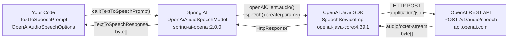

# Text-to-Speech (TTS) — How It Works

## Spring AI as a Translation Layer

Spring AI sits between your application code and the OpenAI REST API, abstracting away HTTP concerns, SDK specifics, and request/response mapping.
Your code works with Spring AI's portable abstractions (`TextToSpeechPrompt`, `OpenAiAudioSpeechOptions`), and Spring AI translates those into the exact HTTP call that OpenAI expects.



### What Spring AI translates

| Your abstraction | Translates to |
|-----------------|---------------|
| `TextToSpeechPrompt(text)` | `"input"` field in the JSON body |
| `OpenAiAudioSpeechOptions.model()` | `"model"` field (`tts-1`, `tts-1-hd`) |
| `OpenAiAudioSpeechOptions.voice()` | `"voice"` field (`alloy`, `echo`, `fable`, etc.) |
| `OpenAiAudioSpeechOptions.speed()` | `"speed"` field (`0.25` – `4.0`) |
| `OpenAiAudioSpeechOptions.responseFormat()` | `"response_format"` field (`mp3`, `opus`, etc.) |
| `TextToSpeechResponse.getResult().getOutput()` | Raw `byte[]` from the response body |

---

## OpenAI REST API

> API Contract: [https://platform.openai.com/docs/api-reference/audio/createSpeech](https://platform.openai.com/docs/api-reference/audio/createSpeech)

```
POST https://api.openai.com/v1/audio/speech
Authorization: Bearer <OPENAI_API_KEY>
Content-Type: application/json
Accept: application/octet-stream

{
  "model": "tts-1",
  "input": "Hello, this is a test.",
  "voice": "alloy"
}
```

Response is raw binary audio bytes (MP3 or other format), written to disk by `AudioUtil.writeMP3ToFile()`.

---

## Overview

This module exposes two REST endpoints that convert text into audio using OpenAI's TTS API.
The call flows from the Spring controller down through Spring AI, the OpenAI Java SDK, and finally to the OpenAI REST API.

---

## Endpoints

### POST /v1/tts — Simple

Accepts a plain prompt and uses default TTS settings.

```json
POST /v1/tts
{
  "prompt": "Hello, this is a test."
}
```

Output is written to `multimodal-llms/src/main/resources/files/audio/speech.mp3`.

---

### POST /v2/tts — Advanced

Accepts full TTS options for model, voice, speed, format, and output filename.

```json
POST /v2/tts
{
  "prompt": "Hello, this is a test.",
  "model": "tts-1",
  "voice": "alloy",
  "speed": 1.0,
  "responseFormat": "mp3",
  "fileName": "my-audio"
}
```

Output is written to `multimodal-llms/src/main/resources/files/audio/<fileName>.<responseFormat>`.

---

## Call Chain

```
TextToSpeechController.call()
  └── openAiAudioSpeechModel.call(TextToSpeechPrompt)      [Spring AI]
        └── OpenAiAudioSpeechModel.java:142
              └── openAiClient.audio().speech().create()   [OpenAI Java SDK]
                    └── SpeechServiceImpl.kt:57
                          └── POST https://api.openai.com/v1/audio/speech
```

---

## Layer-by-layer Breakdown

### 1. Controller — `TextToSpeechController`

```java
var speechPrompt = new TextToSpeechPrompt(userInput.prompt());
var speechResponse = openAiAudioSpeechModel.call(speechPrompt);
byte[] responseBytes = speechResponse.getResult().getOutput();
writeMP3ToFile(responseBytes, OUTPUT_PATH + "/speech.mp3");
```

For the advanced endpoint, `OpenAiAudioSpeechOptions` is built from the request body and passed alongside the prompt:

```java
var speechOptions = OpenAiAudioSpeechOptions.builder()
        .model(ttsInput.model())
        .speed(ttsInput.speed())
        .responseFormat(ttsInput.responseFormat())
        .voice(ttsInput.voice())
        .build();
var speechPrompt = new TextToSpeechPrompt(ttsInput.prompt(), speechOptions);
```

---

### 2. Spring AI — `OpenAiAudioSpeechModel`

`OpenAiAudioSpeechModel` is auto-configured by Spring AI via the `spring-ai-starter-model-openai` dependency.
It wraps the OpenAI Java SDK client and delegates the actual call:

```java
// OpenAiAudioSpeechModel.java:142  (spring-ai-openai:2.0.0)
com.openai.core.http.HttpResponse httpResponse =
    this.openAiClient.audio().speech().create(params);
```

---

### 3. OpenAI Java SDK — `SpeechServiceImpl`

The SDK builds the HTTP request and appends the path segments:

```kotlin
// SpeechServiceImpl.kt:54-60  (openai-java-core:4.39.1)
HttpRequest.builder()
    .method(HttpMethod.POST)
    .baseUrl(clientOptions.baseUrl())   // https://api.openai.com/v1
    .addPathSegments("audio", "speech") // /audio/speech
    .putHeader("Accept", "application/octet-stream")
    .body(json(clientOptions.jsonMapper, params._body()))
    .build()
```

The base URL default is defined in `OpenAiSetup.java`:

```java
// OpenAiSetup.java:55  (spring-ai-openai:2.0.0)
static final String OPENAI_URL = "https://api.openai.com/v1";
```

---

### 4. OpenAI REST API

> API Contract: [https://platform.openai.com/docs/api-reference/audio/createSpeech](https://platform.openai.com/docs/api-reference/audio/createSpeech)

```
POST https://api.openai.com/v1/audio/speech
Authorization: Bearer <OPENAI_API_KEY>
Content-Type: application/json
Accept: application/octet-stream

{
  "model": "tts-1",
  "input": "Hello, this is a test.",
  "voice": "alloy"
}
```

Response is raw binary audio bytes (MP3 or other format), written to disk by `AudioUtil.writeMP3ToFile()`.

---

## Dependency Chain

```
build.gradle
  └── org.springframework.ai:spring-ai-starter-model-openai
        └── org.springframework.ai:spring-ai-openai:2.0.0
              └── com.openai:openai-java-core:4.39.1
```

---

## Key Classes

| Class | Role | Artifact |
|-------|------|----------|
| `TextToSpeechController` | REST entry point; builds prompt and writes audio to disk | This project |
| `OpenAiAudioSpeechModel` | Spring AI adapter; delegates to OpenAI Java SDK | `spring-ai-openai:2.0.0` |
| `OpenAiSetup` | Configures the `OpenAIClient` with base URL and API key | `spring-ai-openai:2.0.0` |
| `SpeechServiceImpl` | Builds and executes the HTTP POST to `/v1/audio/speech` | `openai-java-core:4.39.1` |
| `AudioUtil` | Writes raw audio bytes to a file on disk | This project |
