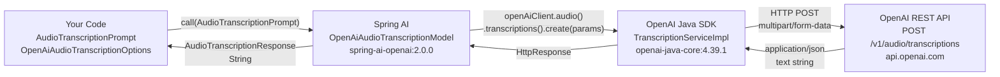

# Transcription — How It Works

## Spring AI as a Translation Layer

Spring AI sits between your application code and the OpenAI REST API, abstracting away HTTP concerns, SDK specifics, and request/response mapping.
Your code works with Spring AI's portable abstractions (`AudioTranscriptionPrompt`, `OpenAiAudioTranscriptionOptions`), and Spring AI translates those into the exact HTTP call that OpenAI expects.



### What Spring AI translates

| Your abstraction | Translates to |
|-----------------|---------------|
| `AudioTranscriptionPrompt(resource)` | `"file"` field in the multipart form body |
| `OpenAiAudioTranscriptionOptions.language()` | `"language"` field (ISO-639-1 code, e.g. `en`, `fr`) |
| `OpenAiAudioTranscriptionOptions.prompt()` | `"prompt"` field (optional hint to guide transcription style) |
| `OpenAiAudioTranscriptionOptions.temperature()` | `"temperature"` field (`0.0` – `1.0`) |
| `OpenAiAudioTranscriptionOptions.responseFormat()` | `"response_format"` field (`json`, `text`, `srt`, `vtt`, `verbose_json`) |
| `response.getResult().getOutput()` | Transcribed text string from the response body |

---

## OpenAI REST API

> API Contract: [https://platform.openai.com/docs/api-reference/audio/createTranscription](https://platform.openai.com/docs/api-reference/audio/createTranscription)

```
POST https://api.openai.com/v1/audio/transcriptions
Authorization: Bearer <OPENAI_API_KEY>
Content-Type: multipart/form-data

file=<audio-binary>
model=whisper-1
```

Response is a JSON object containing the transcribed text:

```json
{
  "text": "Hello, this is a transcription of the audio file."
}
```

---

## Overview

This module exposes two REST endpoints that convert audio files into text using OpenAI's Whisper model.
The call flows from the Spring controller down through Spring AI, the OpenAI Java SDK, and finally to the OpenAI REST API.

---

## Endpoints

### POST /v1/transcription — Simple

Accepts an audio file upload and uses default transcription settings.

```
POST /v1/transcription
Content-Type: multipart/form-data

file=<audio-file>
```

Sample audio files are available under `multimodal-llms/src/main/resources/files/audio/transcription/`:
- `RAG.mp3` — English audio
- `french_audio.mp3` — French audio

---

### POST /v2/transcription — Advanced

Accepts an audio file plus full transcription options for model, language, prompt hint, response format, and temperature.

```
POST /v2/transcription
Content-Type: multipart/form-data

file=<audio-file>
prompt=Transcribe the following audio
model=whisper-1
language=en
response_format=json
temperature=1.0
```

| Parameter | Required | Description |
|-----------|----------|-------------|
| `file` | Yes | Audio file (mp3, mp4, wav, webm, etc.) |
| `prompt` | Yes | Optional hint to guide the transcription style or vocabulary |
| `model` | Yes | Model to use — `whisper-1` is the only supported value |
| `language` | Yes | ISO-639-1 language code (e.g. `en`, `fr`, `de`) |
| `response_format` | Yes | Output format — `json`, `text`, `srt`, `vtt`, or `verbose_json` |
| `temperature` | No | Sampling temperature (`0.0` – `1.0`); defaults to `1.0` if not provided |

---

## Call Chain

```
TranscriptionController.transcription() / transcriptionV2()
  └── openAiAudioTranscriptionModel.call(AudioTranscriptionPrompt)   [Spring AI]
        └── OpenAiAudioTranscriptionModel.java
              └── openAiClient.audio().transcriptions().create()     [OpenAI Java SDK]
                    └── TranscriptionServiceImpl
                          └── POST https://api.openai.com/v1/audio/transcriptions
```

---

## Layer-by-layer Breakdown

### 1. Controller — `TranscriptionController`

**Simple endpoint** — uses default settings:

```java
var audioFile = file.getResource();
AudioTranscriptionPrompt transcriptionRequest = new AudioTranscriptionPrompt(audioFile);
var response = openAiAudioTranscriptionModel.call(transcriptionRequest);
return new TranscriptionResponse(response.getResult().getOutput(), file.getOriginalFilename());
```

**Advanced endpoint** — builds full options from request params:

```java
OpenAiAudioTranscriptionOptions transcriptionOptions = OpenAiAudioTranscriptionOptions.builder()
        .language(language)
        .prompt(prompt)
        .temperature(temperature)
        .responseFormat(AudioResponseFormat.of(responseFormat.toLowerCase()))
        .build();

AudioTranscriptionPrompt transcriptionPrompt = new AudioTranscriptionPrompt(audioFile, transcriptionOptions);
var response = openAiAudioTranscriptionModel.call(transcriptionPrompt);
return new TranscriptionResponse(response.getResult().getOutput(), file.getOriginalFilename());
```

---

### 2. Spring AI — `OpenAiAudioTranscriptionModel`

`OpenAiAudioTranscriptionModel` is auto-configured by Spring AI via the `spring-ai-starter-model-openai` dependency.
It wraps the OpenAI Java SDK client and delegates the actual call:

```java
// OpenAiAudioTranscriptionModel.java  (spring-ai-openai:2.0.0)
this.openAiClient.audio().transcriptions().create(params);
```

---

### 3. OpenAI Java SDK — `TranscriptionServiceImpl`

The SDK builds the multipart HTTP request and appends the path segments:

```kotlin
HttpRequest.builder()
    .method(HttpMethod.POST)
    .baseUrl(clientOptions.baseUrl())          // https://api.openai.com/v1
    .addPathSegments("audio", "transcriptions") // /audio/transcriptions
    .body(multipartFormData(params))
    .build()
```

The base URL default is defined in `OpenAiSetup.java`:

```java
// OpenAiSetup.java:55  (spring-ai-openai:2.0.0)
static final String OPENAI_URL = "https://api.openai.com/v1";
```

---

### 4. OpenAI REST API

> API Contract: [https://platform.openai.com/docs/api-reference/audio/createTranscription](https://platform.openai.com/docs/api-reference/audio/createTranscription)

```
POST https://api.openai.com/v1/audio/transcriptions
Authorization: Bearer <OPENAI_API_KEY>
Content-Type: multipart/form-data

file=<audio-binary>
model=whisper-1
language=en
response_format=json
```

Response:

```json
{
  "text": "Hello, this is a transcription of the audio file."
}
```

---

## Dependency Chain

```
build.gradle
  └── org.springframework.ai:spring-ai-starter-model-openai
        └── org.springframework.ai:spring-ai-openai:2.0.0
              └── com.openai:openai-java-core:4.39.1
```

---

## Key Classes

| Class | Role | Artifact |
|-------|------|----------|
| `TranscriptionController` | REST entry point; accepts audio file upload and returns transcribed text | This project |
| `OpenAiAudioTranscriptionModel` | Spring AI adapter; delegates to OpenAI Java SDK | `spring-ai-openai:2.0.0` |
| `OpenAiAudioTranscriptionOptions` | Carries language, prompt, temperature, and response format options | `spring-ai-openai:2.0.0` |
| `AudioTranscriptionPrompt` | Wraps the audio resource and options into a single prompt object | `spring-ai-openai:2.0.0` |
| `OpenAiSetup` | Configures the `OpenAIClient` with base URL and API key | `spring-ai-openai:2.0.0` |
| `TranscriptionResponse` | Response record holding transcribed text and original filename | This project |
